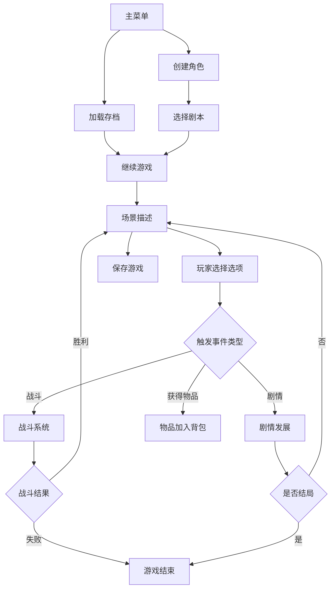

## 1. 产品概述
龙与地下城风格文字冒险游戏，玩家通过文字描述和选项按钮进行互动冒险。
- 主要目的：提供沉浸式的文字冒险体验，支持角色创建、多剧本、战斗系统、物品管理等核心玩法
- 目标用户：喜欢文字冒险和RPG游戏的玩家，桌面角色扮演游戏爱好者

## 2. 核心功能

### 2.1 功能模块
1. **主菜单**：开始游戏、角色创建、剧本选择、存档加载、帮助说明、游戏设置
2. **角色创建**：职业选择（战士/法师/游侠），不同职业拥有不同初始属性
3. **游戏主界面**：场景描述、选项按钮、角色属性面板、物品栏、战斗日志
4. **战斗系统**：掷骰子判定、攻击/防御/逃跑选项、详细战斗日志
5. **物品系统**：获取/使用药水、武器、护甲，物品影响角色属性
6. **存档系统**：localStorage保存、JSON文件导入/导出
7. **设置系统**：音效开关、字体大小调节、深色/浅色模式切换

### 2.2 页面详情
| 页面名称 | 模块名称 | 功能描述 |
|---------|---------|----------|
| 主菜单页 | 导航菜单 | 开始新游戏、继续游戏、帮助、设置按钮 |
| 角色创建页 | 职业选择 | 展示三种职业特性和初始属性，确认创建 |
| 剧本选择页 | 剧本列表 | 三个预设剧本：地牢逃生、巨龙宝藏、森林谜团 |
| 游戏主界面 | 场景描述区 | 显示当前场景文字描述，支持滚动 |
| 游戏主界面 | 选项按钮区 | 2-4个选择按钮，点击推进剧情 |
| 游戏主界面 | 角色属性栏 | 生命值、攻击力、防御力实时显示 |
| 游戏主界面 | 物品栏 | 展示背包物品，点击使用 |
| 游戏主界面 | 战斗日志 | 记录战斗过程，支持滚动查看 |
| 设置弹窗 | 游戏设置 | 音效开关、字体大小滑块、主题切换 |
| 帮助弹窗 | 操作说明 | 游戏玩法、快捷键、系统说明 |

## 3. 核心流程

## 4. 用户界面设计

### 4.1 设计风格
- **主色调**：深褐色系（#2d1810）作为主背景，金色（#d4af37）作为强调色，营造中世纪奇幻氛围
- **辅助色**：血红色（#8b0000）表示生命值，森林绿（#228b22）表示治疗效果
- **按钮风格**：圆角矩形，渐变背景，hover时有浮雕效果，点击有按压反馈
- **字体**：标题使用Cinzel（衬线字体），正文使用Georgia，营造古籍感
- **布局风格**：卡片式布局，羊皮纸质感背景，边框装饰，适当的阴影效果
- **图标/emoji**：使用复古风格的符号和emoji（⚔️🛡️🧙🧪📜）

### 4.2 页面设计概述
| 页面名称 | 模块名称 | UI元素 |
|---------|---------|--------|
| 主菜单页 | 标题区域 | 大字号游戏标题，发光效果，副标题 |
| 主菜单页 | 按钮区域 | 垂直排列的大按钮，图标+文字 |
| 游戏主界面 | 左侧面板 | 角色头像、属性条、物品网格 |
| 游戏主界面 | 中间区域 | 羊皮纸质感场景描述框，底部选项按钮 |
| 游戏主界面 | 右侧面板 | 战斗日志滚动区域，时间戳+事件文字 |
| 弹窗组件 | 通用弹窗 | 半透明黑色遮罩，居中白色卡片，关闭按钮 |

### 4.3 响应式
- Desktop-first设计，主界面采用三栏布局
- 平板设备：左右面板可折叠收起
- 手机设备：单栏滚动布局，属性栏固定在顶部，日志折叠为底部抽屉
- 触摸优化：按钮最小高度48px，适当增加点击区域

### 4.4 动效设计
- 页面加载：渐入+轻微上浮动画
- 场景切换：文字打字机效果
- 按钮交互：hover放大，点击缩放
- 战斗伤害：数字弹跳+颜色变化
- 属性更新：进度条平滑过渡动画
- 骰子滚动：旋转动画加震动效果
