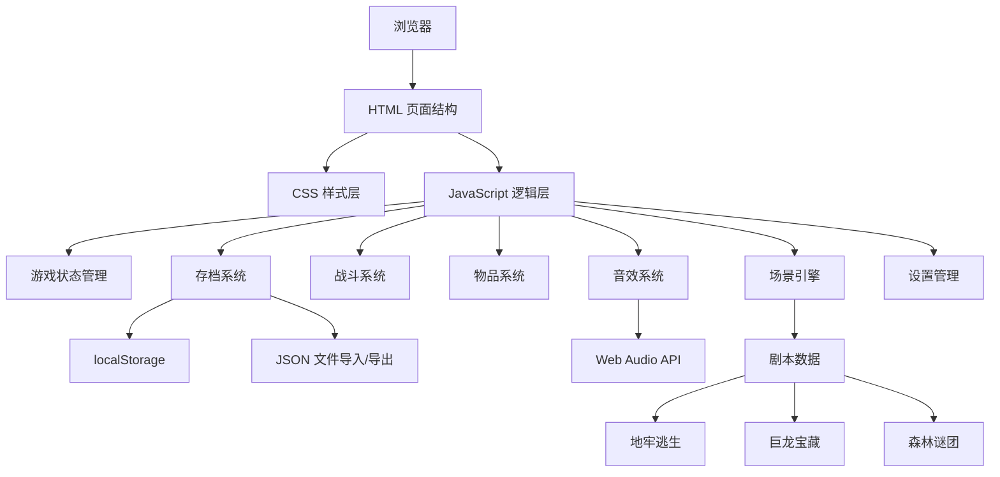

## 1. 架构设计



## 2. 技术描述

- **前端技术栈**: 原生 HTML5 + CSS3 + JavaScript (ES6+)
- **构建工具**: 无（纯静态文件，直接运行）
- **后端**: 无（纯前端应用）
- **数据存储**: localStorage 存储游戏存档
- **音效**: Web Audio API 生成简单音效

## 3. 文件结构

| 文件路径 | 用途 |
|---------|------|
| `/index.html` | 游戏主页面，包含所有HTML结构 |
| `/css/style.css` | 游戏样式，含主题切换和响应式设计 |
| `/js/game.js` | 游戏核心逻辑引擎 |
| `/js/scenarios.js` | 三个冒险剧本数据定义 |
| `/js/storage.js` | 存档系统、localStorage操作、JSON导入导出 |
| `/js/audio.js` | 音效系统，使用Web Audio API |
| `/js/settings.js` | 设置管理（音效、字体、主题） |

## 4. 数据模型

### 4.1 角色数据模型
```javascript
{
  name: string,           // 角色名称
  class: 'warrior' | 'mage' | 'ranger',  // 职业
  maxHp: number,          // 最大生命值
  currentHp: number,      // 当前生命值
  attack: number,         // 攻击力
  defense: number,        // 防御力
  inventory: Item[],      // 物品背包
  equipment: {            // 装备
    weapon: Item | null,
    armor: Item | null
  }
}
```

### 4.2 物品数据模型
```javascript
{
  id: string,
  name: string,
  type: 'potion' | 'weapon' | 'armor',
  description: string,
  effect: {
    hp?: number,          // 药水回复量
    attack?: number,      // 武器攻击加成
    defense?: number      // 护甲防御加成
  },
  emoji: string
}
```

### 4.3 游戏状态模型
```javascript
{
  player: Player,
  currentScenario: string,  // 当前剧本ID
  currentScene: string,     // 当前场景ID
  visitedScenes: string[],  // 已访问场景
  battleLog: LogEntry[],    // 战斗日志
  gameOver: boolean,
  ending: string | null     // 结局类型
}
```

### 4.4 场景数据模型
```javascript
{
  id: string,
  title: string,
  description: string,
  type: 'normal' | 'battle' | 'shop' | 'ending',
  enemy?: Enemy,            // 战斗场景敌人
  items?: Item[],           // 可获得物品
  choices: Choice[]         // 选项
}
```

## 5. 核心API（函数）

### 5.1 游戏引擎
- `GameEngine.init()` - 初始化游戏
- `GameEngine.loadScene(sceneId)` - 加载场景
- `GameEngine.makeChoice(choiceIndex)` - 做出选择
- `GameEngine.startBattle(enemy)` - 开始战斗
- `GameEngine.playerAttack()` - 玩家攻击
- `GameEngine.enemyAttack()` - 敌人攻击
- `GameEngine.useItem(itemId)` - 使用物品
- `GameEngine.gameOver(ending)` - 游戏结束

### 5.2 存档系统
- `Storage.saveGame()` - 保存到localStorage
- `Storage.loadGame()` - 从localStorage加载
- `Storage.exportSave()` - 导出JSON文件
- `Storage.importSave(file)` - 导入JSON文件

### 5.3 音效系统
- `AudioManager.playAttack()` - 攻击音效
- `AudioManager.playHit()` - 受击音效
- `AudioManager.playHeal()` - 治疗音效
- `AudioManager.playDice()` - 掷骰子音效
- `AudioManager.playVictory()` - 胜利音效
- `AudioManager.playDefeat()` - 失败音效

### 5.4 设置管理
- `Settings.toggleSound(enabled)` - 开关音效
- `Settings.setFontSize(size)` - 设置字体大小
- `Settings.setTheme(theme)` - 设置主题（dark/light）
- `Settings.load()` - 加载设置
- `Settings.save()` - 保存设置

## 6. 核心算法

### 6.1 战斗判定算法
```javascript
function calculateDamage(attacker, defender) {
  // 掷1D20骰子
  const diceRoll = Math.floor(Math.random() * 20) + 1;
  
  // 命中判定：骰子 + 攻击者攻击力 > 10 + 防御者防御力
  const hitChance = diceRoll + attacker.attack;
  const dodgeChance = 10 + defender.defense;
  
  if (diceRoll === 20) {
    // 暴击：双倍伤害
    return { hit: true, critical: true, damage: attacker.attack * 2 };
  } else if (diceRoll === 1) {
    // 失误：未命中
    return { hit: false, critical: false, damage: 0 };
  } else if (hitChance > dodgeChance) {
    // 命中：攻击力 - 防御力/2（最小1）
    const damage = Math.max(1, attacker.attack - Math.floor(defender.defense / 2));
    return { hit: true, critical: false, damage };
  } else {
    return { hit: false, critical: false, damage: 0 };
  }
}
```

### 6.2 场景状态管理
使用状态机模式管理游戏场景切换，确保状态一致性和可追溯性。
