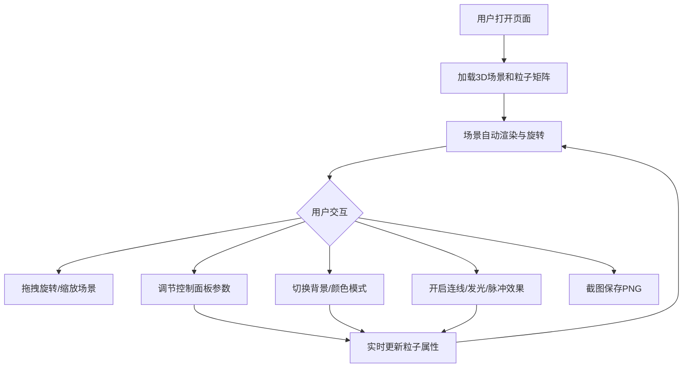

## 1. 产品概述

基于Three.js的3D动态立方体粒子场交互网页，用户可在浏览器中体验数千个彩色小立方体粒子组成的动态矩阵场景，并通过丰富的控制面板实时调节粒子参数与视觉特效。
- 目标用户：3D视觉爱好者、创意开发者、交互设计学习者
- 核心价值：提供一个高度可定制的3D粒子可视化体验，兼具视觉冲击力与交互趣味性

## 2. 核心功能

### 2.1 功能模块

1. **主场景页面**：3D立方体粒子矩阵、控制面板、状态信息栏

### 2.2 页面详情

| 页面名称 | 模块名称 | 功能描述 |
|----------|----------|----------|
| 主场景页面 | 3D粒子矩阵 | 数千个彩色小立方体排列成矩阵，整体缓慢自转，每个粒子绕自身中心旋转 |
| 主场景页面 | 控制面板-粒子数量滑块 | 调节粒子数量（1000~10000），动态调整矩阵密度 |
| 主场景页面 | 控制面板-粒子大小滑块 | 调节每个立方体的显示尺寸 |
| 主场景页面 | 控制面板-旋转速度滑块 | 控制整体自转速度 |
| 主场景页面 | 控制面板-自身旋转速度滑块 | 控制每个小立方体的自转快慢 |
| 主场景页面 | 控制面板-背景切换 | 切换背景为黑色、白色、渐变星空 |
| 主场景页面 | 控制面板-截图功能 | 一键保存当前画面为PNG图片 |
| 主场景页面 | 控制面板-颜色模式切换 | 彩虹渐变模式与单色系模式切换 |
| 主场景页面 | 控制面板-粒子连线效果 | 开启/关闭相邻粒子之间的半透明白线，形成网状结构 |
| 主场景页面 | 控制面板-相机自动旋转 | 开启/关闭相机自动旋转模式 |
| 主场景页面 | 控制面板-发光效果 | 开启/关闭每个粒子的微弱光晕 |
| 主场景页面 | 控制面板-脉冲动画 | 开启/关闭所有粒子大小随时间周期变化 |
| 主场景页面 | 状态信息栏 | 显示总粒子数量和实时帧率 |

## 3. 核心流程

用户打开页面后，自动加载3D立方体粒子矩阵场景，场景支持鼠标拖拽旋转和滚轮缩放。左侧或右侧控制面板提供丰富的参数调节选项，用户可实时调整视觉效果。状态栏实时显示粒子数量和帧率信息。

## 4. 用户界面设计

### 4.1 设计风格

- 主色调：深色系控制面板搭配鲜艳的3D粒子色彩（红蓝渐变/彩虹）
- 辅助色：半透明面板背景，确保不遮挡3D场景
- 按钮/滑块风格：圆角滑块，科技感按钮，半透明毛玻璃效果面板
- 字体：Orbitron（标题/数据）+ 系统无衬线字体（说明文字）
- 布局：3D场景全屏，控制面板浮于右侧，状态栏浮于左上角

### 4.2 页面设计概览

| 页面名称 | 模块名称 | UI元素 |
|----------|----------|--------|
| 主场景页面 | 3D粒子矩阵 | 全屏Canvas，深色背景，彩色立方体粒子矩阵 |
| 主场景页面 | 控制面板 | 右侧毛玻璃面板，圆角滑块组，切换按钮，截图按钮 |
| 主场景页面 | 状态信息栏 | 左上角半透明标签，显示粒子数和FPS |

### 4.3 响应式设计

- 桌面端优先，3D场景占满视口
- 控制面板在窄屏幕时可折叠收起
- 触屏设备支持触摸旋转和双指缩放

### 4.4 3D场景指引

- 环境：深色/星空背景，突出粒子发光效果
- 灯光：环境光 + 点光源，确保粒子颜色鲜明
- 相机：透视相机，OrbitControls支持自由旋转缩放
- 构图：粒子矩阵居中，相机默认45度俯视角
- 交互：鼠标拖拽旋转、滚轮缩放、控制面板参数调节
- 后处理：发光效果（Bloom/UnrealBloomPass）
- 性能预算：10000粒子时保持30FPS以上，使用InstancedMesh优化渲染
