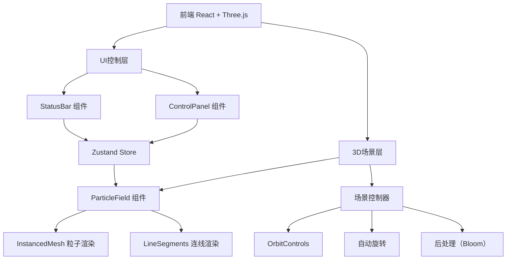

## 1. 架构设计



## 2. 技术说明

- 前端：React@18 + TypeScript + Tailwind CSS + Vite
- 3D引擎：Three.js + @react-three/fiber + @react-three/drei + @react-three/postprocessing
- 状态管理：Zustand
- 初始化工具：vite-init
- 后端：无
- 数据库：无

## 3. 路由定义

| 路由 | 用途 |
|------|------|
| / | 主场景页面，包含3D粒子矩阵和控制面板 |

## 4. 核心组件架构

### 4.1 组件结构

| 组件 | 职责 |
|------|------|
| App | 根组件，布局3D场景和UI面板 |
| Scene3D | @react-three/fiber Canvas容器，包含场景所有3D元素 |
| ParticleField | 核心粒子组件，使用InstancedMesh渲染立方体矩阵 |
| ParticleLines | 连线效果组件，使用LineSegments绘制粒子间连线 |
| Effects | 后处理组件，管理Bloom发光效果 |
| CameraController | 相机控制器，管理OrbitControls和自动旋转 |
| ControlPanel | 右侧控制面板，包含所有参数滑块和开关 |
| StatusBar | 左上角状态栏，显示粒子数量和FPS |

### 4.2 Zustand Store 设计

```typescript
interface ParticleStore {
  particleCount: number;       // 1000-10000
  particleSize: number;        // 0.05-0.5
  rotationSpeed: number;       // 0-2
  selfRotationSpeed: number;   // 0-5
  background: 'black' | 'white' | 'starfield';
  colorMode: 'rainbow' | 'monochrome';
  showLines: boolean;
  autoRotate: boolean;
  glowEnabled: boolean;
  pulseEnabled: boolean;
  // actions
  setParticleCount: (v: number) => void;
  setParticleSize: (v: number) => void;
  setRotationSpeed: (v: number) => void;
  setSelfRotationSpeed: (v: number) => void;
  setBackground: (v: string) => void;
  setColorMode: (v: string) => void;
  toggleLines: () => void;
  toggleAutoRotate: () => void;
  toggleGlow: () => void;
  togglePulse: () => void;
}
```

### 4.3 性能优化策略

- **InstancedMesh**：所有粒子使用单一InstancedMesh，避免逐个创建Mesh，大幅减少Draw Call
- **矩阵计算优化**：粒子位置使用Matrix4批量设置，颜色使用InstancedBufferAttribute
- **连线效果限制**：仅在粒子数量≤5000时启用连线，避免性能崩溃
- **Bloom后处理**：使用UnrealBloomPass实现发光效果，可按需开关
- **脉冲动画**：在useFrame中通过scale矩阵实现，无需重建几何体
