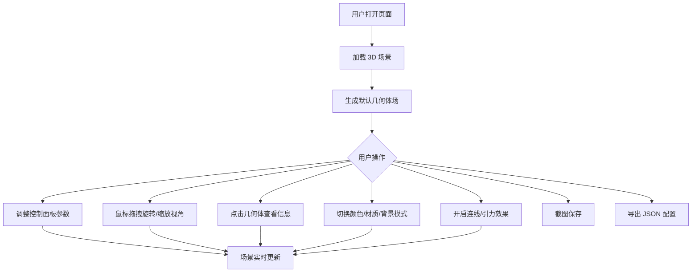

## 1. 产品概述

基于 Three.js 的 3D 漂浮几何体场交互网页，用户可在三维空间中生成、控制大量随机几何体，体验沉浸式的漂浮视觉效果，并通过丰富的控制面板自定义场景参数。

- 目标用户：3D 视觉爱好者、创意开发者、设计师
- 核心价值：提供零门槛的 3D 几何体场景生成与交互体验，支持丰富的参数调控与视觉效果切换

## 2. 核心功能

### 2.1 功能模块

1. **3D 场景页面**：几何体漂浮场、粒子背景、连线效果、交互控制面板

### 2.2 页面详情

| 页面名称 | 模块名称 | 功能描述 |
|----------|----------|----------|
| 3D 场景页面 | 几何体漂浮场 | 生成随机形状（立方体、球体、圆柱体、环面）的几何体，独立漂浮并缓慢旋转，随机分布在三维空间 |
| 3D 场景页面 | 相机控制 | 支持 OrbitControls 旋转缩放视角，支持自动缓慢旋转模式 |
| 3D 场景页面 | 控制面板 | 几何体数量滑块（20-200）、大小随机化范围滑块、漂浮速度滑块、颜色模式切换、背景切换、材质切换 |
| 3D 场景页面 | 连线效果 | 距离较近的几何体之间用半透光线连接，形成网状结构 |
| 3D 场景页面 | 中心引力 | 所有几何体围绕中心点做圆周运动 |
| 3D 场景页面 | 点击交互 | 点击几何体高亮并显示其形状名称 |
| 3D 场景页面 | 粒子背景 | 飘浮的粒子背景效果 |
| 3D 场景页面 | 截图保存 | 一键截图保存当前画面为 PNG 图片 |
| 3D 场景页面 | 配置导出 | 导出几何体场配置为 JSON 文件 |
| 3D 场景页面 | 状态显示 | 显示当前几何体数量 |

## 3. 核心流程

用户打开页面 → 看到 3D 漂浮几何体场（默认 80 个几何体）→ 通过控制面板调整参数 → 几何体实时响应变化 → 可点击几何体查看信息 → 可截图/导出配置

## 4. 用户界面设计

### 4.1 设计风格

- 主色调：深色科技风（暗黑底色 + 青色/霓虹蓝强调色）
- 控制面板：半透明毛玻璃风格，悬浮于 3D 场景右侧
- 字体：Orbitron（标题/数字显示）+ Source Sans 3（正文）
- 布局：全屏 3D 场景 + 右侧可收起控制面板
- 图标：Lucide Icons
- 滑块与按钮：圆角、霓虹发光边框

### 4.2 页面设计概览

| 页面名称 | 模块名称 | UI 元素 |
|----------|----------|----------|
| 3D 场景页面 | 3D 画布 | 全屏 Canvas，占据整个视口 |
| 3D 场景页面 | 控制面板 | 右侧悬浮面板，毛玻璃背景，包含滑块、开关、下拉框、按钮 |
| 3D 场景页面 | 状态栏 | 左上角显示几何体数量和 FPS |
| 3D 场景页面 | 点击提示 | 几何体上方弹出标签，显示形状名称 |

### 4.3 响应式

- 桌面优先设计
- 控制面板在移动端可折叠为底部抽屉
- 触控支持 OrbitControls 手势

### 4.4 3D 场景指引

- 环境：深色空间感，根据背景模式切换（黑色/深蓝/星空）
- 灯光：环境光 + 多点光源，金属质感模式下增强反射
- 相机：透视相机，默认距离 30，FOV 60°，自动旋转可切换
- 后期处理：发光材质模式下启用 Bloom 效果
- 性能预算：200 个几何体 + 1000 粒子，目标 60fps
