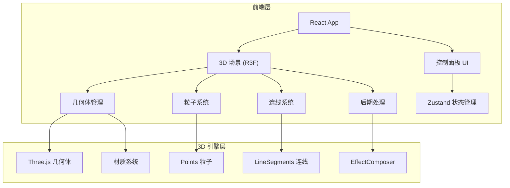

## 1. 架构设计



## 2. 技术说明

- 前端框架：React@18 + TypeScript + Vite
- 3D 渲染：three + @react-three/fiber + @react-three/drei + @react-three/postprocessing
- 样式：Tailwind CSS@3
- 状态管理：Zustand
- 初始化工具：vite-init (react-ts 模板)
- 无后端需求

## 3. 路由定义

| 路由 | 用途 |
|------|------|
| / | 3D 漂浮几何体场主页面 |

## 4. 组件结构

```
src/
├── components/
│   ├── Scene.tsx            # 主 3D 场景容器
│   ├── GeometryField.tsx    # 几何体场组件（管理所有几何体）
│   ├── FloatingGeometry.tsx # 单个漂浮几何体组件
│   ├── Particles.tsx        # 粒子背景组件
│   ├── ConnectionLines.tsx  # 连线效果组件
│   ├── ControlPanel.tsx     # 控制面板 UI
│   └── StatusDisplay.tsx    # 状态显示组件
├── store/
│   └── useStore.ts          # Zustand 全局状态
├── utils/
│   └── geometryUtils.ts     # 几何体生成工具函数
├── App.tsx
└── main.tsx
```

## 5. 状态管理

```typescript
interface AppState {
  geometryCount: number;
  sizeRange: [number, number];
  floatSpeed: number;
  colorMode: 'random' | 'metallic' | 'rainbow';
  background: 'black' | 'darkblue' | 'starfield';
  material: 'standard' | 'wireframe' | 'emissive';
  showConnections: boolean;
  connectionDistance: number;
  autoRotate: boolean;
  centerGravity: boolean;
  showParticles: boolean;
  selectedGeometry: string | null;
}
```

## 6. 关键技术决策

| 决策 | 选择 | 理由 |
|------|------|------|
| 3D 渲染 | @react-three/fiber | React 生态中 Three.js 的标准封装，声明式 API |
| 辅助库 | @react-three/drei | 提供 OrbitControls、Bloom 等现成组件 |
| 后期处理 | @react-three/postprocessing | 发光材质需要 Bloom 效果 |
| 状态管理 | Zustand | 轻量级，适合 3D 场景的高频状态更新 |
| 连线实现 | BufferGeometry + LineSegments | 性能优于逐条 Line，支持大量连线 |
| 截图实现 | gl.domElement.toDataURL | 直接从 WebGL Canvas 获取图像 |
