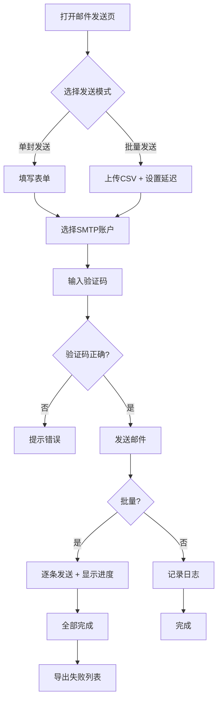

## 1. 产品概述

基于Flask的轻量级邮件发送服务，无需数据库，通过Web表单即可完成邮件发送、批量投递、模板管理等操作。面向需要频繁发送邮件的运营人员和开发者，解决手动逐一发送邮件效率低下的问题。

## 2. 核心功能

### 2.1 功能模块

1. **邮件发送页**: 单封/批量邮件发送表单、附件上传、HTML切换、模板选择、变量替换、验证码
2. **模板管理页**: 邮件模板的保存、列表展示、一键填充、删除
3. **发送日志页**: 发送记录列表、状态筛选、导出失败列表CSV
4. **设置页**: SMTP账户配置、邮件签名、暗色主题切换

### 2.2 页面详情

| 页面名称 | 模块名称 | 功能描述 |
|----------|----------|----------|
| 邮件发送页 | 邮件表单 | 收件人邮箱、主题、内容输入，HTML格式勾选，附件上传（多文件），模板选择下拉框，批量CSV上传，发送延迟设置，验证码输入 |
| 邮件发送页 | 批量发送进度 | 显示已完成数量/总数量，进度条，发送中状态实时更新 |
| 模板管理页 | 模板列表 | 展示已保存模板，支持一键填充到发送表单，支持删除 |
| 模板管理页 | 保存模板 | 从当前表单内容保存为模板（主题+内容） |
| 发送日志页 | 日志列表 | 时间、收件人、主题、状态（成功/失败），支持筛选 |
| 发送日志页 | 导出失败 | 导出失败记录为CSV文件 |
| 设置页 | SMTP账户管理 | 添加/编辑/删除多个SMTP账户，选择默认账户 |
| 设置页 | 邮件签名 | 设置签名文本，自动追加到邮件内容末尾 |
| 设置页 | 测试发送 | 一键发送测试邮件到发件人自己邮箱验证配置 |
| 设置页 | 主题切换 | 暗色/亮色主题切换 |

## 3. 核心流程

用户打开邮件发送页，填写收件人、主题、内容（或从模板选择填充），可选择勾选HTML格式、添加附件。单封发送直接提交；批量发送需上传CSV文件，设置发送间隔延迟，提交后显示发送进度。系统通过SMTP协议发送邮件，记录发送日志，失败条目可导出CSV。

## 4. 用户界面设计

### 4.1 设计风格

- 主色调: 深蓝 #1a1a2e / 亮色 #f0f2f5，强调色 #4361ee
- 按钮风格: 圆角8px，轻微阴影，hover微动效
- 字体: 系统字体栈，中文优先思源黑体
- 布局风格: 左侧导航 + 右侧内容区，卡片式内容
- 图标风格: 线性图标，2px描边

### 4.2 页面设计概述

| 页面名称 | 模块名称 | UI元素 |
|----------|----------|--------|
| 邮件发送页 | 邮件表单 | 白色卡片表单，输入框带图标前缀，文件拖拽上传区域，模板选择下拉，验证码内联显示 |
| 邮件发送页 | 批量进度 | 顶部进度条，已完成/总数文字，动态更新 |
| 模板管理页 | 模板列表 | 卡片网格布局，每个模板卡片显示名称、预览、操作按钮 |
| 发送日志页 | 日志列表 | 表格布局，状态列带颜色标签，筛选下拉，导出按钮 |
| 设置页 | 账户管理 | 卡片式账户列表，每个账户可展开编辑，测试发送按钮带加载态 |
| 设置页 | 主题切换 | 顶部导航栏右上角切换按钮，太阳/月亮图标 |

### 4.3 响应式

- 桌面优先设计，最小宽度1024px
- 移动端自适应：导航栏折叠为汉堡菜单，卡片单列排列

### 4.4 暗色主题

- 暗色背景 #0f0f1a，卡片 #1a1a2e，文字 #e0e0e0
- 强调色保持 #4361ee，输入框背景 #16213e
- CSS变量控制主题切换，transition过渡动画
