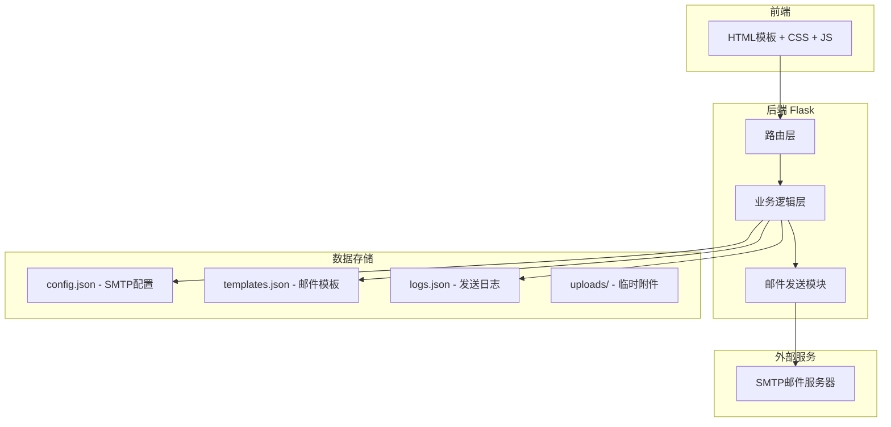
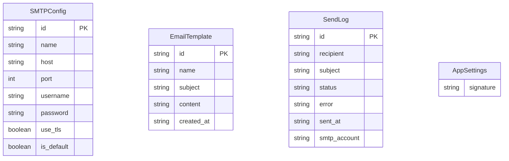

## 1. 架构设计



## 2. 技术说明

- 前端: Jinja2模板 + CSS3 + Vanilla JS（无前端框架）
- 后端: Python Flask
- 数据存储: JSON文件（无数据库）
- 邮件发送: Python smtplib + email库
- 文件上传: Flask Werkzeug

## 3. 路由定义

| 路由 | 方法 | 用途 |
|------|------|------|
| `/` | GET | 邮件发送页（主页） |
| `/send` | POST | 发送邮件（单封/批量） |
| `/send/batch-progress` | GET | SSE批量发送进度流 |
| `/templates` | GET | 模板管理页 |
| `/templates/save` | POST | 保存模板 |
| `/templates/delete/<id>` | POST | 删除模板 |
| `/logs` | GET | 发送日志页 |
| `/logs/export-failed` | GET | 导出失败列表CSV |
| `/settings` | GET | 设置页 |
| `/settings/smtp` | POST | 保存SMTP配置 |
| `/settings/smtp/delete/<id>` | POST | 删除SMTP配置 |
| `/settings/signature` | POST | 保存签名 |
| `/settings/test-send` | POST | 测试发送 |
| `/captcha` | GET | 获取验证码图片 |

## 4. API定义

### 发送邮件 POST `/send`
```typescript
Request FormData: {
  recipient: string          // 单个收件人
  subject: string            // 邮件主题
  content: string            // 邮件内容
  is_html: boolean           // 是否HTML格式
  smtp_account: string       // SMTP账户ID
  attachments: File[]        // 附件文件
  csv_file: File             // 批量CSV文件（可选）
  delay: number              // 发送间隔秒数（批量时）
  captcha_answer: string     // 验证码答案
}

Response: {
  success: boolean
  message: string
  failed?: Array<{recipient: string, error: string}>
}
```

### 保存模板 POST `/templates/save`
```typescript
Request: {
  name: string
  subject: string
  content: string
}
Response: {
  success: boolean
  message: string
}
```

### 批量发送进度 SSE `/send/batch-progress`
```typescript
Event: {
  current: number
  total: number
  recipient: string
  status: "success" | "failed"
}
```

## 5. 数据模型

### 5.1 数据模型定义



### 5.2 JSON文件结构

**config.json:**
```json
{
  "smtp_accounts": [
    {
      "id": "uuid",
      "name": "主账户",
      "host": "smtp.example.com",
      "port": 465,
      "username": "user@example.com",
      "password": "password",
      "use_tls": true,
      "is_default": true
    }
  ],
  "signature": ""
}
```

**templates.json:**
```json
[
  {
    "id": "uuid",
    "name": "欢迎邮件",
    "subject": "欢迎加入",
    "content": "亲爱的{{姓名}}，欢迎加入我们！",
    "created_at": "2026-05-29 10:00:00"
  }
]
```

**logs.json:**
```json
[
  {
    "id": "uuid",
    "recipient": "user@example.com",
    "subject": "测试邮件",
    "status": "success",
    "error": "",
    "sent_at": "2026-05-29 10:00:00",
    "smtp_account": "主账户"
  }
]
```
