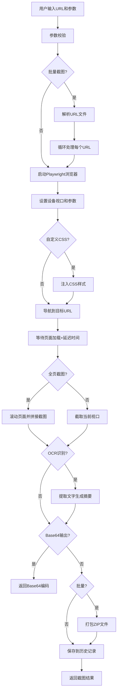

## 1. 产品概述

网页截图服务是一个基于Flask的在线工具，用户可以通过Web界面或API对任意网页进行截图，并支持多种高级功能。该服务无需数据库，使用内存存储历史记录，通过无头浏览器实现高质量网页渲染和截图。

- 核心价值：为用户提供便捷、功能丰富的网页截图工具，支持从简单截图到批量处理、定时任务等高级需求
- 目标用户：开发者、设计师、内容创作者、运营人员等需要网页截图的各类用户

## 2. 核心功能

### 2.1 功能模块

1. **单图截图模块**：URL输入、尺寸设置、截图下载
2. **高级截图功能**：延迟等待、全页长截图、设备模拟、自定义CSS、暗色模式、质量调节、宽高比锁定
3. **批量截图模块**：URL文件上传、批量处理、ZIP打包下载
4. **历史记录模块**：最近10次任务记录、快速重新生成
5. **定时任务模块**：cron表达式设置、自动截图、邮件发送
6. **OCR识别模块**：截图文字识别、内容摘要提取
7. **Base64输出模块**：Base64编码返回、HTML嵌入支持

### 2.2 页面详情

| 页面名称 | 模块名称 | 功能描述 |
|---------|---------|---------|
| 首页 | 截图表单 | URL输入、尺寸设置、高级选项展开、截图按钮 |
| 首页 | 设备选择 | 手机/平板/桌面设备切换、自定义视口 |
| 首页 | 高级选项 | 延迟设置、全页截图开关、自定义CSS输入、暗色模式、质量调节、宽高比锁定、OCR开关、Base64输出开关 |
| 首页 | 批量截图 | 文件上传、批量处理、ZIP下载 |
| 首页 | 历史记录 | 最近10次任务列表、快速重新生成按钮 |
| 首页 | 定时任务 | cron表达式设置、URL配置、邮箱配置、任务管理 |
| 结果展示页 | 截图预览 | 图片展示、下载按钮、Base64复制、OCR结果展示 |

## 3. 核心流程

## 4. 用户界面设计

### 4.1 设计风格

- **主色调**：深蓝渐变 (#1e3a5f → #2d5a87) + 青色点缀 (#00d4ff)
- **辅助色**：橙色 (#ff6b35) 用于操作按钮，绿色 (#22c55e) 用于成功状态，红色 (#ef4444) 用于错误状态
- **背景**：深色主题，深灰蓝底色 (#0f172a) 搭配微妙的网格纹理
- **按钮风格**：圆角8px、悬停时有发光效果、点击有轻微缩放动画
- **字体**：标题使用 'Space Grotesk' 无衬线字体，正文使用 'Inter' 字体
- **布局风格**：卡片式布局，分组清晰，表单字段左侧标签右侧输入
- **图标**：使用 lucide-react 图标库，统一线性风格
- **整体风格**：现代科技感，深色主题，流畅动画，磨砂玻璃效果卡片

### 4.2 页面设计概述

| 页面名称 | 模块名称 | UI元素 |
|---------|---------|-------------|
| 首页 | 头部 | Logo、标题、简短描述、深色/浅色模式切换 |
| 首页 | 主表单区 | URL输入框（带图标）、尺寸输入（宽/高，带锁定按钮）、设备选择器（三个按钮组） |
| 首页 | 高级选项面板 | 可折叠面板，包含：延迟滑块、全页截图开关、CSS文本域、暗色模式开关、质量滑块、OCR开关、Base64开关 |
| 首页 | 批量截图区 | 文件拖拽上传区域、格式说明、上传按钮 |
| 首页 | 历史记录区 | 横向滚动卡片列表，每个卡片显示缩略图（如可用）、URL、时间、重新生成按钮 |
| 首页 | 定时任务区 | cron表达式输入（带预设快捷选项）、URL输入、邮箱输入、添加任务按钮、任务列表 |
| 结果展示 | 图片预览区 | 居中大图展示、悬停放大效果、下载按钮组 |
| 结果展示 | 信息面板 | 截图参数、尺寸、文件大小、下载按钮、复制Base64按钮 |
| 结果展示 | OCR结果区 | 可折叠面板，显示识别的文字内容、复制按钮 |

### 4.3 响应式设计

- Desktop-first设计，适配1200px以上为主
- 平板（768px-1200px）：表单两列变单列，历史记录卡片缩小
- 移动端（<768px）：所有元素单列布局，按钮尺寸增大，输入框全宽，历史记录垂直滚动
- 触摸优化：所有可点击元素最小44x44px，表单输入框有适当padding

### 4.4 动画与交互

- 页面加载：元素淡入+上移，错落有致（staggered animation）
- 表单提交：按钮loading状态，进度条动画
- 截图过程：进度指示动画，loading旋转图标
- 悬停效果：卡片轻微上浮+阴影增强，按钮发光效果
- 开关切换：平滑过渡动画，滑块有惯性效果
- 历史记录：卡片hover显示操作按钮，点击有波纹效果
