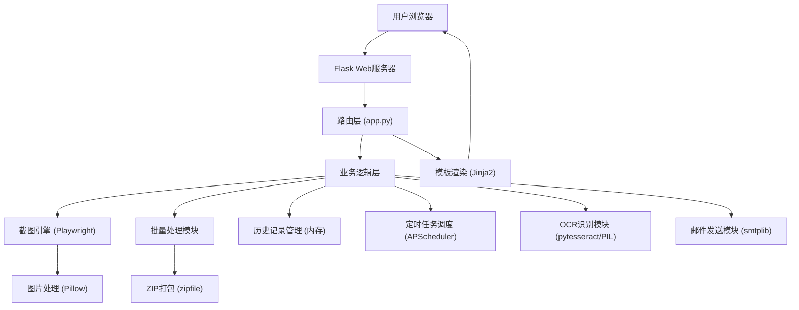

## 1. 架构设计



## 2. 技术选型说明

- **后端框架**：Flask@3.0.0 - 轻量级Python Web框架，适合快速开发
- **无头浏览器**：Playwright@1.40.0 - Microsoft出品的现代化浏览器自动化工具，支持Chromium/Firefox/WebKit
- **图片处理**：Pillow@10.1.0 - Python图像处理库，用于图片压缩、格式转换
- **OCR识别**：pytesseract@0.3.10 + Pillow - 开源OCR引擎，支持多语言识别
- **定时任务**：APScheduler@3.10.4 - Python任务调度库，支持cron表达式
- **邮件发送**：smtplib (Python标准库) + email - 发送带附件的邮件
- **前端模板**：Jinja2 (Flask内置) + 原生JavaScript + Tailwind CSS
- **数据存储**：内存存储 (collections.deque) - 无需数据库，历史记录最多保存10条

## 3. 目录结构

```
/
├── app.py                    # Flask主应用，路由和业务逻辑
├── requirements.txt          # Python依赖清单
├── config.py                 # 配置文件（邮箱、默认参数等）
├── templates/
│   ├── index.html            # 主页面
│   └── result.html           # 结果展示页面
├── static/
│   ├── css/
│   │   └── style.css         # 自定义样式
│   └── js/
│       └── main.js           # 前端交互逻辑
├── screenshots/              # 临时截图存储目录（运行时创建）
└── .trae/
    └── documents/
        ├── PRD.md
        └── 技术架构.md
```

## 4. 路由定义

| 方法 | 路由 | 功能描述 |
|------|------|---------|
| GET | / | 首页，显示截图表单 |
| POST | /screenshot | 单图截图处理 |
| POST | /batch | 批量截图处理，返回ZIP |
| GET | /download/<filename> | 下载截图文件 |
| GET | /history | 获取历史记录JSON |
| POST | /history/regen/<id> | 根据历史记录重新生成截图 |
| POST | /schedule/add | 添加定时任务 |
| GET | /schedule/list | 获取定时任务列表 |
| POST | /schedule/delete/<id> | 删除定时任务 |
| POST | /api/screenshot | API接口，返回JSON（支持Base64） |

## 5. API定义

### 5.1 截图请求参数

```python
@dataclass
class ScreenshotRequest:
    url: str                    # 目标URL (必填)
    width: int = 1920           # 宽度
    height: int = 1080          # 高度
    device: str = 'desktop'     # 设备类型: mobile/tablet/desktop
    delay: float = 0.0          # 延迟秒数 (0-10)
    full_page: bool = False     # 全页截图
    custom_css: str = ''        # 自定义CSS
    dark_mode: bool = False     # 暗色模式
    quality: int = 80           # JPG质量 (1-100)
    format: str = 'png'         # 输出格式: png/jpg/webp
    ocr: bool = False           # OCR识别
    base64: bool = False        # 返回Base64
    keep_aspect_ratio: bool = False  # 锁定宽高比
```

### 5.2 截图响应

```python
@dataclass
class ScreenshotResponse:
    success: bool
    filename: str = None
    download_url: str = None
    base64: str = None
    ocr_text: str = None
    width: int = None
    height: int = None
    file_size: int = None
    error: str = None
```

### 5.3 设备预设尺寸

```python
DEVICE_PRESETS = {
    'mobile': {'width': 375, 'height': 667, 'user_agent': 'Mozilla/5.0 (iPhone; CPU iPhone OS 14_0 like Mac OS X)'},
    'tablet': {'width': 768, 'height': 1024, 'user_agent': 'Mozilla/5.0 (iPad; CPU OS 14_0 like Mac OS X)'},
    'desktop': {'width': 1920, 'height': 1080, 'user_agent': 'Mozilla/5.0 (Windows NT 10.0; Win64; x64) AppleWebKit/537.36'}
}
```

## 6. 核心模块设计

### 6.1 截图引擎模块

| 类/函数 | 功能描述 |
|---------|---------|
| ScreenshotEngine | 截图引擎类，封装Playwright操作 |
| capture_screenshot() | 执行截图主流程 |
| _setup_browser() | 启动浏览器，设置参数 |
| _inject_css() | 注入自定义CSS |
| _capture_full_page() | 全页截图（滚动拼接） |
| _compress_image() | 图片压缩处理 |
| _ocr_extract() | OCR文字提取 |
| _to_base64() | 转换为Base64编码 |

### 6.2 全页截图算法

```
算法：滚动截图拼接
1. 获取页面总高度 scroll_height
2. 设置每次滚动高度 = 视口高度
3. 从顶部开始循环：
   a. 截取当前视口
   b. 保存到临时图片列表
   c. 滚动到下一屏
   d. 等待滚动完成
4. 使用Pillow垂直拼接所有图片
5. 处理最后一屏可能的重复区域
```

### 6.3 历史记录管理

使用 `collections.deque(maxlen=10)` 实现固定长度队列，内存存储：

```python
class HistoryManager:
    def __init__(self):
        self.records = deque(maxlen=10)
    
    def add(self, params, result):
        self.records.appendleft({
            'id': uuid.uuid4().hex[:8],
            'timestamp': datetime.now(),
            'params': params,
            'result': result
        })
    
    def get_all(self):
        return list(self.records)
    
    def get(self, record_id):
        for r in self.records:
            if r['id'] == record_id:
                return r
        return None
```

### 6.4 定时任务模块

```python
from apscheduler.schedulers.background import BackgroundScheduler

scheduler = BackgroundScheduler()

class ScheduledTask:
    def __init__(self, cron_expr, url, email, params):
        self.id = uuid.uuid4().hex[:8]
        self.cron_expr = cron_expr
        self.url = url
        self.email = email
        self.params = params
        self.job = None
    
    def _execute(self):
        # 1. 执行截图
        # 2. 发送邮件带附件
        pass
```

## 7. 安全与限制

1. **URL白名单/黑名单**：禁止访问内网IP、本地文件
2. **请求频率限制**：使用Flask-Limiter限制单IP请求频率
3. **超时限制**：单截图最长30秒超时
4. **文件大小限制**：单截图最大10MB，批量ZIP最大100MB
5. **批量数量限制**：单次批量最多20个URL
6. **XSS防护**：自定义CSS做基本过滤，禁止expression/javascript

## 8. 配置参数 (config.py)

```python
class Config:
    SECRET_KEY = os.environ.get('SECRET_KEY', 'dev-secret-key')
    MAX_CONTENT_LENGTH = 100 * 1024 * 1024  # 100MB
    SCREENSHOT_DIR = 'screenshots'
    SCREENSHOT_TIMEOUT = 30  # 秒
    MAX_BATCH_URLS = 20
    HISTORY_LIMIT = 10
    DEFAULT_QUALITY = 80
    DEFAULT_DELAY = 0
    DEFAULT_DEVICE = 'desktop'
    
    # SMTP配置
    SMTP_HOST = os.environ.get('SMTP_HOST', 'smtp.gmail.com')
    SMTP_PORT = int(os.environ.get('SMTP_PORT', 587))
    SMTP_USER = os.environ.get('SMTP_USER', '')
    SMTP_PASSWORD = os.environ.get('SMTP_PASSWORD', '')
    SMTP_USE_TLS = True
```
