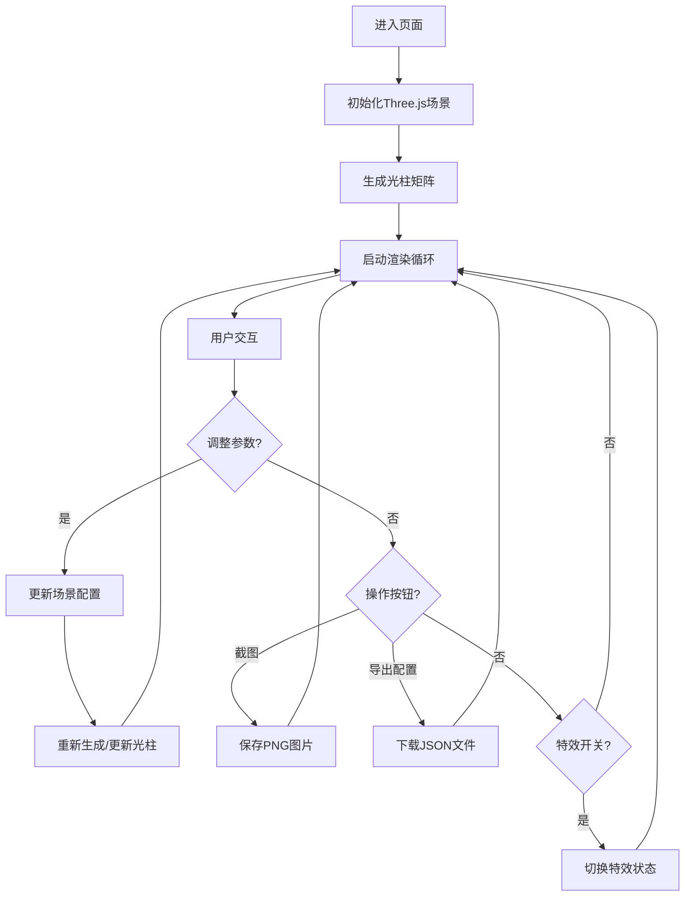

## 1. 产品概述

3D彩色光柱森林是一款基于Three.js的交互式视觉体验网页。场景中生成大量垂直向上的彩色半透明光柱，排列成矩形阵列，营造出梦幻般的光柱森林效果。用户可以自由穿梭其中，通过丰富的控制面板调节各种视觉参数，创造独特的光影体验。

- **核心目标**：提供沉浸式的3D视觉体验，支持高度可调节的交互式光柱森林
- **目标用户**：视觉艺术爱好者、3D交互体验用户、创意设计人员
- **核心价值**：沉浸式视觉享受，创意灵感来源，交互式艺术展示

## 2. 核心功能

### 2.1 功能模块

1. **3D光柱森林核心场景**：光柱矩阵、渐变色彩、亮度脉冲
2. **相机控制系统**：OrbitControls旋转缩放、自动环绕模式
3. **参数调节面板**：光柱数量、高度范围、粗细、脉冲速度滑块
4. **视觉效果系统**：颜色模式切换、背景切换、雾化效果
5. **镜面反射系统**：地面镜面反射、光柱倒影
6. **粒子特效系统**：飘浮粒子在光柱间飘动
7. **功能操作区**：一键截图、导出配置、显示当前光柱数量

### 2.2 页面详情

| 页面名称 | 模块名称 | 功能描述 |
|-----------|-------------|---------------------|
| 主场景 | 光柱森林 | 大量彩色半透明光柱垂直排列，高度随机，矩形阵列 |
| 主场景 | 相机控制 | 鼠标拖拽旋转、滚轮缩放、右键平移 |
| 控制面板 | 光柱参数 | 光柱数量滑块(100-2500)、高度范围滑块、粗细滑块 |
| 控制面板 | 动画参数 | 脉冲速度滑块、自动环绕开关 |
| 控制面板 | 视觉效果 | 颜色模式切换(彩虹/暖色系/冷色系) |
| 控制面板 | 背景切换 | 黑色/深蓝色/紫色 |
| 控制面板 | 特效开关 | 镜面反射开关、雾化效果开关、粒子效果开关 |
| 控制面板 | 操作按钮 | 一键截图PNG、导出JSON配置、显示光柱数量 |

## 3. 核心流程

## 4. 用户界面设计

### 4.1 设计风格

- **主色调**：深色系背景，配合彩虹渐变光柱色彩
- **光柱色彩模式**：
  - 彩虹随机色：全色相随机
  - 暖色系：红橙渐变
  - 冷色系：蓝绿渐变
- **背景色**：纯黑(#000000)、深蓝(#0a0a2e)、深紫(#1a0a2e)
- **控制面板**：半透明深色玻璃质感面板，圆角设计
- **滑块样式**：自定义轨道和拇指，发光高亮效果
- **按钮样式**：圆角胶囊按钮，悬停发光效果
- **字体**：使用 Google Fonts 的 'Orbitron'（数字显示）和 'Inter'（正文）
- **布局风格**：全屏3D场景 + 右侧固定控制面板，半透明浮动层叠
- **图标风格**：使用 lucide-react 图标库，线性简约风格

### 4.2 页面设计概述

| 页面名称 | 模块名称 | UI 元素 |
|-----------|-------------|----------|
| 主场景 | 3D画布 | 全屏Three.js渲染，占满整个视口 |
| 控制面板 | 标题栏 | 应用标题、版本信息 |
| 控制面板 | 滑块区域 | 标签+数值显示+滑块轨道 |
| 控制面板 | 切换按钮组 | 三态切换(彩虹/暖色/冷色) |
| 控制面板 | 功能开关 | 开关按钮，开启时发光 |
| 控制面板 | 操作按钮 | 图标+文字，主要操作突出显示 |
| 控制面板 | 信息显示 | 当前光柱数量实时显示 |
| 主场景 | 粒子系统 | 半透明光点，缓慢飘动 |
| 主场景 | 镜面地面 | 倒影效果，半透明地面 |

### 4.3 响应性

- **桌面优先**：1024px 以上为主要设计基准
- **平板适配**：768px - 1024px，控制面板可折叠
- **手机适配**：375px - 768px，控制面板改为底部抽屉式
- **触控优化**：滑块增大触控区域，支持触摸滑动
- **性能适配**：移动端自动降低光柱数量上限

### 4.4 3D场景设计

- **环境氛围**：深邃神秘的光柱森林，梦幻光影
- **光照设置**：环境光+辅助光，配合光柱自发光
- **相机设置**：PerspectiveCamera，初始位置(0, 8, 15)，看向原点
- **构图焦点**：光柱阵列中心，光柱高度错落有致
- **交互动画**：
  - 光柱亮度脉冲：正弦函数控制
  - 相机自动环绕：绕Y轴缓慢旋转
  - 粒子飘动：随机上下左右飘动
- **后期处理**：
  - 雾化效果：远处光柱逐渐隐没
  - 镜面反射：地面反射光柱
- **性能预算**：光柱数量上限2500，使用InstancedMesh优化性能
- **光柱材质**：ShaderMaterial自定义着色器，实现渐变和脉冲效果
