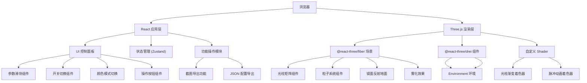
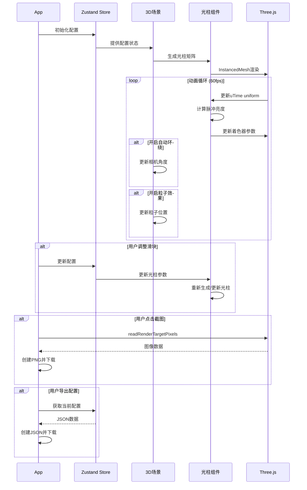

## 1. 架构设计



## 2. 技术选型

- **前端框架**：React@18 + TypeScript
- **构建工具**：Vite@5
- **样式方案**：TailwindCSS@3
- **状态管理**：Zustand
- **3D 引擎**：Three.js@0.160
- **React Three 生态**：
  - @react-three/fiber@8.15 (React 渲染器)
  - @react-three/drei@9.92 (常用组件库)
  - @react-three/postprocessing@2.15 (后期处理)
- **图标库**：lucide-react
- **字体**：Google Fonts (Orbitron, Inter)

## 3. 文件结构

```
src/
├── components/
│   ├── ControlPanel/          # 控制面板
│   │   ├── SliderItem.tsx     # 滑块组件
│   │   ├── ToggleItem.tsx     # 开关组件
│   │   ├── ColorModeSwitch.tsx # 颜色模式切换
│   │   ├── BackgroundSwitch.tsx # 背景切换
│   │   ├── ActionButtons.tsx  # 操作按钮
│   │   └── index.tsx          # 控制面板主组件
│   ├── Scene3D/
│   │   ├── LightBeams.tsx     # 光柱矩阵组件
│   │   ├── Particles.tsx      # 粒子系统组件
│   │   ├── MirrorGround.tsx   # 镜面地面组件
│   │   └── index.tsx          # 3D场景主组件
│   └── UI/
│       └── BeamCountBadge.tsx # 光柱数量显示
├── hooks/
│   ├── useLightBeamConfig.ts  # 光柱配置Hook
│   ├── useAutoRotate.ts       # 自动旋转Hook
│   └── useScreenshot.ts       # 截图Hook
├── store/
│   └── useSceneStore.ts       # Zustand状态管理
├── shaders/
│   ├── beamVertex.glsl        # 光柱顶点着色器
│   └── beamFragment.glsl      # 光柱片元着色器
├── types/
│   └── index.ts               # 类型定义
├── utils/
│   ├── colorUtils.ts          # 颜色工具函数
│   └── exportUtils.ts         # 导出工具函数
├── App.tsx                    # 主应用组件
├── main.tsx                   # 入口文件
└── index.css                  # 全局样式
```

## 4. 核心数据结构

### 4.1 场景配置状态

```typescript
interface SceneConfig {
  // 光柱参数
  beamCount: number;           // 光柱数量 100-2500
  beamMinHeight: number;       // 最小高度
  beamMaxHeight: number;       // 最大高度
  beamRadius: number;          // 光柱粗细
  pulseSpeed: number;          // 脉冲速度
  
  // 颜色设置
  colorMode: 'rainbow' | 'warm' | 'cool';  // 颜色模式
  backgroundColor: 'black' | 'darkblue' | 'purple';  // 背景色
  
  // 特效开关
  enableMirror: boolean;       // 镜面反射
  enableFog: boolean;          // 雾化效果
  enableParticles: boolean;    // 粒子效果
  autoRotate: boolean;         // 自动环绕
  
  // 布局参数
  gridSize: number;            // 网格大小（根据光柱数量计算）
  spacing: number;             // 光柱间距
}
```

### 4.2 光柱数据

```typescript
interface BeamData {
  id: number;
  x: number;                   // X坐标
  z: number;                   // Z坐标
  height: number;              // 高度
  color: THREE.Color;          // 基础颜色
  pulseOffset: number;         // 脉冲相位偏移
  pulseStrength: number;       // 脉冲强度
}
```

### 4.3 粒子数据

```typescript
interface ParticleData {
  id: number;
  position: THREE.Vector3;     // 位置
  velocity: THREE.Vector3;     // 速度
  size: number;                // 大小
  color: THREE.Color;          // 颜色
  opacity: number;             // 透明度
}
```

## 5. 核心模块接口

### 5.1 光柱矩阵组件

```typescript
interface LightBeamsProps {
  config: SceneConfig;
  beamData: BeamData[];
}

class LightBeams {
  constructor(props: LightBeamsProps);
  updateBeams(config: SceneConfig): void;  // 更新光柱参数
  updatePulse(time: number): void;          // 更新脉冲动画
}
```

### 5.2 自定义着色器

**顶点着色器 (beamVertex.glsl)**：
```glsl
varying vec3 vPosition;
varying float vHeightRatio;
uniform float uTime;
uniform float uPulseSpeed;
uniform float uPulseOffset;
uniform float uPulseStrength;

void main() {
  vPosition = position;
  vHeightRatio = (position.y + 1.0) / 2.0;  // 0-1从底部到顶部
  
  // 脉冲动画逻辑
  float pulse = sin(uTime * uPulseSpeed + uPulseOffset) * 0.5 + 0.5;
  vec3 pos = position;
  pos.y *= 1.0 + pulse * uPulseStrength * 0.1;
  
  gl_Position = projectionMatrix * modelViewMatrix * vec4(pos, 1.0);
}
```

**片元着色器 (beamFragment.glsl)**：
```glsl
varying vec3 vPosition;
varying float vHeightRatio;
uniform vec3 uBottomColor;
uniform vec3 uTopColor;
uniform float uTime;
uniform float uPulseSpeed;
uniform float uPulseOffset;
uniform float uPulseStrength;
uniform float uOpacity;

void main() {
  // 渐变颜色：底部亮色，顶部淡色
  vec3 color = mix(uBottomColor, uTopColor, vHeightRatio);
  
  // 亮度脉冲
  float pulse = sin(uTime * uPulseSpeed + uPulseOffset) * 0.5 + 0.5;
  float brightness = 0.6 + pulse * uPulseStrength * 0.4;
  color *= brightness;
  
  // 径向衰减（边缘透明）
  float dist = length(vPosition.xz);
  float alpha = (1.0 - dist) * uOpacity;
  alpha *= 0.7 + vHeightRatio * 0.3;  // 顶部稍透明
  
  gl_FragColor = vec4(color, alpha);
}
```

### 5.3 状态管理 Store

```typescript
interface SceneState {
  config: SceneConfig;
  beamData: BeamData[];
  actions: {
    setBeamCount: (count: number) => void;
    setHeightRange: (min: number, max: number) => void;
    setBeamRadius: (radius: number) => void;
    setPulseSpeed: (speed: number) => void;
    setColorMode: (mode: 'rainbow' | 'warm' | 'cool') => void;
    setBackgroundColor: (bg: 'black' | 'darkblue' | 'purple') => void;
    toggleMirror: () => void;
    toggleFog: () => void;
    toggleParticles: () => void;
    toggleAutoRotate: () => void;
    regenerateBeams: () => void;
    exportConfig: () => void;
    takeScreenshot: () => void;
  };
}
```

## 6. 核心渲染流程



## 7. 性能优化策略

1. **InstancedMesh**：使用实例化网格渲染大量光柱，减少Draw Call
2. **ShaderMaterial**：自定义着色器处理渐变和脉冲，在GPU上并行计算
3. **按需更新**：仅当参数变化时重新生成光柱数据，帧动画只更新uniform
4. **LOD策略**：根据设备性能动态调整光柱数量上限
5. **雾化裁剪**：开启雾化时自动剔除远处光柱的渲染
6. **粒子池**：使用粒子对象池，避免频繁创建销毁
