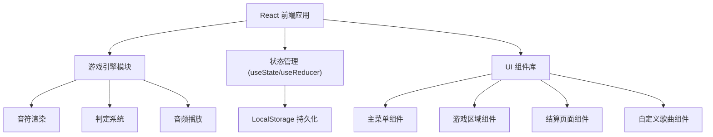

## 1. 架构设计



## 2. 技术描述

- **前端**：React@18 + TypeScript + tailwindcss@3 + vite
- **初始化工具**：vite-init
- **后端**：无（纯前端应用）
- **数据存储**：LocalStorage（存储最高分、自定义歌曲）
- **音频处理**：Web Audio API
- **游戏渲染**：Canvas API 或 CSS 动画

## 3. 路由定义

| Route | 目的 |
|-------|------|
| / | 主菜单 - 歌曲选择 |
| /play/:songId | 游戏页面 |
| /result | 结算页面 |
| /custom | 自定义歌曲编辑 |

## 4. 数据模型

### 4.1 类型定义

```typescript
// 方向类型
type Direction = 'up' | 'down' | 'left' | 'right';

// 判定等级
type JudgeResult = 'perfect' | 'good' | 'miss';

// 单个音符
interface Note {
  id: string;
  direction: Direction;
  time: number; // 毫秒
  hit?: JudgeResult;
}

// 歌曲数据
interface Song {
  id: string;
  name: string;
  bpm: number;
  duration: number;
  notes: Note[];
  audioUrl?: string;
  isCustom?: boolean;
}

// 游戏状态
interface GameState {
  score: number;
  combo: number;
  maxCombo: number;
  health: number;
  perfectCount: number;
  goodCount: number;
  missCount: number;
  isPlaying: boolean;
  isPaused: boolean;
}

// 最高分记录
interface HighScore {
  songId: string;
  score: number;
  grade: string;
  date: string;
}
```

### 4.2 本地存储结构

```typescript
// localStorage keys
const STORAGE_KEYS = {
  HIGH_SCORES: 'rhythm_game_high_scores',
  CUSTOM_SONGS: 'rhythm_game_custom_songs'
};
```

## 5. 核心模块设计

### 5.1 游戏引擎核心

```typescript
// 游戏循环
class GameEngine {
  constructor(song: Song, canvas: HTMLCanvasElement);
  start(): void;
  pause(): void;
  resume(): void;
  stop(): void;
  onNoteHit(direction: Direction): JudgeResult | null;
  onUpdate(callback: (state: GameState) => void): void;
  onEnd(callback: () => void): void;
}
```

### 5.2 判定系统

```typescript
// 判定时间窗口（毫秒）
const JUDGE_WINDOWS = {
  perfect: 50,  // ±50ms
  good: 120     // ±120ms
};

// 分数配置
const SCORE_CONFIG = {
  perfect: 100,
  good: 50,
  miss: 0,
  comboBonus: 10
};

// 血量配置
const HEALTH_CONFIG = {
  max: 100,
  missDamage: 15,
  goodHeal: 2,
  perfectHeal: 5
};
```

### 5.3 评级系统

```typescript
// 根据准确率评级
function getGrade(accuracy: number): string {
  if (accuracy >= 95) return 'S';
  if (accuracy >= 90) return 'A';
  if (accuracy >= 80) return 'B';
  if (accuracy >= 70) return 'C';
  if (accuracy >= 60) return 'D';
  return 'F';
}
```

## 6. 组件树结构

```
App
├── Router (React Router)
├── MainMenu
│   ├── SongList
│   └── SongCard
├── GamePage
│   ├── GameCanvas
│   ├── HUD
│   │   ├── ScoreDisplay
│   │   ├── ComboDisplay
│   │   ├── HealthBar
│   │   └── JudgeFeedback
│   └── PauseMenu
├── ResultPage
│   ├── ScoreBoard
│   ├── GradeDisplay
│   └── ActionButtons
└── CustomSongEditor
    ├── AudioUploader
    ├── TimelineEditor
    └── PreviewPlayer
```
