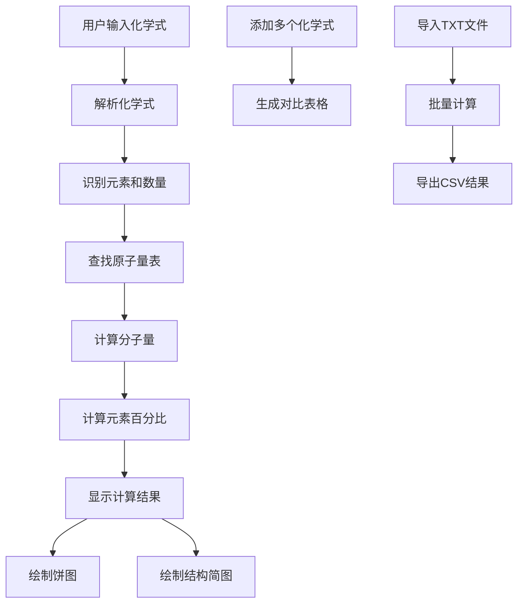

## 1. 产品概述

化学分子式质量计算器是一款面向学生、教师和化学工作者的专业工具，用于快速计算化学式的分子量、元素组成百分比，并提供可视化展示。解决了手动计算分子量繁琐易错的问题，提高化学学习和研究的效率。

## 2. 核心功能

### 2.1 功能模块

1. **首页**：化学式输入区域、实时计算结果、元素组成饼图、分子结构简图
2. **对比表格**：多个化学式的分子量对比展示
3. **批量处理**：TXT文件导入、CSV结果导出

### 2.3 页面详情

| 页面名称 | 模块名称 | 功能描述 |
|-----------|-------------|---------------------|
| 首页 | 化学式输入 | 支持输入如H2O、C6H12O6、Fe(OH)3、CuSO4·5H2O等化学式 |
| 首页 | 实时计算 | 自动解析化学式，计算分子量和元素百分比 |
| 首页 | 元素饼图 | 使用Chart.js展示各元素质量百分比分布 |
| 首页 | 结构简图 | 使用Canvas绘制简单有机分子的原子连接结构 |
| 对比表格 | 多化学式对比 | 表格形式展示多个化学式的分子量对比 |
| 批量处理 | 文件导入 | 导入每行一个化学式的TXT文件进行批量计算 |
| 批量处理 | 结果导出 | 将批量计算结果导出为CSV文件 |

## 3. 核心流程

用户在输入框中输入化学式，系统实时解析化学式（识别元素符号、处理括号嵌套、解析水合物点号），查找预定义的元素原子量表，计算分子量和各元素质量百分比，同时绘制饼图和结构简图。用户可添加多个化学式进行对比，或通过文件导入进行批量计算，最后导出结果。

## 4. 用户界面设计

### 4.1 设计风格

- **主色调**：深蓝色 (#1e3a5f) 代表科学严谨
- **辅助色**：青色 (#22d3ee) 作为强调色
- **按钮风格**：圆润边角，微立体效果
- **字体**：标题使用 'Playfair Display'，正文使用 'Inter'
- **布局风格**：卡片式布局，顶部导航栏
- **图标风格**：简洁线性图标，配合化学相关的emoji

### 4.2 页面设计概述

| 页面名称 | 模块名称 | UI 元素 |
|-----------|-------------|-------------|
| 首页 | 输入区域 | 大号输入框，实时计算按钮，清晰的提示文字 |
| 首页 | 结果展示 | 卡片式布局，大字显示分子量，元素列表 |
| 首页 | 饼图区域 | 居中展示，带图例说明，悬停显示详情 |
| 首页 | 结构简图 | Canvas绘制区域，简洁的原子节点和连接线 |
| 对比表格 | 表格区域 | 条纹表格，支持排序，高亮显示 |
| 批量处理 | 文件区域 | 拖拽上传区域，下载按钮，进度指示 |

### 4.3 响应式

桌面端优先设计，使用Tailwind CSS响应式布局。移动端适配单列布局，饼图和结构简图自适应屏幕宽度，触摸区域优化。

### 4.4 交互动效

- 输入框聚焦时边框发光效果
- 计算结果数字滚动动画
- 饼图加载时的扇形展开动画
- 卡片悬浮时的轻微上浮和阴影加深
- 页面加载时元素的淡入和滑动动画
