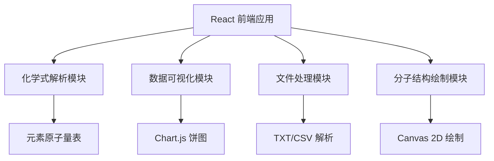

## 1. 架构设计



## 2. 技术描述

- **前端框架**: React@18 + TypeScript + Vite
- **样式方案**: TailwindCSS@3
- **图表库**: Chart.js + react-chartjs-2
- **初始化工具**: Vite
- **后端**: 无（纯前端应用）
- **数据库**: 无（本地状态管理）

## 3. 项目结构

```
src/
├── components/
│   ├── FormulaInput.tsx       # 化学式输入组件
│   ├── ResultDisplay.tsx      # 计算结果展示
│   ├── PieChart.tsx         # 元素百分比饼图
│   ├── CompareTable.tsx        # 多化学式对比表格
│   ├── MoleculeStructure.tsx # 分子结构简图
│   └── FileHandler.tsx        # 文件导入导出
├── utils/
│   ├── formulaParser.ts      # 化学式解析算法
│   ├── elements.ts         # 元素原子量表
│   └── fileUtils.ts        # 文件处理工具
├── types/
│   └── index.ts          # 类型定义
├── App.tsx
├── main.tsx
└── index.css
```

## 4. 核心数据类型

```typescript
// 元素信息
interface Element {
  symbol: string;
  name: string;
  atomicWeight: number;
}

// 解析结果
interface ParsedElement {
  symbol: string;
  count: number;
  weight: number;
  percentage: number;
}

interface CalculationResult {
  formula: string;
  molecularWeight: number;
  elements: ParsedElement[];
  isValid: boolean;
  error?: string;
}
```

## 5. 化学式解析算法设计

### 5.1 解析流程

1. **水合物处理**: 按 `·` 或 `.` 分割水合物部分
2. **括号处理**: 使用栈结构处理嵌套括号
3. **元素识别**: 正则表达式匹配元素符号（大写字母开头，可选小写字母）
4. **数量解析**: 识别元素后的数字作为数量
5. **权重计算**: 累加各元素总质量

### 5.2 关键算法

```typescript
// 元素符号正则: /[A-Z][a-z]?\d*
// 括号匹配: 使用栈保存当前系数
```

## 6. 分子结构绘制规则

- 仅处理常见有机分子（CH4, C2H5OH, C6H6等）
- 使用Canvas 2D API绘制
- 碳原子为中心节点，氢原子连接在周围
- 使用简单的圆形节点和直线连接
