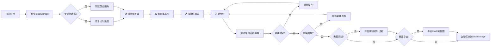

## 1. 产品概述

对称画板是一款创意绘图工具，用户在画布一侧绘制，另一侧自动生成对称图案，支持水平、垂直、中心三种对称模式。面向艺术家、设计师和创意爱好者，提供高效的对称图案创作体验。

## 2. 核心 Features

### 2.1 功能模块

1. **主画布区域**：核心绘制区域，实时显示对称效果
2. **工具栏**：画笔、直线、矩形、圆形、吸色、撤销、重做
3. **属性面板**：颜色选择、粗细调节、透明度控制
4. **对称模式切换**：水平对称、垂直对称、中心对称
5. **图层面板**：多图层管理，独立开关对称效果
6. **背景设置**：网格背景或纯色背景
7. **录制控制**：动画录制、回放、导出
8. **导出功能**：PNG导出、对称前后对比图导出
9. **存储管理**：localStorage保存/加载绘制进度

### 2.2 页面详情

| 页面名称 | 模块名称 | Feature描述 |
|---------|---------|------------|
| 主页面 | 画布区域 | 支持鼠标和触摸绘制，实时显示对称效果 |
| 主页面 | 工具栏 | 画笔、直线、矩形、圆形、吸色、撤销、重做、清空 |
| 主页面 | 对称模式切换 | 水平/垂直/中心三种模式实时切换 |
| 主页面 | 画笔属性 | 颜色选择器、粗细滑块、透明度滑块 |
| 主页面 | 图层面板 | 新建/删除/排序图层，独立开关对称，显示/隐藏图层 |
| 主页面 | 背景设置 | 网格大小/颜色设置，纯色背景选择 |
| 主页面 | 录制面板 | 开始/停止录制，回放录制内容 |
| 主页面 | 底图导入 | 导入外部图片作为底图，可调节透明度 |
| 主页面 | 导出按钮 | 导出PNG，导出对称前后对比图 |

## 3. 核心流程

## 4. 用户界面设计

### 4.1 设计风格

- **主色调**：深蓝紫色系 (#6366f1, #8b5cf6) 作为主色，搭配深灰背景 (#1e1b4b)
- **辅助色**：洋红 (#ec4899)、青色 (#06b6d4) 作为功能高亮
- **按钮风格**：圆角胶囊形，渐变边框，hover时有发光效果
- **字体**：展示字体使用 'Space Mono'，正文字体使用 'Inter'
- **布局风格**：左右分栏布局，左侧工具栏，中间画布，右侧图层面板
- **整体风格**：深色科技感，霓虹发光效果，流畅动画过渡

### 4.2 页面设计概述

| 页面名称 | 模块名称 | UI Elements |
|---------|---------|------------|
| 主页面 | 工具栏 | 垂直排列图标按钮，选中状态有发光边框，tooltip提示 |
| 主页面 | 画布区域 | 居中显示，带阴影，边框渐变，鼠标跟随十字准星 |
| 主页面 | 对称指示器 | 画布中心显示对称轴/对称点，半透明虚线 |
| 主页面 | 属性面板 | 滑块带有渐变轨道，颜色选择器支持历史颜色 |
| 主页面 | 图层面板 | 卡片式设计，拖拽排序，开关带平滑过渡动画 |
| 主页面 | 录制状态 | 右上角红点闪烁，录制时长计时显示 |

### 4.3 响应式设计

- **桌面端**：左右三栏布局，画布居中最大化
- **平板端**：工具栏可折叠，图层面板改为底部抽屉
- **移动端**：单栏布局，工具栏改为底部浮动条，支持手势操作
- **触摸屏**：支持多指触控，双指缩放画布，防止误触优化

### 4.4 交互与动画

- 绘制时对称图案同步生成，带轻微拖尾效果
- 工具切换时有缩放过渡动画
- 滑块调节时实时预览效果
- 录制按钮脉冲动画
- 导出成功时有缩放确认动画
- 页面加载元素依次淡入
