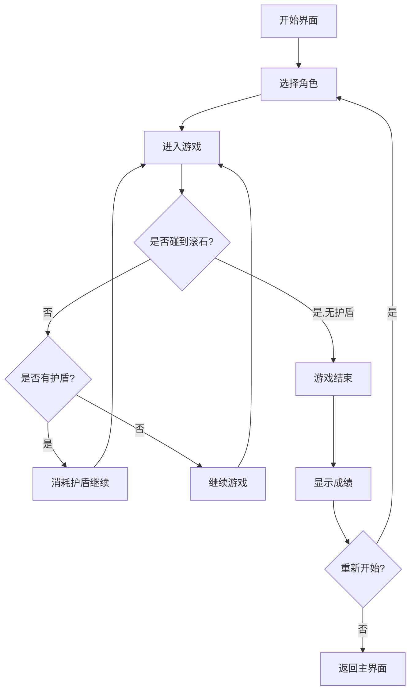

## 1. 产品概述

躲避滚石是一款基于 HTML5 Canvas 的横版无尽跑酷游戏。玩家控制角色在多地形场景中躲避从右侧滚来的巨石，收集金币获取高分，利用道具增强生存能力。游戏节奏随得分递增，考验反应力和策略选择。

- 目标用户：休闲游戏玩家、手机端用户
- 核心价值：简单上手、难于精通的无尽挑战体验

## 2. 核心功能

### 2.1 游戏主页面
1. **游戏画布**：Canvas 渲染区域，包含地面、角色、滚石、金币、道具
2. **HUD 界面**：当前得分、最高分、已跑距离（米）、当前地形指示
3. **角色选择界面**：选择工人/矿工/冒险家，各有不同跳跃高度
4. **游戏结束弹窗**：显示本局得分、最高分、已跑距离，重新开始按钮

### 2.2 页面详情

| 页面 | 模块 | 功能描述 |
|------|------|----------|
| 游戏主页面 | 游戏画布 | Canvas 渲染所有游戏元素，实时刷新 |
| 游戏主页面 | HUD 界面 | 左上角显示得分/最高分，右上角显示距离/地形 |
| 游戏主页面 | 角色选择 | 游戏开始前的角色选择面板 |
| 游戏主页面 | 游戏结束弹窗 | 碰撞后弹出，显示成绩和重试按钮 |
| 游戏主页面 | 触摸控制区 | 移动端左侧跳跃、右侧左右移动 |

### 2.3 核心玩法机制

| 机制 | 描述 |
|------|------|
| 移动 | 左右方向键控制角色水平移动 |
| 跳跃 | 上方向键跳跃躲避滚石 |
| 滚石 | 从右侧随机生成，大小随机，向左滚动 |
| 速度递增 | 得分越高，滚石速度越快 |
| 地形系统 | 沙地（正常）、冰面（移动惯性大，滑动明显） |
| 金币 | 空中随机出现，吃到加 10 分 |
| 护盾道具 | 偶尔出现，抵挡一次滚石碰撞 |
| 磁铁道具 | 偶尔出现，自动吸引附近金币 |
| 角色差异 | 工人（跳跃中等）、矿工（跳跃最低但碰撞体小）、冒险家（跳跃最高） |
| 无尽模式 | 无终点，坚持越久得分越高 |
| 距离统计 | 实时显示已跑距离（米） |
| 音效 | 跳跃、吃金币、游戏结束各有不同音效（Web Audio API 合成） |

## 3. 核心流程

玩家进入游戏 → 选择角色 → 开始游戏 → 角色自动跑动（场景滚动）→ 躲避滚石/收集金币/拾取道具 → 碰撞后游戏结束 → 显示成绩 → 重新开始或切换角色

## 4. 界面设计

### 4.1 设计风格
- 主色调：暖色沙漠金（#D4A843）搭配深棕（#3E2723）
- 辅助色：冰蓝色（#81D4FA）用于冰面地形
- 按钮风格：圆角按钮，带立体阴影效果
- 字体：像素风格字体（Press Start 2P）用于标题，系统字体用于 UI
- 布局：全屏 Canvas 居中，HUD 叠加在 Canvas 上方
- 图标/表情：简约像素风角色和道具

### 4.2 页面设计概览

| 页面 | 模块 | UI 元素 |
|------|------|---------|
| 游戏主页面 | 游戏画布 | 全屏 Canvas，像素风背景，角色动画 |
| 游戏主页面 | HUD | 半透明背景，白色文字，得分/最高分/距离/地形 |
| 游戏主页面 | 角色选择 | 三个角色卡片，像素风角色图标，选中高亮 |
| 游戏主页面 | 游戏结束弹窗 | 暗色半透明遮罩，居中卡片显示成绩 |
| 游戏主页面 | 触摸区域 | 左半屏跳跃（半透明上箭头），右半屏左右移动 |

### 4.3 响应式设计
- 桌面优先，Canvas 自适应窗口大小
- 移动端触摸控制：左半屏点击跳跃，右半屏左右滑动移动
- 触摸按钮半透明显示，不影响视觉

### 4.4 音效设计
- 跳跃：短促上升音调
- 金币：叮咚声
- 护盾：金属碰撞声
- 磁铁：嗡嗡吸引声
- 游戏结束：低沉坠落声
- 全部使用 Web Audio API 合成，无需外部音频文件
