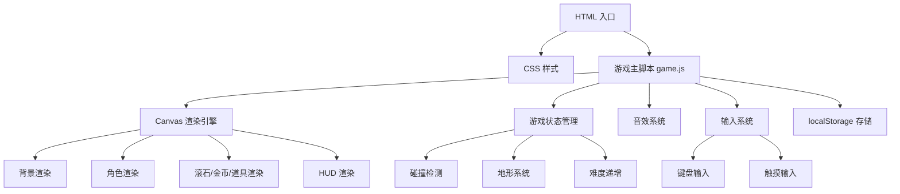

## 1. 架构设计

## 2. 技术说明

- 前端：HTML5 + CSS3 + 原生 JavaScript（ES6+）
- 渲染：Canvas 2D API
- 音效：Web Audio API（程序化合成，无外部音频文件）
- 存储：localStorage（最高分持久化）
- 部署：单文件 HTML，无需构建工具和服务器
- 初始化：直接打开 HTML 文件即可运行

## 3. 文件结构

| 文件 | 用途 |
|------|------|
| index.html | 游戏入口，包含所有 HTML/CSS/JS |

整个游戏打包在一个 HTML 文件中，CSS 通过 `<style>` 标签内联，JS 通过 `<script>` 标签内联。无需外部依赖和构建步骤。

## 4. 核心模块设计

### 4.1 游戏循环
- 使用 `requestAnimationFrame` 实现 60fps 游戏循环
- 每帧：更新状态 → 碰撞检测 → 渲染画面

### 4.2 角色系统

| 角色 | 跳跃高度 | 碰撞体积 | 特点 |
|------|----------|----------|------|
| 工人 | 中等（120px） | 中等 | 均衡型 |
| 矿工 | 较低（90px） | 较小 | 灵活型，不易被击中 |
| 冒险家 | 最高（150px） | 中等 | 跳跃型，轻松越过高滚石 |

### 4.3 地形系统

| 地形 | 摩擦系数 | 视觉效果 |
|------|----------|----------|
| 沙地 | 0.85（正常） | 黄褐色地面，沙粒纹理 |
| 冰面 | 0.97（高惯性） | 浅蓝色地面，光滑反光效果 |

地形每隔 15-25 秒随机切换，有过渡动画。

### 4.4 滚石系统
- 大小随机：半径 20-60px
- 速度随得分增加：基础 3px/帧 + 得分 × 0.02
- 生成间隔随得分缩短：基础 90 帧 - 得分 × 0.3（最小 30 帧）
- 滚石旋转动画

### 4.5 道具系统

| 道具 | 出现概率 | 持续时间 | 效果 |
|------|----------|----------|------|
| 护盾 | 5% | 碰撞消耗 | 抵挡一次滚石撞击 |
| 磁铁 | 3% | 5 秒 | 自动吸引半径 200px 内金币 |

### 4.6 金币系统
- 空中随机高度出现
- 每个 +10 分
- 磁铁效果下自动飞向角色
- 旋转闪烁动画

### 4.7 碰撞检测
- 使用圆形碰撞检测（滚石）和矩形碰撞检测（角色）
- 精确像素级碰撞容差，手感友好

### 4.8 音效系统（Web Audio API 合成）
- 创建 AudioContext
- 使用 OscillatorNode 生成不同波形
- 跳跃：440Hz → 880Hz 快速上升
- 金币：1047Hz 短促正弦波
- 护盾：220Hz 方波
- 磁铁：330Hz 三角波持续音
- 游戏结束：440Hz → 110Hz 下降

### 4.9 输入系统

| 输入方式 | 操作 |
|----------|------|
| ← → 方向键 | 左右移动 |
| ↑ 方向键 / 空格 | 跳跃 |
| 触摸左半屏 | 跳跃 |
| 触摸右半屏左部 | 向左移动 |
| 触摸右半屏右部 | 向右移动 |

### 4.10 数据持久化
- localStorage key: `dodgeBoulderHighScore`
- 存储最高分整数
- 每次游戏结束时对比更新
