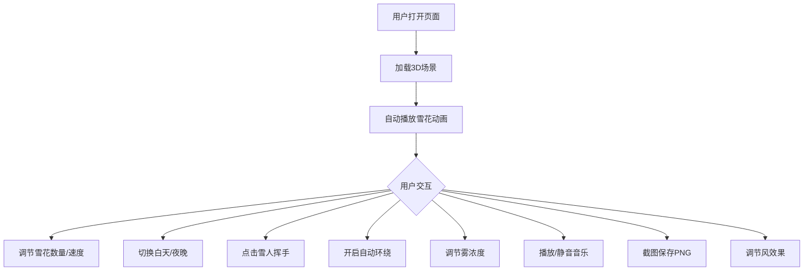

## 1. 产品概述

基于 Three.js 的 3D 下雪村庄互动场景，用户可以在浏览器中沉浸式体验一个被白雪覆盖的圣诞村庄。场景包含带雪顶的小房子、圣诞树和雪人，雪花粒子从天空飘落，支持白天/夜晚切换、相机环绕飞行、背景音乐播放、雪人挥手动画等丰富交互功能。

- 目标用户：喜欢圣诞氛围、3D 互动体验的网页访客
- 核心价值：通过高质量 3D 渲染和丰富交互，营造沉浸式圣诞村庄氛围

## 2. 核心功能

### 2.1 功能模块

1. **3D 场景页**：村庄全景、雪花飘落、白天/夜晚切换、相机控制、音乐播放、截图保存

### 2.2 页面详情

| 页面名称 | 模块名称 | 功能描述 |
|----------|----------|----------|
| 3D 场景页 | 村庄场景 | 几座带雪顶的小房子、几棵圣诞树、一个雪人、雪地地面 |
| 3D 场景页 | 雪花粒子系统 | 雪花从天空飘落，到达地面消失；支持调节数量（100-2000）和下落速度；偶尔闪烁效果；风效果偏移 |
| 3D 场景页 | 白天/夜晚切换 | 夜晚模式下房子窗户亮起黄色灯光，雪人围巾颜色变亮 |
| 3D 场景页 | 相机控制 | 鼠标拖拽绕 Y 轴旋转观察全景；支持自动环绕飞行模式 |
| 3D 场景页 | 雪人交互 | 点击雪人触发挥手动画 |
| 3D 场景页 | 背景音乐 | 圣诞节风格音乐，可静音/取消静音 |
| 3D 场景页 | 雾浓度调节 | 调节场景雾的浓度，模拟风雪感 |
| 3D 场景页 | 截图功能 | 一键截图保存当前场景为 PNG |
| 3D 场景页 | FPS 显示 | 实时显示帧率 |
| 3D 场景页 | 风效果 | 雪花飘落时略微向左或向右偏移 |
| 3D 场景页 | 控制面板 | 所有参数调节的统一 UI 面板 |

## 3. 核心流程

用户打开页面 → 加载 3D 场景 → 自动播放雪花飘落动画 → 用户通过控制面板调节参数 → 可切换白天/夜晚 → 可点击雪人触发动画 → 可开启自动环绕飞行 → 可截图保存

## 4. 用户界面设计

### 4.1 设计风格

- 主色调：冰蓝色 (#B0E0E6) + 暖黄色 (#FFD700) 为辅助色（夜晚灯光）
- 控制面板：半透明深色玻璃拟态风格，圆角卡片
- 字体：标题使用 Playfair Display，正文使用 Nunito
- 布局：3D 场景全屏，左下角控制面板可折叠
- 图标：lucide-react 图标库

### 4.2 页面设计概述

| 页面名称 | 模块名称 | UI 元素 |
|----------|----------|---------|
| 3D 场景页 | 3D画布 | 全屏 Canvas，占满视口 |
| 3D 场景页 | 控制面板 | 半透明深色面板，包含滑块、开关、按钮 |
| 3D 场景页 | FPS显示 | 右上角小标签 |
| 3D 场景页 | 音乐按钮 | 底部中央圆形按钮 |

### 4.3 响应式

- 桌面优先设计，3D 场景自适应窗口大小
- 控制面板在移动端可折叠为图标按钮

### 4.4 3D 场景指引

- 环境氛围：冬季雪景，白天为冷色调天光，夜晚为深蓝星空
- 光照设置：白天使用 DirectionalLight + AmbientLight；夜晚降低环境光，增加 PointLight 模拟窗户灯光
- 相机：PerspectiveCamera，初始俯视角度约 45°，支持 OrbitControls 旋转
- 构图焦点：村庄中心为雪人，周围环绕房子和圣诞树
- 交互：点击雪人触发动画，拖拽旋转相机
- 后处理效果：雾效（Fog）模拟风雪感
- 性能预算：保持 60fps，粒子数量上限 2000
