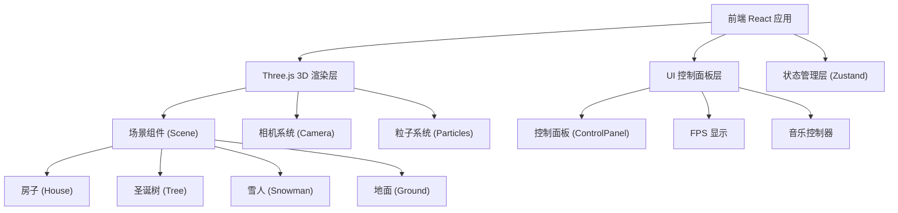

## 1. 架构设计



## 2. 技术说明

- 前端框架：React 18 + TypeScript + Vite
- 3D 渲染：Three.js + @react-three/fiber + @react-three/drei
- 样式：Tailwind CSS 3
- 状态管理：Zustand
- 初始化工具：vite-init（react-ts 模板）
- 后端：无
- 数据库：无

## 3. 路由定义

| 路由 | 用途 |
|------|------|
| / | 主场景页面，包含 3D 村庄场景和控制面板 |

## 4. 核心组件结构

```
src/
├── components/
│   ├── Scene.tsx          # 主3D场景容器
│   ├── House.tsx          # 带雪顶的房子
│   ├── ChristmasTree.tsx  # 圣诞树
│   ├── Snowman.tsx        # 雪人（含挥手动画）
│   ├── Ground.tsx         # 雪地地面
│   ├── SnowParticles.tsx  # 雪花粒子系统
│   ├── CameraController.tsx # 相机控制与自动环绕
│   ├── Lighting.tsx       # 灯光系统（白天/夜晚）
│   ├── ControlPanel.tsx   # 控制面板UI
│   ├── FPSDisplay.tsx     # FPS显示
│   └── MusicPlayer.tsx    # 背景音乐控制
├── store/
│   └── useStore.ts        # Zustand全局状态
├── App.tsx                # 根组件
└── main.tsx               # 入口文件
```

## 5. 状态管理设计

```typescript
interface StoreState {
  snowflakeCount: number;       // 100-2000
  snowfallSpeed: number;        // 下落速度
  isNight: boolean;             // 白天/夜晚
  fogDensity: number;           // 雾浓度
  windStrength: number;         // 风强度（负值向左，正值向右）
  isAutoOrbit: boolean;         // 自动环绕飞行
  isMusicMuted: boolean;        // 音乐静音
  snowmanWaving: boolean;       // 雪人挥手状态
}
```

## 6. 关键技术方案

### 6.1 雪花粒子系统
- 使用 `THREE.Points` + `BufferGeometry` 实现高性能粒子渲染
- 每个粒子存储位置(x,y,z)、速度、闪烁状态
- 在 `useFrame` 中更新粒子位置，到达 y=0 时重置到顶部
- 闪烁效果：随机选取部分粒子，周期性改变 opacity/size

### 6.2 白天/夜晚切换
- 切换 AmbientLight 和 DirectionalLight 的强度和颜色
- 夜晚模式：在窗户位置添加 PointLight（黄色），更改窗户材质为 emissive
- 雪人围巾材质颜色在夜晚模式下变亮

### 6.3 雪人挥手动画
- 雪人手臂使用单独 Group，设置 pivot 点在肩膀位置
- 点击时通过 `useFrame` 驱动旋转动画（正弦波往复运动）
- 使用 Raycaster 检测点击

### 6.4 相机自动环绕
- 基于 OrbitControls，在自动模式下持续更新 azimuthal angle
- 手动拖拽时暂停自动环绕

### 6.5 截图功能
- 渲染器设置 `preserveDrawingBuffer: true`
- 使用 `canvas.toDataURL('image/png')` 获取图片数据
- 创建临时 `<a>` 标签触发下载

### 6.6 雾效
- 使用 `THREE.FogExp2`，通过调节 density 参数控制浓度

### 6.7 风效果
- 在粒子更新逻辑中，根据 windStrength 给 x 坐标添加偏移量
- 风强度可正可负，控制方向

### 6.8 背景音乐
- 使用 HTML5 Audio API 播放音频
- 音频文件使用免费圣诞风格 BGM
- 通过 Zustand 状态控制静音/取消静音
