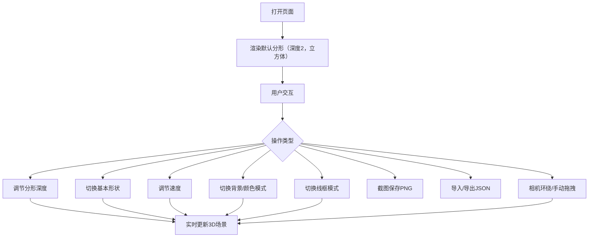

## 1. 产品概述

分形万花筒是一个基于 Three.js 的交互式 3D 可视化应用，展示由分形规则组合的抽象万花筒效果。用户可实时调节分形深度、形状类型、旋转速度等参数，创造独特的分形艺术，并支持截图保存和参数导入导出。

- 目标用户：3D艺术爱好者、创意开发者、数学可视化研究者
- 核心价值：通过交互式参数调节，让用户轻松创造和探索令人震撼的分形几何艺术

## 2. 核心功能

### 2.1 功能模块

1. **3D 分形场景页面**：分形几何体渲染、参数控制面板、交互操作

### 2.2 页面详情

| 页面名称 | 模块名称 | 功能描述 |
|----------|----------|----------|
| 分形万花筒主页 | 3D 画布 | 渲染中心旋转缩放的分形几何体，支持鼠标拖拽和缩放 |
| 分形万花筒主页 | 分形深度控制 | 滑块调节分形深度（1-5级），实时更新几何体复杂度 |
| 分形万花筒主页 | 基本形状切换 | 切换四面体、立方体、二十面体作为基本形状 |
| 分形万花筒主页 | 速度控制 | 调节旋转速度和缩放速度 |
| 分形万花筒主页 | 背景切换 | 黑色、深蓝色、彩色渐变三种背景模式 |
| 分形万花筒主页 | 颜色模式 | 渐变（随深度变化）、随机鲜艳颜色、单色系三种模式 |
| 分形万花筒主页 | 线框模式 | 开启/关闭边缘线框，切换实体与线框显示 |
| 分形万花筒主页 | 截图保存 | 一键截图保存当前分形形态为 PNG |
| 分形万花筒主页 | 相机控制 | 自动环绕模式 + 手动拖拽模式切换 |
| 分形万花筒主页 | 导入导出 | 导出当前参数为 JSON / 导入 JSON 恢复参数 |
| 分形万花筒主页 | 统计信息 | 实时显示当前分形的顶点数和面数 |

## 3. 核心流程

用户打开页面 → 看到默认分形万花筒效果 → 通过控制面板调节参数 → 实时预览变化 → 截图保存 / 导出参数

## 4. 用户界面设计

### 4.1 设计风格

- 主色调：深色系背景 + 霓虹色分形几何体（赛博朋克风格）
- 辅助色：紫红色（#FF006E）、青色（#00F5D4）、琥珀色（#F5A623）
- 控制面板：半透明毛玻璃效果，悬浮于3D画布右侧
- 字体：使用 Orbitron 作为展示字体（科技感），Source Sans 3 作为UI字体
- 布局：全屏3D画布 + 右侧浮动控制面板
- 按钮风格：圆角胶囊按钮，带有微妙的发光效果

### 4.2 页面设计概览

| 页面名称 | 模块名称 | UI元素 |
|----------|----------|--------|
| 分形万花筒主页 | 3D画布 | 全屏深色背景，中心分形几何体，占满视窗 |
| 分形万花筒主页 | 控制面板 | 右侧浮动半透明面板，毛玻璃背景，分组折叠控件 |
| 分形万花筒主页 | 统计信息 | 控制面板底部，小号等宽字体显示顶点/面数 |
| 分形万花筒主页 | 截图按钮 | 面板顶部工具栏，图标按钮带提示 |

### 4.3 响应式设计

- 桌面优先设计，3D画布全屏
- 控制面板在窄屏时可折叠收起
- 触屏支持：拖拽旋转、双指缩放

### 4.4 3D场景指导

- 环境：无HDRI，纯色/渐变背景，营造深空感
- 灯光：环境光 + 多点光源，突出分形层次
- 相机：透视相机，自动环绕轨道 + 手动控制
- 焦点元素：中心分形几何体，不断旋转缩放
- 交互：OrbitControls手动拖拽 + 自动环绕切换
- 后处理：可选Bloom效果增强发光感
- 性能预算：深度5级时顶点数可能超10万，需要LOD或实例化渲染优化

## 5. 分形几何规则

### 5.1 分形构建算法

以基本形状为根节点，在每个面的中心位置放置一个缩小的副本，递归进行：

1. **深度1**：仅渲染1个基本形状
2. **深度2**：在深度1的每个面上放置缩小0.4倍的基本形状
3. **深度N**：在深度N-1的每个面上放置缩小0.4^N倍的基本形状

### 5.2 缩放因子

- 四面体：每个面0.35倍缩放
- 立方体：每个面0.35倍缩放
- 二十面体：每个面0.3倍缩放

### 5.3 数量限制

为防止深度5时几何体数量爆炸，每个层级最多放置在6个面上（取法线方向最分散的6个面），并在总实例数超过10000时停止递归。
