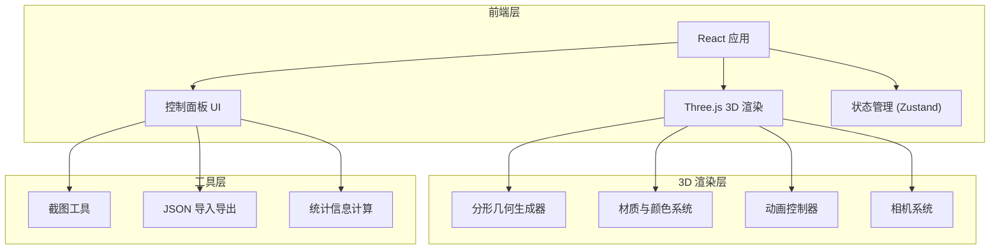

## 1. 架构设计



纯前端应用，无后端服务。所有计算在浏览器端完成。

## 2. 技术选型

- **前端框架**: React 18 + TypeScript
- **3D 引擎**: Three.js + @react-three/fiber + @react-three/drei
- **后处理**: @react-three/postprocessing（Bloom效果）
- **样式**: Tailwind CSS
- **构建工具**: Vite
- **状态管理**: Zustand
- **图标**: lucide-react

## 3. 路由定义

| 路由 | 用途 |
|------|------|
| / | 分形万花筒主页（唯一页面） |

## 4. 项目结构

```
src/
├── components/
│   ├── FractalScene.tsx       # 3D场景主组件
│   ├── FractalGeometry.tsx    # 分形几何体生成与渲染
│   ├── ControlPanel.tsx       # 控制面板主容器
│   ├── DepthSlider.tsx        # 分形深度滑块
│   ├── ShapeSelector.tsx      # 形状选择器
│   ├── SpeedControls.tsx      # 速度控制
│   ├── BackgroundSelector.tsx # 背景切换
│   ├── ColorModeSelector.tsx  # 颜色模式选择
│   ├── WireframeToggle.tsx    # 线框模式切换
│   ├── CameraControls.tsx     # 相机控制
│   ├── StatsDisplay.tsx       # 统计信息显示
│   └── Toolbar.tsx            # 工具栏（截图、导入导出）
├── hooks/
│   └── useFractalGeometry.ts  # 分形几何生成逻辑Hook
├── store/
│   └── fractalStore.ts        # Zustand状态管理
├── utils/
│   ├── fractalGenerator.ts    # 分形递归生成算法
│   ├── screenshot.ts          # 截图工具函数
│   └── jsonIO.ts              # JSON导入导出
├── types/
│   └── index.ts               # TypeScript类型定义
├── App.tsx
└── main.tsx
```

## 5. 核心数据模型

### 5.1 分形参数状态

```typescript
interface FractalParams {
  depth: number;              // 分形深度 1-5
  shapeType: 'tetrahedron' | 'cube' | 'icosahedron';
  rotationSpeed: number;      // 旋转速度 0-2
  scaleSpeed: number;         // 缩放速度 0-2
  backgroundMode: 'black' | 'darkBlue' | 'gradient';
  colorMode: 'gradient' | 'random' | 'monochrome';
  wireframe: boolean;         // 是否显示线框
  autoOrbit: boolean;         // 相机自动环绕
}
```

### 5.2 分形实例数据

```typescript
interface FractalInstance {
  position: [number, number, number];
  rotation: [number, number, number];
  scale: number;
  depth: number;
  faceIndex: number;
}
```

## 6. 性能优化策略

1. **InstancedMesh**: 使用 Three.js 的 InstancedMesh 渲染大量相同几何体，减少 draw call
2. **递归裁剪**: 总实例数超过 10000 时停止递归
3. **面数限制**: 每层最多选取 6 个面放置子几何体
4. **按需重建**: 参数变化时才重新生成分形数据，使用 useMemo 缓存
5. **Bloom 后处理**: 可选开启，深度 ≥ 4 时提示可能影响性能
