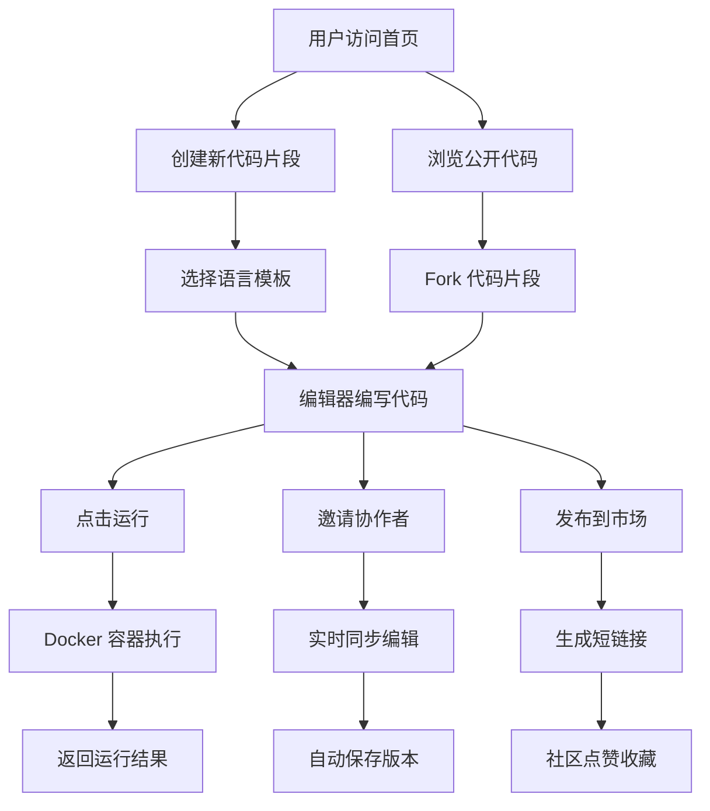

## 1. 产品概述

CodeSandbox Pro 是一个面向开发者的在线代码沙盒平台，支持多语言代码编写、实时协作、容器化运行和代码分享。解决本地开发环境配置繁琐、团队协作效率低、代码分享不便等问题，目标用户为全栈开发者、学生、技术博主和开源贡献者。

产品核心价值：开箱即用的多语言开发环境、毫秒级实时协作体验、安全的容器化代码运行、活跃的代码分享社区。

---

## 2. 核心功能

### 2.1 用户角色

| 角色 | 注册方式 | 核心权限 |
|------|----------|----------|
| 普通用户 | GitHub/邮箱注册 | 创建/编辑/运行代码、实时协作、收藏点赞、发布公开代码 |
| 访客 | 无需注册 | 浏览公开代码、运行代码、通过协作链接参与编辑 |

### 2.2 功能模块

1. **代码编辑器页面**：Monaco Editor 代码编辑、多语言支持、主题切换、快捷键自定义、代码运行
2. **实时协作模块**：多用户同时编辑、光标实时同步、协作者头像显示
3. **代码运行模块**：Docker 容器执行、stdin/stdout 支持、CPU/内存限制
4. **版本管理模块**：版本标签、历史版本列表、一键回退
5. **代码片段管理**：创建/保存/删除、Fork 派生、短链接分享
6. **市场广场**：公开代码列表、搜索筛选、点赞收藏、排序功能
7. **个人主页**：我的代码、我的收藏、访问统计图表
8. **讨论模块**：代码片段评论、代码行引用、回复互动

### 2.3 页面详情

| 页面名称 | 模块名称 | 功能描述 |
|-----------|-------------|---------------------|
| 首页/市场广场 | 导航栏 | 登录入口、搜索框、新建按钮、个人中心 |
| 首页/市场广场 | Hero 区域 | 产品 slogan、快速开始按钮、统计数据展示 |
| 首页/市场广场 | 代码列表 | 卡片式展示、语言标签、点赞收藏数、排序筛选 |
| 代码编辑器页 | 顶部工具栏 | 运行按钮、语言选择、版本管理、分享按钮、协作者列表 |
| 代码编辑器页 | 代码编辑区 | Monaco Editor、行号显示、语法高亮、协作者光标 |
| 代码编辑器页 | 控制面板 | 标准输入、运行输出、执行状态、资源使用 |
| 代码编辑器页 | 右侧边栏 | 版本历史、讨论区、代码信息 |
| 个人主页 | 头部区域 | 用户头像、昵称、简介、统计数据 |
| 个人主页 | 标签切换 | 我创建的、我收藏的、访问统计 |
| 个人主页 | 统计图表 | 访问量趋势、语言分布、点赞收藏统计 |
| 设置页面 | 编辑器设置 | 主题切换、字体大小、快捷键自定义 |

---

## 3. 核心流程

### 3.1 代码编辑运行流程
用户进入编辑器 → 选择语言/模板 → 编写代码 → 点击运行 → 后端创建 Docker 容器 → 注入代码 → 限制资源执行 → 返回 stdout/stderr → 展示结果

### 3.2 实时协作流程
创建代码片段 → 生成协作链接 → 分享给协作者 → 多人同时加入 → WebSocket 同步编辑操作 → 光标位置实时同步 → 自动保存版本

### 3.3 代码分享流程
完成代码编写 → 点击发布 → 填写标题描述 → 设置公开/私有 → 生成永久短链接 → 分享到社区 → 获得点赞收藏

---

## 4. 用户界面设计

### 4.1 设计风格

**整体风格**：深色科技风 + 赛博朋克美学，营造专业开发工具氛围

- **主色调**：深邃蓝 `#0f172a`、电光紫 `#8b5cf6`、霓虹青 `#06b6d4`
- **辅助色**：成功绿 `#10b981`、警告橙 `#f59e0b`、错误红 `#ef4444`
- **背景**：深灰渐变 + 网格纹理 + 微妙发光效果
- **按钮风格**：圆角 8px，悬停发光效果，渐变色填充
- **字体**：标题使用 `Space Grotesk`，代码使用 `JetBrains Mono`，正文使用 `Inter`
- **布局**：三栏式布局（导航 + 编辑区 + 侧边栏），卡片式信息展示
- **图标**：Lucide 图标库，统一线性风格
- **动效**：微妙的渐变动画、光标闪烁效果、加载骨架屏

### 4.2 页面设计概述

| 页面名称 | 模块名称 | UI 元素 |
|-----------|-------------|-------------|
| 市场广场 | Hero 区域 | 渐变背景 + 发光文字动画 + 浮动代码块装饰 |
| 市场广场 | 代码卡片 | 毛玻璃效果、悬停上浮、语言标签发光 |
| 代码编辑器 | 编辑区 | 深色主题、行号高亮、协作者光标彩色标记 |
| 代码编辑器 | 终端面板 | 等宽字体、打字机效果、资源进度条 |
| 代码编辑器 | 协作标识 | 右上角头像堆叠、悬停显示用户名 |
| 个人主页 | 统计图表 | 渐变色面积图、动画加载、交互提示 |
| 讨论区 | 评论列表 | 代码引用块、行号高亮、时间线布局 |

### 4.3 响应式设计

- **桌面端**：三栏完整布局，编辑器宽度自适应
- **平板端**：折叠侧边栏为抽屉式，支持滑动呼出
- **移动端**：简化为单栏布局，编辑区全屏，功能入口底部导航
- **触摸优化**：按钮最小高度 48px，支持双指缩放编辑区

