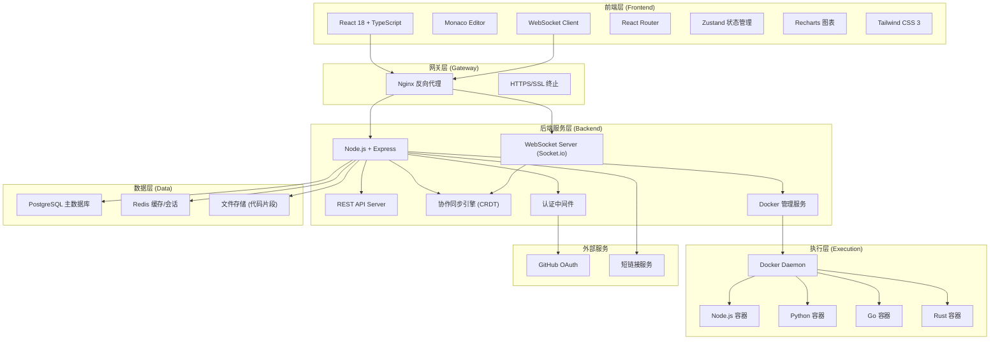
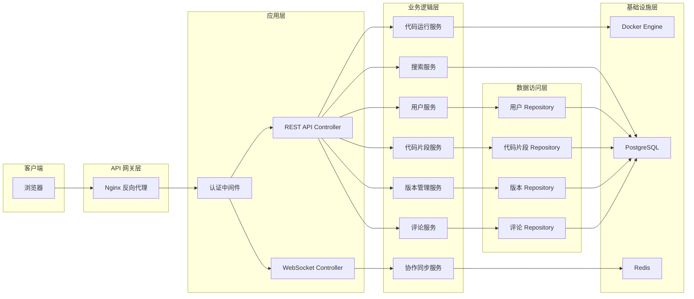
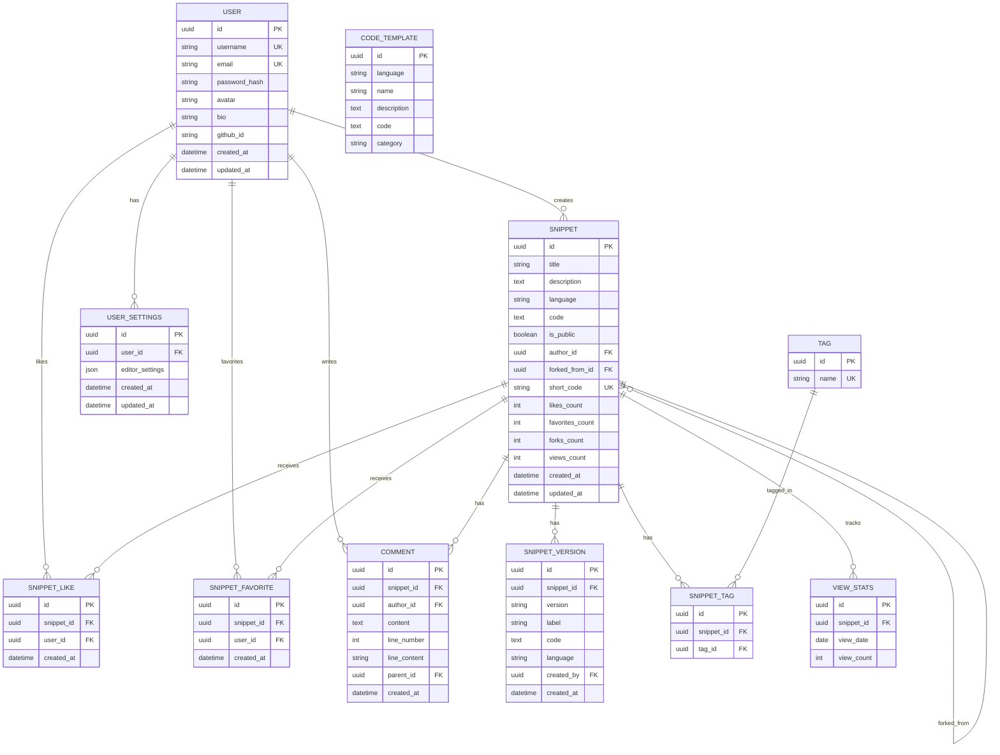

## 1. 架构设计



---

## 2. 技术描述

### 2.1 前端技术栈
- **框架**: React 18.2.0 + TypeScript 5.3
- **构建工具**: Vite 5.0
- **代码编辑器**: @monaco-editor/react 4.6.0
- **状态管理**: Zustand 4.4
- **路由**: React Router 6.21
- **UI 样式**: Tailwind CSS 3.4 + Lucide React
- **实时通信**: Socket.io Client 4.6
- **图表**: Recharts 2.10
- **HTTP 客户端**: Axios 1.6

### 2.2 后端技术栈
- **运行时**: Node.js 20 LTS
- **框架**: Express 4.18
- **语言**: TypeScript 5.3
- **实时通信**: Socket.io 4.6
- **ORM**: Prisma 5.7
- **数据库**: PostgreSQL 15
- **缓存**: Redis 7
- **容器管理**: Dockerode 4.0
- **认证**: jsonwebtoken + bcrypt
- **代码同步**: Yjs (CRDT 实现)

### 2.3 执行环境 Docker 镜像
- JavaScript: node:20-alpine
- Python: python:3.11-alpine
- Go: golang:1.21-alpine
- Rust: rust:1.74-alpine

### 2.4 资源限制
- CPU: 最大 1 核心，超时 10 秒
- 内存: 最大 256MB
- 网络: 禁用（安全隔离）
- 文件系统: 只读挂载

---

## 3. 路由定义

### 3.1 前端路由

| 路由路径 | 页面用途 |
|----------|----------|
| `/` | 首页/市场广场，展示公开代码片段 |
| `/explore` | 探索页面，高级搜索筛选 |
| `/new` | 创建新代码片段 |
| `/snippet/:id` | 代码编辑器页面 |
| `/snippet/:id/versions` | 版本历史页面 |
| `/share/:shortCode` | 短链接跳转 |
| `/u/:username` | 用户个人主页 |
| `/settings` | 用户设置页面 |
| `/login` | 登录页面 |
| `/register` | 注册页面 |

### 3.2 API 路由

| 方法 | 路径 | 用途 |
|------|------|------|
| POST | `/api/auth/register` | 用户注册 |
| POST | `/api/auth/login` | 用户登录 |
| GET | `/api/auth/github` | GitHub OAuth |
| GET | `/api/snippets` | 获取代码片段列表 |
| POST | `/api/snippets` | 创建代码片段 |
| GET | `/api/snippets/:id` | 获取代码片段详情 |
| PUT | `/api/snippets/:id` | 更新代码片段 |
| DELETE | `/api/snippets/:id` | 删除代码片段 |
| POST | `/api/snippets/:id/fork` | Fork 代码片段 |
| POST | `/api/snippets/:id/run` | 运行代码 |
| GET | `/api/snippets/:id/versions` | 获取版本列表 |
| POST | `/api/snippets/:id/versions` | 创建版本标签 |
| POST | `/api/snippets/:id/versions/:vid/restore` | 回退到版本 |
| GET | `/api/snippets/:id/comments` | 获取评论列表 |
| POST | `/api/snippets/:id/comments` | 添加评论 |
| POST | `/api/snippets/:id/like` | 点赞/取消点赞 |
| POST | `/api/snippets/:id/favorite` | 收藏/取消收藏 |
| GET | `/api/users/:username` | 获取用户信息 |
| GET | `/api/users/:username/snippets` | 获取用户创建的代码 |
| GET | `/api/users/:username/favorites` | 获取用户收藏的代码 |
| GET | `/api/users/:username/stats` | 获取用户统计数据 |
| PUT | `/api/users/settings` | 更新用户设置 |
| GET | `/api/templates` | 获取代码模板列表 |
| GET | `/api/share/:shortCode` | 短链接解析 |

---

## 4. API 类型定义

```typescript
// 用户相关
interface User {
  id: string;
  username: string;
  email: string;
  avatar: string;
  bio: string;
  createdAt: Date;
}

interface UserStats {
  totalSnippets: number;
  totalForks: number;
  totalLikes: number;
  totalViews: number;
  viewsByDay: { date: string; count: number }[];
  languageDistribution: { language: string; count: number }[];
}

// 代码片段相关
type Language = 'javascript' | 'python' | 'go' | 'rust';

interface Snippet {
  id: string;
  title: string;
  description: string;
  language: Language;
  code: string;
  isPublic: boolean;
  authorId: string;
  author: User;
  likesCount: number;
  favoritesCount: number;
  forksCount: number;
  viewsCount: number;
  shortCode: string;
  createdAt: Date;
  updatedAt: Date;
  tags: string[];
}

interface SnippetVersion {
  id: string;
  snippetId: string;
  version: string;
  label: string;
  code: string;
  language: Language;
  createdAt: Date;
  createdBy: string;
}

// 代码运行相关
interface RunRequest {
  language: Language;
  code: string;
  stdin: string;
}

interface RunResponse {
  stdout: string;
  stderr: string;
  exitCode: number;
  executionTime: number;
  memoryUsed: number;
  error?: string;
}

// 评论相关
interface Comment {
  id: string;
  snippetId: string;
  authorId: string;
  author: User;
  content: string;
  lineNumber?: number;
  lineContent?: string;
  parentId?: string;
  createdAt: Date;
}

// 协作相关
interface Collaborator {
  userId: string;
  username: string;
  avatar: string;
  cursor: {
    lineNumber: number;
    column: number;
    selection?: {
      startLineNumber: number;
      startColumn: number;
      endLineNumber: number;
      endColumn: number;
    };
  };
  color: string;
}

// 代码模板
interface CodeTemplate {
  id: string;
  language: Language;
  name: string;
  description: string;
  code: string;
  category: string;
}

// 用户设置
interface EditorSettings {
  theme: 'vs-dark' | 'vs-light' | 'hc-black';
  fontSize: number;
  fontFamily: string;
  tabSize: number;
  insertSpaces: boolean;
  minimap: boolean;
  wordWrap: 'on' | 'off' | 'wordWrapColumn';
  keybindings: Record<string, string>;
}
```

---

## 5. 服务器架构图



---

## 6. 数据模型

### 6.1 ER 图



### 6.2 DDL 语句

```sql
-- 扩展
CREATE EXTENSION IF NOT EXISTS "uuid-ossp";

-- 用户表
CREATE TABLE users (
    id UUID PRIMARY KEY DEFAULT uuid_generate_v4(),
    username VARCHAR(50) UNIQUE NOT NULL,
    email VARCHAR(255) UNIQUE NOT NULL,
    password_hash VARCHAR(255),
    avatar VARCHAR(500),
    bio TEXT,
    github_id VARCHAR(100) UNIQUE,
    created_at TIMESTAMPTZ DEFAULT CURRENT_TIMESTAMP,
    updated_at TIMESTAMPTZ DEFAULT CURRENT_TIMESTAMP
);

-- 代码片段表
CREATE TABLE snippets (
    id UUID PRIMARY KEY DEFAULT uuid_generate_v4(),
    title VARCHAR(200) NOT NULL,
    description TEXT,
    language VARCHAR(20) NOT NULL,
    code TEXT NOT NULL,
    is_public BOOLEAN DEFAULT true,
    author_id UUID NOT NULL REFERENCES users(id) ON DELETE CASCADE,
    forked_from_id UUID REFERENCES snippets(id) ON DELETE SET NULL,
    short_code VARCHAR(10) UNIQUE NOT NULL,
    likes_count INTEGER DEFAULT 0,
    favorites_count INTEGER DEFAULT 0,
    forks_count INTEGER DEFAULT 0,
    views_count INTEGER DEFAULT 0,
    created_at TIMESTAMPTZ DEFAULT CURRENT_TIMESTAMP,
    updated_at TIMESTAMPTZ DEFAULT CURRENT_TIMESTAMP
);

-- 版本表
CREATE TABLE snippet_versions (
    id UUID PRIMARY KEY DEFAULT uuid_generate_v4(),
    snippet_id UUID NOT NULL REFERENCES snippets(id) ON DELETE CASCADE,
    version VARCHAR(50) NOT NULL,
    label VARCHAR(100),
    code TEXT NOT NULL,
    language VARCHAR(20) NOT NULL,
    created_by UUID REFERENCES users(id) ON DELETE SET NULL,
    created_at TIMESTAMPTZ DEFAULT CURRENT_TIMESTAMP
);

-- 评论表
CREATE TABLE comments (
    id UUID PRIMARY KEY DEFAULT uuid_generate_v4(),
    snippet_id UUID NOT NULL REFERENCES snippets(id) ON DELETE CASCADE,
    author_id UUID NOT NULL REFERENCES users(id) ON DELETE CASCADE,
    content TEXT NOT NULL,
    line_number INTEGER,
    line_content VARCHAR(500),
    parent_id UUID REFERENCES comments(id) ON DELETE CASCADE,
    created_at TIMESTAMPTZ DEFAULT CURRENT_TIMESTAMP
);

-- 点赞表
CREATE TABLE snippet_likes (
    id UUID PRIMARY KEY DEFAULT uuid_generate_v4(),
    snippet_id UUID NOT NULL REFERENCES snippets(id) ON DELETE CASCADE,
    user_id UUID NOT NULL REFERENCES users(id) ON DELETE CASCADE,
    created_at TIMESTAMPTZ DEFAULT CURRENT_TIMESTAMP,
    UNIQUE(snippet_id, user_id)
);

-- 收藏表
CREATE TABLE snippet_favorites (
    id UUID PRIMARY KEY DEFAULT uuid_generate_v4(),
    snippet_id UUID NOT NULL REFERENCES snippets(id) ON DELETE CASCADE,
    user_id UUID NOT NULL REFERENCES users(id) ON DELETE CASCADE,
    created_at TIMESTAMPTZ DEFAULT CURRENT_TIMESTAMP,
    UNIQUE(snippet_id, user_id)
);

-- 标签表
CREATE TABLE tags (
    id UUID PRIMARY KEY DEFAULT uuid_generate_v4(),
    name VARCHAR(50) UNIQUE NOT NULL
);

-- 代码片段标签关联表
CREATE TABLE snippet_tags (
    id UUID PRIMARY KEY DEFAULT uuid_generate_v4(),
    snippet_id UUID NOT NULL REFERENCES snippets(id) ON DELETE CASCADE,
    tag_id UUID NOT NULL REFERENCES tags(id) ON DELETE CASCADE,
    UNIQUE(snippet_id, tag_id)
);

-- 用户设置表
CREATE TABLE user_settings (
    id UUID PRIMARY KEY DEFAULT uuid_generate_v4(),
    user_id UUID UNIQUE NOT NULL REFERENCES users(id) ON DELETE CASCADE,
    editor_settings JSONB NOT NULL DEFAULT '{}'::jsonb,
    created_at TIMESTAMPTZ DEFAULT CURRENT_TIMESTAMP,
    updated_at TIMESTAMPTZ DEFAULT CURRENT_TIMESTAMP
);

-- 访问统计表
CREATE TABLE view_stats (
    id UUID PRIMARY KEY DEFAULT uuid_generate_v4(),
    snippet_id UUID NOT NULL REFERENCES snippets(id) ON DELETE CASCADE,
    view_date DATE NOT NULL,
    view_count INTEGER DEFAULT 1,
    UNIQUE(snippet_id, view_date)
);

-- 代码模板表
CREATE TABLE code_templates (
    id UUID PRIMARY KEY DEFAULT uuid_generate_v4(),
    language VARCHAR(20) NOT NULL,
    name VARCHAR(100) NOT NULL,
    description TEXT,
    code TEXT NOT NULL,
    category VARCHAR(50)
);

-- 索引
CREATE INDEX idx_snippets_language ON snippets(language);
CREATE INDEX idx_snippets_is_public ON snippets(is_public);
CREATE INDEX idx_snippets_author ON snippets(author_id);
CREATE INDEX idx_snippets_created_at ON snippets(created_at DESC);
CREATE INDEX idx_snippets_updated_at ON snippets(updated_at DESC);
CREATE INDEX idx_snippets_likes ON snippets(likes_count DESC);
CREATE INDEX idx_comments_snippet ON comments(snippet_id);
CREATE INDEX idx_view_stats_date ON view_stats(view_date DESC);

-- 触发器：更新时间
CREATE OR REPLACE FUNCTION update_updated_at()
RETURNS TRIGGER AS $$
BEGIN
    NEW.updated_at = CURRENT_TIMESTAMP;
    RETURN NEW;
END;
$$ LANGUAGE plpgsql;

CREATE TRIGGER update_users_updated_at
    BEFORE UPDATE ON users
    FOR EACH ROW EXECUTE FUNCTION update_updated_at();

CREATE TRIGGER update_snippets_updated_at
    BEFORE UPDATE ON snippets
    FOR EACH ROW EXECUTE FUNCTION update_updated_at();

CREATE TRIGGER update_user_settings_updated_at
    BEFORE UPDATE ON user_settings
    FOR EACH ROW EXECUTE FUNCTION update_updated_at();

-- 预置代码模板
INSERT INTO code_templates (language, name, description, code, category) VALUES
('javascript', 'Hello World', '基础的 JavaScript Hello World 示例',
'console.log("Hello, World!");', '基础'),
('javascript', '快速排序', 'JavaScript 实现的快速排序算法',
`function quickSort(arr) {
  if (arr.length <= 1) return arr;
  const pivot = arr[Math.floor(arr.length / 2)];
  const left = arr.filter(x => x < pivot);
  const middle = arr.filter(x => x === pivot);
  const right = arr.filter(x => x > pivot);
  return [...quickSort(left), ...middle, ...quickSort(right)];
}

console.log(quickSort([64, 34, 25, 12, 22, 11, 90]));`, '算法'),
('python', 'Hello World', '基础的 Python Hello World 示例',
'print("Hello, World!")', '基础'),
('python', '快速排序', 'Python 实现的快速排序算法',
`def quick_sort(arr):
    if len(arr) <= 1:
        return arr
    pivot = arr[len(arr) // 2]
    left = [x for x in arr if x < pivot]
    middle = [x for x in arr if x == pivot]
    right = [x for x in arr if x > pivot]
    return quick_sort(left) + middle + quick_sort(right)

print(quick_sort([64, 34, 25, 12, 22, 11, 90]))`, '算法'),
('go', 'Hello World', '基础的 Go Hello World 示例',
`package main

import "fmt"

func main() {
    fmt.Println("Hello, World!")
}`, '基础'),
('go', '快速排序', 'Go 实现的快速排序算法',
`package main

import "fmt"

func quickSort(arr []int) []int {
    if len(arr) <= 1 {
        return arr
    }
    pivot := arr[len(arr)/2]
    var left, middle, right []int
    for _, x := range arr {
        switch {
        case x < pivot:
            left = append(left, x)
        case x == pivot:
            middle = append(middle, x)
        case x > pivot:
            right = append(right, x)
        }
    }
    return append(append(quickSort(left), middle...), quickSort(right)...)
}

func main() {
    fmt.Println(quickSort([]int{64, 34, 25, 12, 22, 11, 90}))
}`, '算法'),
('rust', 'Hello World', '基础的 Rust Hello World 示例',
`fn main() {
    println!("Hello, World!");
}`, '基础'),
('rust', '快速排序', 'Rust 实现的快速排序算法',
`fn quick_sort<T: Ord>(arr: &mut [T]) {
    if arr.len() <= 1 {
        return;
    }
    let pivot = partition(arr);
    let (left, right) = arr.split_at_mut(pivot);
    quick_sort(left);
    quick_sort(&mut right[1..]);
}

fn partition<T: Ord>(arr: &mut [T]) -> usize {
    let len = arr.len();
    let pivot_idx = len / 2;
    arr.swap(pivot_idx, len - 1);
    let mut store_idx = 0;
    for i in 0..len - 1 {
        if arr[i] < arr[len - 1] {
            arr.swap(i, store_idx);
            store_idx += 1;
        }
    }
    arr.swap(store_idx, len - 1);
    store_idx
}

fn main() {
    let mut arr = vec![64, 34, 25, 12, 22, 11, 90];
    quick_sort(&mut arr);
    println!("{:?}", arr);
}`, '算法');
```
