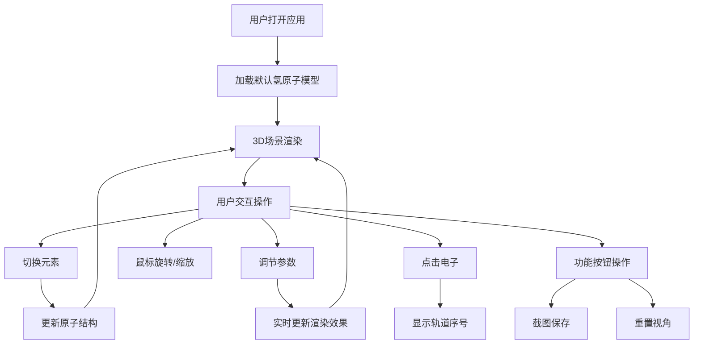

## 1. 产品概述

基于Three.js的交互式3D原子模型可视化应用，展示动态原子结构，支持多种元素切换和参数调节，为教育和科学展示提供直观的原子模型可视化工具。

- 核心目的：通过3D可视化技术直观展示原子结构，帮助用户理解原子构成和电子运动规律
- 目标用户：学生、教师、科学爱好者以及需要原子模型展示的相关从业者
- 产品价值：将抽象的原子结构概念转化为可交互的3D可视化体验，提升学习和展示效果

## 2. 核心功能

### 2.1 用户角色
| 角色 | 注册方式 | 核心权限 |
|------|----------|----------|
| 普通用户 | 无需注册 | 浏览3D原子模型、调节参数、切换元素、截图保存 |

### 2.2 功能模块
1. **3D原子模型展示区**：原子核、电子轨道、运动电子的实时渲染
2. **元素控制面板**：切换氢、碳、氧、金四种元素
3. **参数调节面板**：电子速度、轨道半径、原子核大小调节
4. **显示控制区**：背景切换、轨道高亮、自动旋转开关
5. **原子信息区**：显示原子序数、原子量、电子排布式
6. **功能按钮区**：一键截图、重置视角等

### 2.3 页面详情
| 页面名称 | 模块名称 | 功能描述 |
|----------|----------|----------|
| 主页面 | 3D场景画布 | 渲染动态原子模型，支持鼠标拖拽旋转、滚轮缩放 |
| 主页面 | 元素选择器 | 下拉选择不同元素，更新原子结构和信息 |
| 主页面 | 参数滑块 | 实时调节电子速度、轨道半径、原子核大小 |
| 主页面 | 开关控制 | 背景切换（深空/纯黑）、轨道高亮、自动旋转 |
| 主页面 | 信息面板 | 显示原子基本信息和电子排布 |
| 主页面 | 功能按钮 | 截图保存、视角重置 |

## 3. 核心流程

用户打开应用后，默认展示氢原子模型。用户可通过鼠标拖拽旋转视角、滚轮缩放观察原子结构。可切换不同元素查看不同原子结构，调节参数自定义显示效果，点击电子可查看轨道序号，最终可一键截图保存当前视图。

## 4. 用户界面设计

### 4.1 设计风格
- **主色调**：深空蓝 (#0a1628) 作为主背景，科技蓝 (#00d4ff) 作为强调色，电子发光色 (#ff6b6b, #ffd93d, #6bcb77)
- **按钮风格**：半透明玻璃拟态风格，圆角设计，hover时有发光效果
- **字体**：采用现代无衬线字体 'Orbitron' 作为标题，'Roboto' 作为正文字体，营造科技感
- **布局风格**：3D画布全屏展示，控制面板采用右侧悬浮半透明面板形式
- **图标风格**：线性简约图标，配合发光效果

### 4.2 页面设计概述
| 页面名称 | 模块名称 | UI元素 |
|----------|----------|----------|
| 主页面 | 3D场景 | 全屏Three.js画布，动态原子模型，光晕效果，深空背景星点 |
| 主页面 | 控制面板 | 右侧悬浮半透明面板，分组控件，滑块、开关、下拉选择器 |
| 主页面 | 信息面板 | 左上角信息卡片，展示原子序数、原子量、电子排布式 |
| 主页面 | 功能按钮 | 底部居中排列，截图、重置等功能按钮 |

### 4.3 响应式
- **桌面端优先**：主要针对桌面端优化，利用大屏幕展示3D效果
- **平板适配**：控制面板可切换为底部弹出式
- **移动端**：简化控制选项，优化触摸交互

### 4.4 3D场景指导
- **环境与氛围**：深空背景，带有星点效果，营造宇宙空间感
- **光照设置**：环境光 + 点光源组合，突出原子核和电子的立体感和光晕效果
- **相机设置**：PerspectiveCamera，支持OrbitControls拖拽旋转和滚轮缩放
- **构图与焦点**：原子核位于场景中心，电子轨道环绕，视觉焦点集中在原子核心
- **交互与动画**：电子沿椭圆轨道平滑运动，支持点击交互，自动旋转模式
- **后期效果**：光晕(Bloom)效果，增强电子和原子核的发光视觉效果
- **性能优化**：合理控制粒子数量，使用BufferGeometry优化渲染性能
