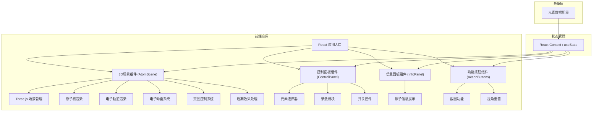

## 1. 架构设计



## 2. 技术描述

- **前端框架**：React@18 + TypeScript
- **构建工具**：Vite@5
- **3D渲染引擎**：Three.js@0.160
- **3D React封装**：@react-three/fiber@8 + @react-three/drei@9
- **后期效果**：@react-three/postprocessing@2
- **样式方案**：TailwindCSS@3
- **图标库**：lucide-react

## 3. 路由定义

| 路由 | 用途 |
|------|------|
| / | 主页面，包含3D原子模型和控制面板 |

## 4. 数据模型

### 4.1 元素数据定义

```typescript
interface ElementData {
  name: string;
  symbol: string;
  atomicNumber: number;
  atomicMass: number;
  electronConfiguration: string;
  nucleusColor: string;
  orbits: OrbitConfig[];
}

interface OrbitConfig {
  radius: number;
  inclination: number;
  electronCount: number;
  electronColor: string;
}

interface AppState {
  selectedElement: string;
  electronSpeed: number;
  orbitRadiusScale: number;
  nucleusSize: number;
  backgroundType: 'space' | 'black';
  showOrbitHighlight: boolean;
  autoRotate: boolean;
}
```

### 4.2 元素配置数据

```typescript
const elements: Record<string, ElementData> = {
  hydrogen: {
    name: '氢',
    symbol: 'H',
    atomicNumber: 1,
    atomicMass: 1.008,
    electronConfiguration: '1s¹',
    nucleusColor: '#ff6b6b',
    orbits: [
      { radius: 2, inclination: 0, electronCount: 1, electronColor: '#ff6b6b' }
    ]
  },
  carbon: {
    name: '碳',
    symbol: 'C',
    atomicNumber: 6,
    atomicMass: 12.011,
    electronConfiguration: '[He] 2s² 2p²',
    nucleusColor: '#4ecdc4',
    orbits: [
      { radius: 2, inclination: 0, electronCount: 2, electronColor: '#ff6b6b' },
      { radius: 3.5, inclination: 0.4, electronCount: 4, electronColor: '#ffd93d' }
    ]
  },
  oxygen: {
    name: '氧',
    symbol: 'O',
    atomicNumber: 8,
    atomicMass: 15.999,
    electronConfiguration: '[He] 2s² 2p⁴',
    nucleusColor: '#ff6b6b',
    orbits: [
      { radius: 2, inclination: 0, electronCount: 2, electronColor: '#ff6b6b' },
      { radius: 3.5, inclination: 0.4, electronCount: 6, electronColor: '#ffd93d' }
    ]
  },
  gold: {
    name: '金',
    symbol: 'Au',
    atomicNumber: 79,
    atomicMass: 196.967,
    electronConfiguration: '[Xe] 4f¹⁴ 5d¹⁰ 6s¹',
    nucleusColor: '#ffd700',
    orbits: [
      { radius: 1.5, inclination: 0, electronCount: 2, electronColor: '#ff6b6b' },
      { radius: 2.5, inclination: 0.3, electronCount: 8, electronColor: '#ffd93d' },
      { radius: 3.8, inclination: 0.6, electronCount: 18, electronColor: '#6bcb77' },
      { radius: 5, inclination: 0.9, electronCount: 32, electronColor: '#4ecdc4' },
      { radius: 6.2, inclination: 1.2, electronCount: 18, electronColor: '#a855f7' },
      { radius: 7.5, inclination: 1.5, electronCount: 1, electronColor: '#ec4899' }
    ]
  }
};
```

## 5. 核心组件结构

```
src/
├── components/
│   ├── AtomScene/           # 3D原子场景组件
│   │   ├── index.tsx
│   │   ├── Nucleus.tsx      # 原子核组件
│   │   ├── ElectronOrbit.tsx # 电子轨道组件
│   │   └── Electron.tsx     # 电子组件
│   ├── ControlPanel/        # 控制面板组件
│   │   ├── index.tsx
│   │   ├── ElementSelector.tsx
│   │   ├── ParameterSliders.tsx
│   │   └── ToggleSwitches.tsx
│   ├── InfoPanel/           # 信息面板组件
│   │   └── index.tsx
│   └── ActionButtons/       # 功能按钮组件
│       └── index.tsx
├── data/
│   └── elements.ts          # 元素配置数据
├── hooks/
│   └── useScreenshot.ts     # 截图功能hook
├── store/
│   └── useAtomStore.ts      # 状态管理
├── App.tsx
├── main.tsx
└── index.css
```

## 6. 关键技术实现

### 6.1 3D场景渲染
- 使用 `@react-three/fiber` 声明式创建Three.js场景
- 使用 `OrbitControls` 实现相机拖拽旋转和缩放
- 使用 `EffectComposer` 和 `Bloom` 实现光晕效果

### 6.2 电子轨道动画
- 使用椭圆方程计算电子位置
- 使用 `useFrame` hook实现每一帧的动画更新
- 支持不同轨道的倾角和速度调节

### 6.3 交互功能
- 使用射线检测(Raycaster)实现电子点击交互
- 点击电子时显示轨道序号悬浮标签
- 支持自动旋转相机模式

### 6.4 截图功能
- 使用Three.js的 `renderer.domElement.toDataURL()` 获取画布
- 创建下载链接实现一键保存
