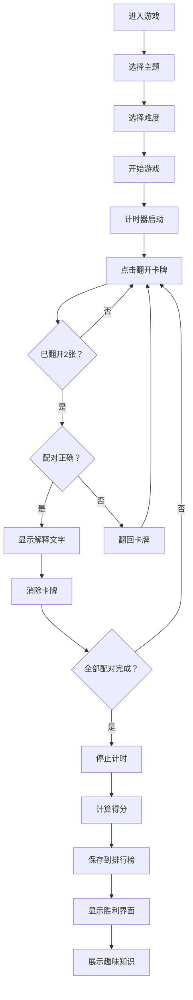

## 1. 产品概述
因果关系配对消除游戏是一款教育类益智游戏，玩家需要将具有因果关系的两张牌配对消除。游戏融合了知识性和趣味性，适合各年龄段用户，在娱乐中学习知识。

- 主要目的：通过游戏形式传递知识，提升用户的逻辑思维能力和知识储备
- 目标用户：学生、上班族及所有喜欢益智游戏的用户
- 产品价值：寓教于乐，将知识学习与游戏娱乐相结合

## 2. 核心功能

### 2.1 用户角色
| 角色 | 注册方式 | 核心权限 |
|------|----------|---------|
| 普通用户 | 无需注册 | 游戏游玩、查看排行榜 |

### 2.2 功能模块
1. **游戏主界面**：游戏设置、游戏网格、控制面板
2. **主题选择**：生活常识、科学原理、历史事件
3. **难度选择**：简单(4x4)、中等(6x6)、困难(8x8)
4. **排行榜**：各主题各难度前5名最快完成时间
5. **胜利界面**：得分展示、趣味知识

### 2.3 页面详情
| 页面名称 | 模块名称 | 功能描述 |
|---------|---------|----------|
| 主菜单页 | 主题选择 | 选择游戏主题：生活常识/科学原理/历史事件 |
| 主菜单页 | 难度选择 | 选择游戏难度：4x4/6x6/8x8 |
| 主菜单页 | 排行榜入口 | 查看各主题各难度排行榜 |
| 游戏页面 | 游戏网格 | 显示卡牌网格，支持点击翻开卡牌 |
| 游戏页面 | 信息面板 | 显示计时、配对次数、正确配对数 |
| 游戏页面 | 控制面板 | 洗牌按钮、提示按钮、音效开关 |
| 游戏页面 | 配对解释 | 配对正确时显示因果关系解释 |
| 胜利页面 | 得分展示 | 显示完成时间、得分、排名 |
| 胜利页面 | 趣味知识 | 展示相关主题的冷知识 |
| 胜利页面 | 排行榜 | 显示该主题该难度的前5名 |

## 3. 核心流程
用户进入游戏 → 选择主题和难度 → 开始游戏，计时器启动 → 点击翻开卡牌 → 配对判断 → 正确则显示解释并消除/错误则翻回 → 全部配对完成 → 显示胜利界面 → 保存成绩到排行榜 → 可选择重新开始或返回主菜单

## 4. 用户界面设计

### 4.1 设计风格
- 主色调：深蓝色渐变背景，营造知识探索氛围
- 按钮风格：圆角卡片式按钮，带有悬停动画效果
- 字体：使用现代无衬线字体，标题使用有设计感的字体
- 布局风格：卡片式布局，游戏区域居中，控制面板在侧边或底部
- 图标/emoji：使用emoji作为牌面内容，直观生动

### 4.2 页面设计概述
| 页面名称 | 模块名称 | UI元素 |
|---------|---------|--------|
| 主菜单页 | 主题选择卡片 | 渐变色彩区分不同主题，悬停放大效果 |
| 游戏页面 | 卡牌网格 | 3D翻转效果，配对成功时发光动画 |
| 游戏页面 | 信息面板 | 半透明背景，数字动态更新动画 |
| 胜利页面 | 庆祝动画 | 彩带飘落效果，渐变文字 |

### 4.3 响应性
- 桌面端优先设计，移动端自适应
- 触控优化，支持手机和平板设备
- 网格大小根据屏幕自动调整

### 4.4 交互设计
- 卡牌翻转动画（CSS 3D transform）
- 配对正确时的发光和缩放效果
- 提示时的脉冲高亮动画
- 胜利时的彩带飘落动画
