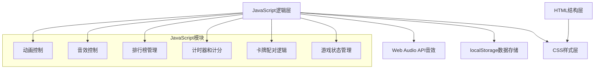

## 1. 架构设计



## 2. 技术描述
- 前端技术：HTML5 + CSS3 + 原生JavaScript (ES6+)
- 构建工具：无需构建工具，纯静态页面
- 数据存储：localStorage（浏览器本地存储）
- 音效技术：Web Audio API 生成音效
- 动画技术：CSS3 Transition/Animation + JavaScript

## 3. 项目文件结构
| 文件路径 | 作用 |
|---------|------|
| /index.html | 主HTML文件，包含页面结构 |
| /css/style.css | 样式文件，包含所有CSS样式和动画 |
| /js/game.js | 游戏核心逻辑 |
| /js/data.js | 游戏数据（主题卡牌、解释文字、冷知识） |
| /js/storage.js | localStorage操作封装 |
| /js/audio.js | 音效生成和播放控制 |
| /js/ui.js | UI交互和动画控制 |

## 4. 数据模型定义

### 4.1 游戏配置数据
```javascript
const GAME_CONFIG = {
  difficulties: {
    easy: { rows: 4, cols: 4, pairs: 8 },
    medium: { rows: 6, cols: 6, pairs: 18 },
    hard: { rows: 8, cols: 8, pairs: 32 }
  },
  themes: ['life', 'science', 'history']
};
```

### 4.2 卡牌数据结构
```javascript
interface CardPair {
  id: string;
  cause: {
    emoji: string;
    text: string;
  };
  effect: {
    emoji: string;
    text: string;
  };
  explanation: string;
}
```

### 4.3 排行榜数据结构
```javascript
interface LeaderboardEntry {
  name: string;
  time: number; // 秒
  score: number;
  date: string;
}

interface Leaderboard {
  [theme: string]: {
    [difficulty: string]: LeaderboardEntry[];
  };
}
```

### 4.4 游戏状态
```javascript
interface GameState {
  theme: string;
  difficulty: string;
  cards: Card[];
  flippedCards: number[];
  matchedPairs: number;
  totalPairs: number;
  attempts: number;
  startTime: number;
  elapsedTime: number;
  isPlaying: boolean;
  soundEnabled: boolean;
}
```

## 5. 核心功能实现方案

### 5.1 卡牌配对逻辑
1. 使用Fisher-Yates洗牌算法随机排列卡牌
2. 每张卡牌存储唯一的pairId标识所属配对
3. 点击卡牌时记录索引，两张后判断pairId是否匹配
4. 匹配成功则标记为已匹配，失败则延迟翻回

### 5.2 计时和计分系统
1. 使用Date.now()记录开始时间和计算已用时间
2. 计分公式：基础分1000 - 用时秒数 * 2 - 尝试次数 * 5
3. 最低分为0分，确保得分非负

### 5.3 排行榜实现
1. 数据存储在localStorage中，key为`causal-game-leaderboard`
2. 按主题和难度分类存储
3. 每个分类保留前5条最快记录
4. 新成绩插入后自动排序并截断到前5条

### 5.4 音效实现
1. 使用Web Audio API的OscillatorNode生成不同频率的音效
2. 配对正确：上升音阶
3. 配对错误：下降音阶
4. 胜利：欢快旋律
5. 支持静音/取消静音切换

### 5.5 提示功能
1. 遍历未匹配卡牌，找出第一对可配对的卡牌
2. 使用CSS动画高亮提示
3. 3秒后自动取消高亮

### 5.6 洗牌功能
1. 收集所有未匹配的卡牌
2. 重新洗牌算法打乱顺序
3. 保持已匹配卡牌位置不变
4. 更新DOM重新渲染

## 6. 性能优化
- 使用CSS transform和opacity实现动画（硬件加速）
- 避免频繁DOM操作，使用文档片段批量更新
- 音效使用AudioContext复用，避免重复创建
- 图片资源：使用emoji避免图片加载
