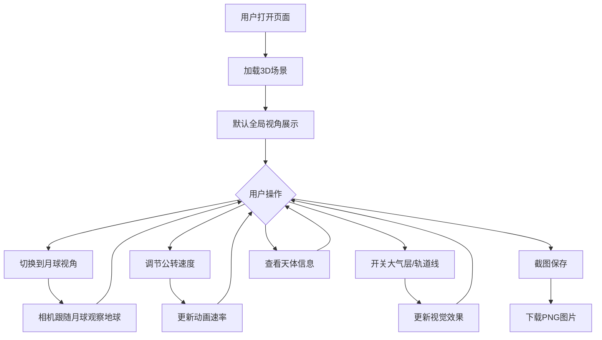

## 1. 产品概述

基于Three.js的地月系统3D交互式模拟器，展示地球与月球的运动关系，支持多种视角、交互控制和信息展示，为用户提供沉浸式的太空观测体验。

- 核心目标：以高保真3D视觉效果模拟地月系统运动，支持视角切换与交互控制
- 目标用户：天文爱好者、教育场景、3D可视化学习者

## 2. 核心功能

### 2.1 功能模块

1. **3D场景页**：地球（高分辨率纹理+云层）、月球（凹凸纹理）、星空粒子背景、公转/自转动画、轨道线
2. **控制面板**：视角切换、轨道线显示/隐藏、大气层光晕开关、公转速度调节、截图保存
3. **信息面板**：地球/月球基本数据、实时距离显示、相机模式指示

### 2.2 页面详情

| 页面名称 | 模块名称 | 功能描述 |
|----------|----------|----------|
| 3D场景页 | 地球渲染 | 高分辨率纹理贴图、云层半透明效果、大气层光晕（可开关） |
| 3D场景页 | 月球渲染 | 凹凸纹理贴图（bump map）、围绕地球公转（周期约3秒） |
| 3D场景页 | 星空背景 | 随机分布的粒子系统模拟星空 |
| 3D场景页 | 轨道线 | 月球公转轨道的可视化线条（可切换显示） |
| 控制面板 | 视角切换 | 全局视角 ↔ 月球视角切换，显示当前模式 |
| 控制面板 | 速度滑块 | 公转速度调节（0.5x / 1x / 2x / 5x） |
| 控制面板 | 截图功能 | 一键保存当前视角为PNG图片 |
| 控制面板 | 大气层开关 | 开启/关闭地球大气层光晕效果 |
| 控制面板 | 轨道线开关 | 显示/隐藏月球公转轨道线 |
| 信息面板 | 天体数据 | 地球和月球的基本物理数据（直径、质量、距日距离等） |
| 信息面板 | 实时距离 | 地月之间按模拟比例的实时距离数值 |
| 信息面板 | 相机模式 | 显示当前相机模式（全局视角/月球视角） |
| 3D场景页 | 相机自动旋转 | 全局视角下相机自动环绕旋转 |

## 3. 核心流程

用户打开页面 → 看到3D地月系统默认全局视角 → 可通过控制面板切换视角/调节参数 → 信息面板实时更新数据 → 可截图保存当前画面

## 4. 用户界面设计

### 4.1 设计风格

- **主色调**：深空黑 (#0a0a1a) + 星蓝 (#4a9eff) + 月白 (#e8e8f0)
- **辅助色**：地球蓝 (#1a6fc4)、月球灰 (#b0b0b0)、轨道金 (#ffd700)
- **按钮风格**：圆角半透明毛玻璃按钮，hover时发光
- **字体**：Orbitron（标题/数据）+ Noto Sans SC（中文正文）
- **布局**：3D场景全屏 + 左下角信息面板 + 右侧控制面板浮动
- **图标风格**：线性简约太空风格图标（lucide-react）

### 4.2 页面设计概览

| 页面名称 | 模块名称 | UI元素 |
|----------|----------|--------|
| 3D场景页 | 主视口 | 全屏Canvas、深空背景、地球居中偏左 |
| 3D场景页 | 信息面板 | 左下角半透明毛玻璃面板、天体数据卡片 |
| 3D场景页 | 控制面板 | 右侧垂直排列的半透明毛玻璃按钮组 |
| 3D场景页 | 速度滑块 | 右侧面板内的滑块控件，标注速度倍率 |
| 3D场景页 | 距离指示 | 顶部居中的距离数值显示 |
| 3D场景页 | 相机模式 | 顶部右侧的模式标签徽章 |

### 4.3 响应式

- 桌面优先设计，3D场景占满视口
- 控制面板和信息面板使用绝对定位浮动覆盖
- 小屏幕下控制面板可折叠

### 4.4 3D场景指引

- **环境**：深空黑色背景，微弱环境光模拟宇宙空间
- **光照**：一个方向光模拟太阳光（从右侧照射），微弱环境光补光
- **相机**：全局视角下OrbitControls可自由旋转缩放；月球视角下相机跟随月球朝向地球
- **构图**：地球居中，月球围绕公转，轨道线辅助理解空间关系
- **交互**：鼠标拖拽旋转、滚轮缩放、控制面板按钮交互
- **动画**：地球自转、月球公转、云层缓慢旋转、星空微微闪烁
- **后处理**：大气层光晕使用自定义shader实现菲涅尔效果
- **纹理来源**：程序化生成纹理或使用NASA公开纹理URL
- **性能预算**：60fps目标，粒子数<5000，单场景Mesh<20
