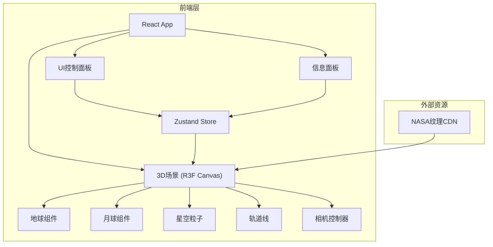
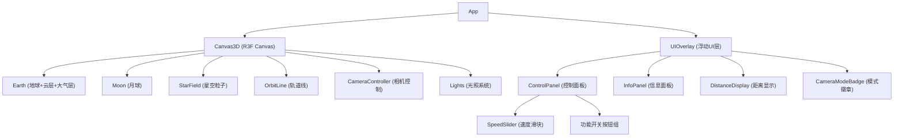

## 1. 架构设计



纯前端项目，无后端服务。所有状态通过Zustand管理，3D渲染通过@react-three/fiber集成。

## 2. 技术说明

- **前端框架**：React 18 + TypeScript + Vite
- **3D渲染**：Three.js + @react-three/fiber + @react-three/drei + @react-three/postprocessing
- **样式方案**：Tailwind CSS 3
- **状态管理**：Zustand
- **图标库**：lucide-react
- **初始化工具**：vite-init (react-ts 模板)
- **后端**：无
- **数据库**：无

## 3. 路由定义

| 路由 | 用途 |
|------|------|
| / | 地月系统3D场景主页面（单页应用） |

## 4. 组件架构



## 5. 状态管理 (Zustand Store)

```typescript
interface SolarSystemStore {
  cameraMode: 'global' | 'lunar'
  orbitSpeed: 0.5 | 1 | 2 | 5
  showOrbitLine: boolean
  showAtmosphere: boolean
  showStarField: boolean
  autoRotate: boolean
  earthMoonDistance: number
  setCameraMode: (mode: 'global' | 'lunar') => void
  setOrbitSpeed: (speed: 0.5 | 1 | 2 | 5) => void
  toggleOrbitLine: () => void
  toggleAtmosphere: () => void
  toggleStarField: () => void
  toggleAutoRotate: () => void
  setEarthMoonDistance: (distance: number) => void
}
```

## 6. 3D场景参数

| 参数 | 值 | 说明 |
|------|-----|------|
| 地球半径 | 2.0 | 场景单位 |
| 月球半径 | 0.55 | 约地球1/3.67 |
| 地月距离 | 8.0 | 场景单位 |
| 月球公转周期 | 3秒 | 基准1x速度 |
| 地球自转周期 | 6秒 | 视觉效果优化 |
| 星空粒子数 | 3000 | 性能与视觉平衡 |
| 方向光强度 | 2.0 | 模拟太阳光 |
| 环境光强度 | 0.15 | 微弱补光 |

## 7. 纹理策略

使用程序化生成纹理确保无需外部依赖：
- **地球纹理**：Canvas绘制蓝绿色地球表面纹理
- **云层纹理**：Canvas绘制半透明白色云层图案
- **月球纹理**：Canvas绘制灰色+陨石坑纹理
- **月球凹凸贴图**：Canvas生成凹凸灰度图
- **大气层**：自定义ShaderMaterial实现菲涅尔光晕效果

## 8. 天体数据（信息面板展示）

| 数据项 | 地球 | 月球 |
|--------|------|------|
| 直径 | 12,742 km | 3,474 km |
| 质量 | 5.972 × 10²⁴ kg | 7.342 × 10²² kg |
| 距日距离 | 1.496 × 10⁸ km | ≈同地球 |
| 表面重力 | 9.807 m/s² | 1.62 m/s² |
| 自转周期 | 23h 56m | 27.3 天 |
| 公转周期 | 365.25 天 | 27.3 天 |
