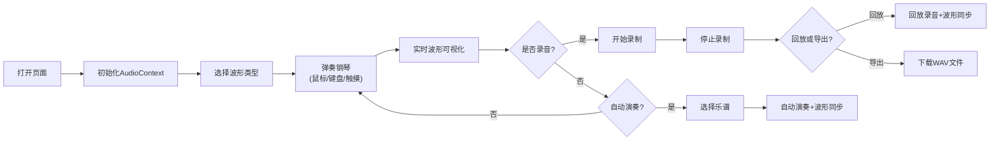

## 1. 产品概述

虚拟钢琴波形可视化网页是一个基于Web Audio API的交互式音乐工具。用户可以通过点击琴键或键盘按键演奏钢琴，实时查看音频波形可视化效果，并进行录音、回放和导出。

- 主要用途：音乐学习、音频可视化演示、简单音乐创作
- 目标用户：音乐爱好者、学生、教师、音频技术爱好者
- 产品价值：提供直观的音频波形可视化体验，帮助理解声音的物理特性

## 2. 核心功能

### 2.1 功能模块

1. **钢琴键盘模块**：一个八度的钢琴键盘，支持鼠标点击、键盘按键、移动端触摸
2. **波形可视化模块**：实时Canvas绘制音频波形，支持多种波形类型
3. **音效控制模块**：混响、延迟效果，支持调节干湿比
4. **录音回放模块**：录制弹奏序列，支持回放和WAV导出
5. **自动演奏模块**：内置简单乐谱，自动演奏时键盘高亮和波形同步
6. **参数调节模块**：波形类型切换、振幅调节、频率偏移调节

### 2.2 页面详情

| 页面名称 | 模块名称 | 功能描述 |
|-----------|-------------|---------------------|
| 主页面 | 钢琴键盘 | 13个琴键（C4-C5），支持鼠标、键盘、触摸操作 |
| 主页面 | 波形显示区 | Canvas实时绘制音频波形，显示当前音高频率 |
| 主页面 | 控制面板 | 波形类型选择、振幅滑块、频率偏移滑块 |
| 主页面 | 音效控制 | 混响开关/干湿比、延迟开关/干湿比/延迟时间 |
| 主页面 | 录音控制 | 开始/停止录音、回放、导出WAV |
| 主页面 | 自动演奏 | 乐谱选择、播放/暂停、速度调节 |

## 3. 核心流程

用户打开页面 → 选择波形类型和音效 → 通过键盘/鼠标/触摸弹奏钢琴 → 实时查看波形可视化 → 可选择录音 → 回放录音或导出WAV → 或选择内置乐谱自动演奏

## 4. 用户界面设计

### 4.1 设计风格

- **主色调**：深黑色背景 (#0a0a0f) 搭配霓虹蓝 (#00d4ff) 和霓虹紫 (#a855f7)，营造科技感
- **辅助色**：琴键白色 (#ffffff) 和黑色 (#1a1a2e)，按下时的高亮色 (#00d4ff)
- **按钮风格**：圆角矩形，带发光边框，hover时有缩放动画
- **字体**：使用 'Orbitron' 科技感字体作为标题，'Roboto Mono' 作为数据显示
- **布局风格**：卡片式布局，半透明毛玻璃效果，深色主题
- **视觉效果**：波形区域带发光效果，琴键按下时有波纹动画

### 4.2 页面设计概述

| 页面名称 | 模块名称 | UI元素 |
|-----------|-------------|-------------|
| 主页面 | 顶部标题 | 发光文字效果，居中显示"虚拟钢琴波形可视化" |
| 主页面 | 波形显示区 | 大尺寸Canvas，波形线条带渐变色和发光效果 |
| 主页面 | 频率显示 | 大字号数字显示当前Hz，位于波形区右上角 |
| 主页面 | 钢琴键盘 | 标准钢琴键布局，白键黑键错落排列 |
| 主页面 | 控制面板 | 半透明卡片，包含滑块、下拉选择、开关按钮 |
| 主页面 | 录音控制 | 红色录音按钮，回放按钮，导出按钮 |

### 4.3 响应式设计

- **桌面端**：横向布局，波形区在上，键盘在中间，控制面板在两侧
- **平板端**：垂直堆叠布局，适当缩小元素尺寸
- **移动端**：单列布局，优化触摸区域，琴键尺寸适配手指触摸
- **触摸优化**：琴键最小尺寸40px，支持多点触控同时弹奏多个音符

### 4.4 动画与交互

- 页面加载：元素淡入动画，琴键依次出现
- 琴键按下：缩放+颜色变化+波纹扩散效果
- 波形绘制：平滑过渡动画，波形线条带拖尾效果
- 控制面板：滑块拖动实时反馈，开关切换带过渡动画
