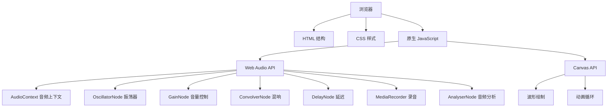

## 1. 架构设计



## 2. 技术选型

- **前端技术栈**：
  - HTML5：语义化结构
  - CSS3：Flexbox/Grid布局、动画、响应式设计
  - 原生 JavaScript (ES6+)：模块化代码，无框架依赖
  - Web Audio API：音频生成、处理、分析
  - Canvas API：波形可视化绘制

- **核心Web API**：
  - `AudioContext`：音频上下文管理
  - `OscillatorNode`：生成不同类型波形
  - `GainNode`：音量控制
  - `ConvolverNode` + 混响效果
  - `DelayNode`：延迟效果
  - `AnalyserNode`：获取音频时域数据
  - `MediaRecorder`：录制音频
  - `Touch Events`：移动端触摸支持
  - `Keyboard Events`：键盘按键支持

## 3. 项目结构

```
/
├── index.html          # 主页面
├── css/
│   └── style.css    # 样式文件
├── js/
│   ├── audio.js     # 音频处理模块
│   ├── piano.js     # 钢琴键盘模块
│   ├── visualizer.js # 波形可视化模块
│   ├── recorder.js  # 录音回放模块
│   ├── effects.js   # 音效模块
│   ├── autoplay.js  # 自动演奏模块
│   └── app.js       # 主应用入口
└── assets/
    └── (无外部资源
```

## 4. 核心模块说明

### 4.1 音频模块 (audio.js)
- 初始化 AudioContext
- 管理振荡器创建与管理
- 音符频率映射表
- 主音量控制

### 4.2 钢琴模块 (piano.js)
- 钢琴键盘DOM操作
- 键盘事件监听
- 触摸事件监听
- 琴键视觉反馈

### 4.3 可视化模块 (visualizer.js)
- Canvas波形绘制
- 动画循环
- 频率显示更新

### 4.4 录音模块 (recorder.js)
- 录制弹奏时间序列记录
- WAV文件编码与导出
- 回放功能

### 4.5 音效模块 (effects.js)
- 混响效果实现
- 延迟效果实现
- 效果参数调节

### 4.6 自动演奏模块 (autoplay.js)
- 内置乐谱数据
- 乐谱解析与播放
- 速度控制

## 5. 音符频率映射

| 音符 | 频率 (Hz) | 键盘按键 |
|------|-----------|----------|
| C4   | 261.63    | A        |
| C#4  | 277.18    | W        |
| D4   | 293.66    | S        |
| D#4  | 311.13    | E        |
| E4   | 329.63    | D        |
| F4   | 349.23    | F        |
| F#4  | 369.99    | T        |
| G4   | 392.00    | G        |
| G#4  | 415.30    | Y        |
| A4   | 440.00    | H        |
| A#4  | 466.16    | U        |
| B4   | 493.88    | J        |
| C5   | 523.25    | K        |

## 6. 内置乐谱

- 《小星星》、《欢乐颂》、《生日快乐》

## 7. 性能优化

- 使用 requestAnimationFrame 进行动画优化
- 振荡器按需创建与销毁
- Canvas 离屏渲染优化
- 触摸事件节流
