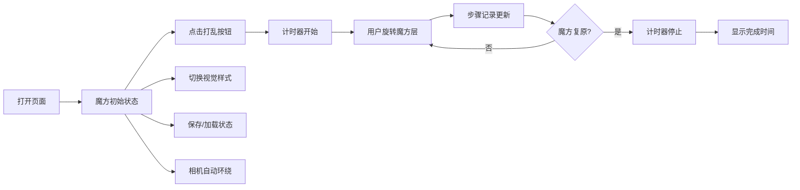

## 1. 产品概述

基于Three.js的3D魔方金字塔（Pyraminx）交互应用，提供沉浸式的魔方解谜体验。
- 面向魔方爱好者、3D交互爱好者，提供可交互的虚拟魔方金字塔
- 支持多种操作模式、视觉样式切换、状态保存等高级功能，兼具娱乐与教学价值

## 2. 核心功能

### 2.1 用户角色
无需用户登录，所有功能对所有访问者开放。

### 2.2 功能模块
1. **3D魔方场景**：Pyraminx四面体魔方渲染，共4个面，每个面9个小三角形块
2. **交互控制系统**：鼠标/触摸视角旋转、面/层旋转操作
3. **游戏功能**：打乱、自动复原、计时器、步骤记录
4. **视觉定制**：三种贴图样式切换、边缘轮廓线开关
5. **数据管理**：状态保存/加载（JSON）、一键截图（PNG）
6. **高级功能**：相机自动环绕、移动端触摸优化

### 2.3 页面详情
| 页面名称 | 模块名称 | 功能描述 |
|---------|---------|---------|
| 主页面 | 3D渲染区域 | Three.js场景渲染魔方金字塔，支持鼠标拖拽旋转视角 |
| 主页面 | 控制面板 | 打乱/复原按钮、计时器显示、样式切换、功能开关 |
| 主页面 | 步骤面板 | 显示操作历史记录，支持查看每次旋转详情 |
| 主页面 | 文件操作 | 保存状态到JSON、从JSON加载状态、截图保存 |

## 3. 核心流程

用户打开页面 → 看到初始状态的魔方金字塔 → 可以选择打乱魔方开始计时 → 通过拖拽旋转魔方层进行复原 → 完成后计时器停止 → 查看操作步骤 → 可切换样式或保存状态。

## 4. 用户界面设计

### 4.1 设计风格
- **主色调**：深空蓝 (#0a1628) 作为背景，营造科技感
- **强调色**：霓虹青色 (#00f5ff) 用于交互元素和边框
- **魔方颜色**：标准四色（红、蓝、绿、黄），支持荧光色和金属质感变体
- **按钮风格**：半透明玻璃态，圆角设计，hover时有发光效果
- **字体**：JetBrains Mono 作为等宽字体用于计时器和步骤显示，Geist 作为界面字体
- **布局风格**：左侧控制面板 + 中央3D场景 + 右侧步骤记录面板
- **视觉效果**：微妙的粒子背景，柔和的环境光，魔方有轻微的漂浮动画

### 4.2 页面设计概述
| 页面名称 | 模块名称 | UI元素 |
|---------|---------|--------|
| 主页面 | 3D场景区域 | 居中的魔方金字塔，支持视角旋转，深色背景 |
| 主页面 | 左侧控制面板 | 垂直排列的按钮组：打乱、复原、截图、保存、加载 |
| 主页面 | 顶部控制栏 | 计时器显示、样式切换下拉、功能开关（轮廓线、自动环绕） |
| 主页面 | 右侧步骤面板 | 可滚动的步骤列表，显示每次旋转的类型和时间 |

### 4.3 响应式
- Desktop-first设计，在桌面端提供三栏布局
- 平板端：控制面板移到底部，步骤面板可折叠
- 移动端：单列布局，所有控件优化为触摸友好尺寸
- 移动端支持长按+拖拽模拟旋转层操作

### 4.4 3D场景指导
- **环境**：深色空间背景，添加微弱的星空粒子效果
- **光照设置**：主方向光 + 环境光 + 补光，确保魔方各面都有良好照明
- **相机设置**：透视相机，初始距离适中，支持轨道控制
- **交互动画**：层旋转动画平滑（300ms），使用ease-out缓动
- **后处理效果**：可选的Bloom效果增强荧光样式
- **性能优化**：几何体合并，合理的三角形数量控制
