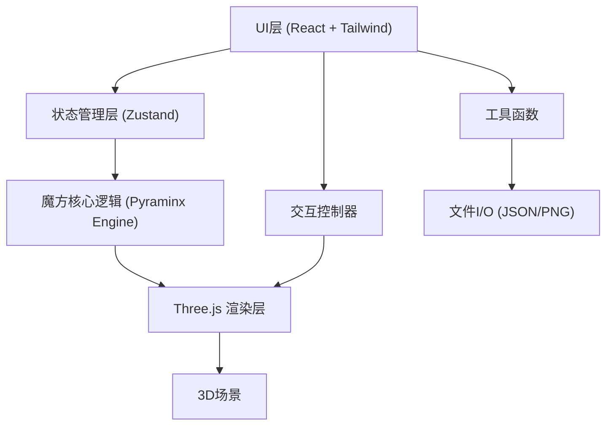

## 1. 架构设计



## 2. 技术描述

- **前端框架**：React@18 + TypeScript
- **构建工具**：Vite@5
- **样式方案**：TailwindCSS@3
- **3D渲染**：Three.js@0.160 + @react-three/fiber@8 + @react-three/drei@9
- **状态管理**：Zustand@4
- **动画库**：@react-spring/three
- **无后端设计**：纯前端应用，所有数据存储在客户端

## 3. 核心模块结构

| 模块路径 | 功能描述 |
|---------|---------|
| `src/components/` | React UI组件 |
| `src/components/Pyraminx/` | 魔方3D组件 |
| `src/engine/` | 魔方核心逻辑引擎 |
| `src/store/` | Zustand状态管理 |
| `src/hooks/` | 自定义React Hooks |
| `src/utils/` | 工具函数 |
| `src/types/` | TypeScript类型定义 |

## 4. 核心数据模型

### 4.1 魔方状态定义

```typescript
// 四面体的四个面
type Face = 'U' | 'R' | 'L' | 'B'; // Up, Right, Left, Back

// 每个面的9个小三角形位置
type FaceletPosition = 0 | 1 | 2 | 3 | 4 | 5 | 6 | 7 | 8;

// 颜色定义
type Color = 'red' | 'blue' | 'green' | 'yellow';

// 小块状态
interface Piece {
  id: string;
  position: [number, number, number];
  colors: { [key in Face]?: Color };
  rotation: [number, number, number];
}

// 魔方完整状态
interface PyraminxState {
  pieces: Piece[];
  isSolved: boolean;
  moveHistory: Move[];
}

// 旋转操作记录
interface Move {
  type: 'tip' | 'middle' | 'face';
  face: Face;
  direction: 'clockwise' | 'counterclockwise';
  timestamp: number;
  duration?: number;
}
```

### 4.2 应用状态

```typescript
interface AppState {
  // 游戏状态
  isPlaying: boolean;
  isShuffled: boolean;
  timer: number;
  timerRunning: boolean;
  
  // 视觉设置
  style: 'standard' | 'neon' | 'metallic';
  showEdges: boolean;
  autoRotate: boolean;
  
  // 交互状态
  isDragging: boolean;
  selectedPiece: string | null;
  
  // 历史记录
  moveHistory: Move[];
}
```

## 5. 核心算法

### 5.1 魔方旋转逻辑

- **顶点旋转 (Tip)**: 旋转最顶端的3个小块，绕顶点轴旋转120度
- **中间层旋转 (Middle)**: 旋转包含顶点的一层，共6个小块
- **整面旋转 (Face)**: 旋转整个面，包含9个小块

### 5.2 复原算法

实现简单的分层复原法：
1. 先复原四个顶点（Tips）
2. 复原中间层的棱块
3. 最后调整中心块位置

### 5.3 打乱算法

- 执行20-30次随机合法旋转
- 避免连续相同的旋转
- 记录所有打乱步骤用于后续复原

## 6. 性能优化策略

1. **几何体复用**: 相同形状的小块共享几何体
2. **材质池**: 预创建所有颜色/样式的材质
3. **批量更新**: 旋转时批量更新小块位置
4. **LOD**: 根据距离切换细节级别
5. **事件节流**: 鼠标移动事件节流处理
