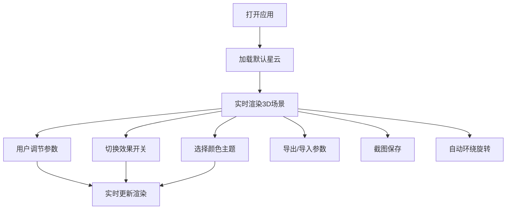

## 1. 产品概述

基于Three.js的交互式3D星云旋涡可视化应用，提供沉浸式的宇宙星云体验。用户可以实时调节各项参数，自定义星云形态、颜色和运动效果，支持参数导出导入和截图保存。

- 核心价值：为用户提供可交互、可定制的3D星云视觉体验，兼具艺术性和娱乐性
- 目标用户：视觉设计师、3D爱好者、天文爱好者、普通用户

## 2. 核心功能

### 2.1 用户角色
| 角色 | 注册方式 | 核心权限 |
|------|----------|----------|
| 普通用户 | 无需注册 | 使用所有功能，调节参数，导出导入，截图保存 |

### 2.2 功能模块
1. **3D星云场景**：核心渲染区域，展示动态星云旋涡效果
2. **参数控制面板**：调节螺旋臂、旋转速度、粒子数量等参数
3. **效果开关面板**：控制Bloom、镜头光晕、拖尾等视觉效果
4. **工具栏**：截图保存、主题切换、导出导入、自动旋转等功能
5. **状态显示**：实时显示粒子总数和帧率

### 2.3 页面详情
| 页面名称 | 模块名称 | 功能描述 |
|---------|----------|----------|
| 主页面 | 3D星云场景 | 发光核心、螺旋臂粒子流、粒子大小颜色渐变、粒子沿螺旋臂运动 |
| 主页面 | 相机控制 | 鼠标拖拽旋转、滚轮缩放、自动环绕旋转 |
| 主页面 | 参数控制面板 | 螺旋臂数量（2/3/4）、旋转速度、粒子数量、粒子运动速度 |
| 主页面 | 效果开关面板 | 背景切换（纯黑/深空星图）、镜头光晕、Bloom发光、粒子拖尾 |
| 主页面 | 工具栏 | 一键截图PNG、随机颜色主题、导出JSON、导入JSON、自动环绕 |
| 主页面 | 状态显示 | 粒子总数、帧率FPS |

## 3. 核心流程

用户打开应用 → 自动加载默认星云效果 → 用户调节参数实时预览 → 切换视觉效果 → 选择颜色主题 → 导出参数或截图保存

## 4. 用户界面设计

### 4.1 设计风格
- **主色调**：深空黑 (#0a0a1a) 作为背景，配合星云主题色（蓝紫、红紫、青绿、金橙）
- **面板设计**：半透明玻璃拟态风格，背景使用 rgba(15, 15, 35, 0.7)，边框微光效果
- **字体**：使用 Orbitron 作为显示字体（科技感），Inter 作为正文字体
- **交互元素**：滑块、开关、按钮使用发光效果，hover时有微动画

### 4.2 页面设计概述
| 页面名称 | 模块名称 | UI元素 |
|---------|----------|--------|
| 主页面 | 3D场景 | 全屏Canvas，居中展示星云，深邃背景 |
| 主页面 | 左侧控制面板 | 垂直排列参数滑块，标签+数值显示 |
| 主页面 | 右侧效果面板 | 开关按钮组，图标+文字 |
| 主页面 | 顶部工具栏 | 横向排列功能按钮，图标+文字 |
| 主页面 | 底部状态栏 | 显示粒子数和FPS，半透明条 |

### 4.3 响应性
- 桌面端：左侧控制面板，右侧效果面板，顶部工具栏
- 移动端：面板改为底部抽屉式，工具栏简化为图标按钮
- 触摸优化：支持双指缩放、单指旋转

### 4.4 3D场景指导
- **环境**：深空背景，可选星图背景，营造宇宙氛围
- **光照**：中心点光源（核心发光），环境光辅助，支持Bloom后处理发光效果
- **相机**：PerspectiveCamera，初始位置 (0, 0, 15)，支持OrbitControls拖拽旋转缩放
- **构图**：星云位于画面中心，螺旋臂向外扩散，形成旋涡视觉焦点
- **交互**：粒子动画持续运行，参数变化实时响应
- **后处理**：Bloom效果、LensFlare镜头光晕
- **性能**：粒子数量控制在合理范围，使用BufferGeometry优化性能

## 5. 非功能需求
- **性能要求**：粒子数5000时帧率稳定在30FPS以上
- **兼容性**：支持WebGL 2.0的现代浏览器
- **可访问性**：控制面板文字清晰，对比度足够
