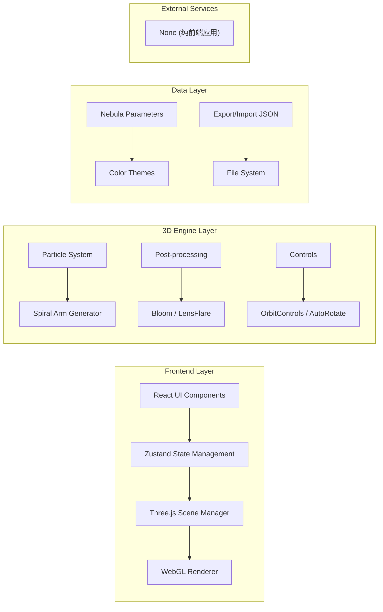

## 1. 架构设计



## 2. 技术描述

- **Frontend**: React@18 + TypeScript + Vite@5
- **3D Engine**: three@0.160 + @react-three/fiber@8.15 + @react-three/drei@9.92 + @react-three/postprocessing@2.15
- **State Management**: zustand@4.4
- **Styling**: tailwindcss@3.4
- **Icons**: lucide-react@0.294
- **Backend**: 无（纯前端应用）
- **Database**: 无（使用本地文件导入导出）

## 3. 核心模块结构

| 模块 | 文件路径 | 职责 |
|------|----------|------|
| 主应用入口 | src/App.tsx | 整体布局、UI面板组合 |
| 3D场景组件 | src/components/NebulaScene.tsx | Three.js场景容器 |
| 星云粒子系统 | src/components/NebulaParticles.tsx | 粒子生成、螺旋臂算法、动画 |
| 发光核心 | src/components/CoreGlow.tsx | 中心点光源、发光效果 |
| 背景星空 | src/components/StarBackground.tsx | 深空星图背景 |
| 参数控制面板 | src/components/ControlPanel.tsx | 参数滑块、数值显示 |
| 效果开关面板 | src/components/EffectsPanel.tsx | 各效果开关控制 |
| 工具栏 | src/components/Toolbar.tsx | 截图、主题、导出导入等 |
| 状态栏 | src/components/StatusBar.tsx | 粒子数、FPS显示 |
| 状态管理 | src/store/useNebulaStore.ts | 星云参数全局状态 |
| 主题配置 | src/config/themes.ts | 颜色主题定义 |
| 工具函数 | src/utils/helpers.ts | 截图、导出导入等工具 |
| 类型定义 | src/types/nebula.ts | TypeScript类型定义 |

## 4. 状态管理设计

### 4.1 Nebula State 类型定义

```typescript
interface NebulaParameters {
  // 基础参数
  particleCount: number;
  armCount: 2 | 3 | 4;
  rotationSpeed: number;
  particleSpeed: number;
  
  // 视觉效果
  bloomEnabled: boolean;
  lensFlareEnabled: boolean;
  trailEnabled: boolean;
  backgroundType: 'black' | 'stars';
  
  // 颜色主题
  colorTheme: 'purple-blue' | 'red-purple' | 'cyan-green' | 'gold-orange';
  coreColor: string;
  outerColor: string;
  
  // 相机
  autoRotate: boolean;
  
  // 性能统计
  fps: number;
}
```

### 4.2 Store Actions

- `updateParameter(key, value)` - 更新单个参数
- `setColorTheme(theme)` - 设置颜色主题
- `randomizeTheme()` - 随机主题
- `exportParameters()` - 导出为JSON
- `importParameters(json)` - 从JSON导入
- `takeScreenshot()` - 截图保存

## 5. 核心算法

### 5.1 螺旋臂粒子生成算法

```
对于每个粒子 i (0 ~ particleCount):
  armIndex = i % armCount                    # 分配到对应螺旋臂
  armAngle = (armIndex / armCount) * 2π      # 螺旋臂起始角度
  
  t = i / particleCount                      # 归一化位置 0~1
  radius = t * maxRadius                     # 从中心向外分布
  
  # 添加螺旋扭曲
  spiralAngle = armAngle + t * spiralTwist + randomOffset
  
  # 计算3D位置
  x = radius * cos(spiralAngle)
  y = (random - 0.5) * verticalSpread        # 垂直方向随机散布
  z = radius * sin(spiralAngle)
  
  # 粒子大小：中心大，外缘小
  size = baseSize * (1 - t * 0.7) + random
  
  # 颜色插值：中心白，外缘主题色
  color = lerp(coreColor, outerColor, t)
```

### 5.2 粒子运动更新

```
每一帧:
  rotationAngle += rotationSpeed * deltaTime
  
  对于每个粒子:
    # 沿螺旋臂向外流动
    particle.progress += particleSpeed * deltaTime
    if particle.progress > 1:
      particle.progress = 0
      
    # 重新计算位置（带旋转）
    angle = baseAngle + particle.progress * spiralTwist + rotationAngle
    radius = particle.progress * maxRadius
    
    particle.position.x = radius * cos(angle)
    particle.position.z = radius * sin(angle)
    particle.position.y = baseY + sin(particle.progress * π) * waveAmplitude
```

## 6. 性能优化策略

1. **BufferGeometry**：使用BufferGeometry而非Geometry，减少内存占用
2. **Points**：使用THREE.Points渲染所有粒子，单次Draw Call
3. **ShaderMaterial**：使用自定义Shader处理粒子大小和颜色
4. **粒子数量限制**：最大值限制为10000，确保性能
5. **帧率控制**：使用deltaTime确保动画速度一致
6. **按需更新**：参数变化时才重建几何体，而非每帧重建

## 7. 依赖包列表

```json
{
  "dependencies": {
    "react": "^18.2.0",
    "react-dom": "^18.2.0",
    "three": "^0.160.0",
    "@react-three/fiber": "^8.15.0",
    "@react-three/drei": "^9.92.0",
    "@react-three/postprocessing": "^2.15.0",
    "zustand": "^4.4.0",
    "lucide-react": "^0.294.0",
    "tailwindcss": "^3.4.0"
  },
  "devDependencies": {
    "@types/react": "^18.2.0",
    "@types/react-dom": "^18.2.0",
    "@types/three": "^0.160.0",
    "typescript": "^5.3.0",
    "vite": "^5.0.0",
    "@vitejs/plugin-react": "^4.2.0",
    "autoprefixer": "^10.4.0",
    "postcss": "^8.4.0"
  }
}
```
