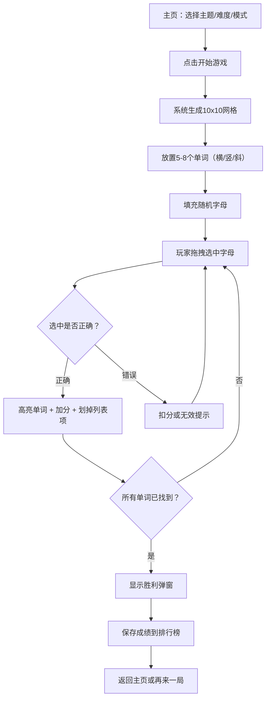

## 1. 产品概述

一款基于HTML、CSS和原生JavaScript的Word Search拼字游戏。系统在10x10字母网格中隐藏5-8个英文单词，玩家通过点击拖拽选中单词完成挑战。支持多主题词库、难度选择、计时/休闲模式、提示功能和排行榜。

- 目标用户：休闲游戏爱好者、英语学习者、消遣娱乐用户
- 核心价值：寓教于乐，在趣味中提升英语词汇量

## 2. 核心功能

### 2.1 功能模块

1. **游戏主页**：主题选择、难度选择、模式选择（计时/休闲）、开始游戏、排行榜入口
2. **游戏页面**：10x10字母网格、待发现单词列表、计分板、计时器、提示按钮、音效控制

### 2.2 页面详情

| 页面名称 | 模块名称 | 功能描述 |
|----------|----------|----------|
| 游戏主页 | 主题选择 | 动物、水果、国家三个主题卡片，每个主题显示图标和名称 |
| 游戏主页 | 难度选择 | 三档难度：简单（3字母起）、普通（4字母起）、困难（5字母起） |
| 游戏主页 | 模式选择 | 计时模式（3分钟限时）和休闲模式（无时间限制） |
| 游戏主页 | 排行榜 | 显示历史最快完成时间，按主题和难度分类 |
| 游戏页面 | 字母网格 | 10x10字母网格，支持鼠标拖拽和触摸拖拽选中 |
| 游戏页面 | 单词列表 | 待发现单词列表，找到后划掉并高亮 |
| 游戏页面 | 计分系统 | 正确选中得分，错误选中扣分，提示扣分 |
| 游戏页面 | 计时器 | 计时模式显示倒计时，休闲模式显示已用时间 |
| 游戏页面 | 提示功能 | 点击后随机高亮一个未发现单词的首字母 |
| 游戏页面 | 音效系统 | 正确选中、错误选中、胜利完成三种音效 |
| 胜利弹窗 | 结果展示 | 显示完成时间、得分、已用提示次数，可保存到排行榜 |

## 3. 核心流程

玩家进入主页 → 选择主题 → 选择难度 → 选择模式 → 点击开始 → 系统生成网格并放置单词 → 填充随机字母 → 玩家拖拽选中单词 → 判断是否正确 → 正确则高亮得分，错误则扣分 → 所有单词找到 → 显示胜利弹窗 → 可选保存成绩到排行榜

## 4. 用户界面设计

### 4.1 设计风格

- **主色调**：暖橙 #FF6B35 搭配深青 #1A535C，辅助色奶油白 #F7FFF7
- **按钮风格**：圆角按钮，带微弱阴影和hover缩放效果
- **字体**：标题使用 Fredoka One，正文使用 Nunito
- **布局风格**：居中卡片式布局，网格突出显示
- **图标**：使用简约emoji/图标风格

### 4.2 页面设计概览

| 页面名称 | 模块名称 | UI元素 |
|----------|----------|--------|
| 游戏主页 | 主题卡片 | 三张横向排列卡片，各含图标+主题名，选中态带橙色边框和阴影 |
| 游戏主页 | 难度选择 | 三个圆角按钮组，选中态高亮填充 |
| 游戏主页 | 模式切换 | 滑动开关，左侧时钟图标(计时)，右侧咖啡图标(休闲) |
| 游戏页面 | 字母网格 | 10x10方格，字母居中，选中路径高亮，正确单词持久高亮 |
| 游戏页面 | 单词列表 | 右侧竖排列表，找到的单词划线+透明度降低 |
| 游戏页面 | 计时器 | 顶部居中，倒计时时变红闪烁 |
| 游戏页面 | 提示按钮 | 灯泡图标，点击后闪光动画 |

### 4.3 响应式设计

- 桌面优先设计，移动端自适应
- 移动端网格和单词列表上下排列
- 触摸拖拽优化，增大触摸区域
- 网格单元格最小44px确保触摸友好
