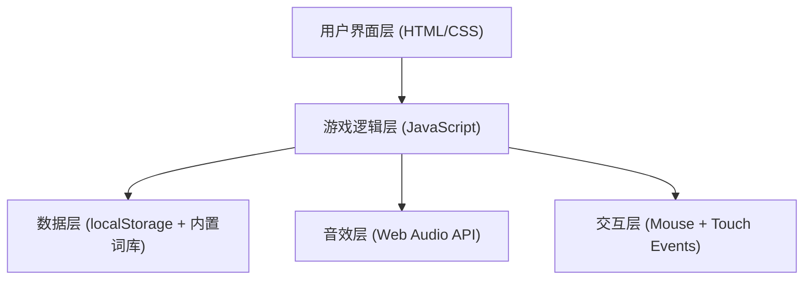

## 1. 架构设计

纯前端架构，无后端服务。所有数据（词库、排行榜）存储在本地。



## 2. 技术说明

- **前端**：原生HTML5 + CSS3 + JavaScript (ES2020)
- **构建工具**：无（纯静态文件，直接浏览器运行）
- **后端**：无
- **数据存储**：localStorage（排行榜数据）、内置词库（JavaScript对象）
- **音效**：Web Audio API（程序化生成音效，无需音频文件）
- **字体**：Google Fonts（Fredoka One + Nunito）

## 3. 文件结构

| 文件 | 用途 |
|------|------|
| index.html | 主页面结构，包含主页和游戏页面 |
| css/style.css | 全局样式、动画、响应式布局 |
| js/wordbank.js | 三主题词库数据 |
| js/grid.js | 网格生成、单词放置、随机字母填充 |
| js/game.js | 游戏核心逻辑：计分、计时、胜负判断 |
| js/interaction.js | 鼠标和触摸交互处理 |
| js/audio.js | Web Audio API音效生成 |
| js/leaderboard.js | 排行榜CRUD操作（localStorage） |
| js/app.js | 应用入口，页面切换，事件绑定 |

## 4. 核心算法

### 4.1 单词放置算法

1. 随机选择一个单词
2. 随机选择方向（8方向：横、竖、对角线）
3. 随机选择起始位置
4. 检查是否能放置（不越界、不冲突）
5. 若能放置则写入网格，若不能则重试（最多100次）
6. 重复直到放置5-8个单词

### 4.2 选中判断算法

1. 记录起始单元格坐标
2. 拖拽过程中计算与起始点的方向向量
3. 限制为8方向之一（横、竖、对角线）
4. 松开时获取从起点到终点的所有单元格
5. 提取字母组成字符串，与单词列表匹配
6. 正向和反向都匹配（单词可以从右到左、从下到上放置）

## 5. 数据模型

### 5.1 词库结构

```javascript
const WORD_BANKS = {
  animals: {
    name: "动物",
    icon: "🐾",
    words: {
      easy: ["cat", "dog", "pig", "cow", "hen", "fox", "bat", "owl", "ant", "bee"],
      medium: ["lion", "bear", "deer", "wolf", "hawk", "frog", "crab", "seal", "goat", "fish"],
      hard: ["tiger", "eagle", "shark", "whale", "horse", "snake", "zebra", "camel", "panda", "koala"]
    }
  },
  fruits: { /* 类似结构 */ },
  countries: { /* 类似结构 */ }
}
```

### 5.2 排行榜数据结构（localStorage）

```javascript
// key: "wordsearch_leaderboard"
// value: Array of records
{
  theme: "animals",
  difficulty: "easy",
  mode: "timed",
  time: 125,        // 秒
  score: 850,
  date: "2026-05-30"
}
```
