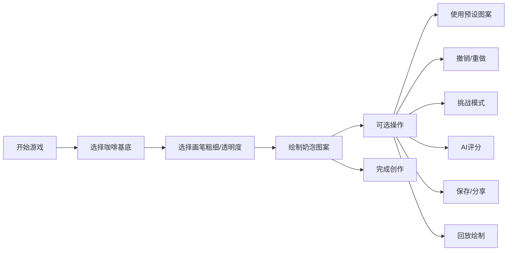

## 1. 产品概述

咖啡拉花艺术小游戏，用户可以在模拟咖啡杯画布上用鼠标或触摸屏绘制奶泡图案，体验咖啡师的创作乐趣。

- **主要用途**：提供沉浸式咖啡拉花体验
- **目标用户**：咖啡爱好者、休闲游戏玩家、创意设计爱好者
- **市场价值**：结合艺术创作与休闲娱乐，提供轻松有趣的创作体验

## 2. 核心功能

### 2.1 用户角色

| 角色 | 注册方式 | 核心权限 |
|------|----------|----------|
| 普通用户 | 无需注册 | 使用所有绘画功能 |

### 2.2 功能模块

1. **主画布**：圆形咖啡杯画布，模拟咖啡表面
2. **工具栏**：画笔设置、颜色选择、预设图案
3. **控制面板**：撤销重做、保存分享、回放、评分
4. **挑战模式**：目标图案模仿绘制

### 2.3 页面详情

| 页面名称 | 模块名称 | 功能描述 |
|-----------|----------|----------|
| 主游戏页 | 咖啡杯画布 | 圆形画布，支持鼠标/触摸绘制 |
| 主游戏页 | 画笔控制 | 粗细调节、透明度调节 |
| 主游戏页 | 咖啡基底 | 深褐色、中烘焙、浅棕色三种选择 |
| 主游戏页 | 预设图案 | 心形、树叶、郁金香一键生成 |
| 主游戏页 | 操作控制 | 撤销、重做、清空 |
| 主游戏页 | 作品管理 | 保存PNG、分享功能 |
| 主游戏页 | 评分系统 | AI评分（1-5星） |
| 主游戏页 | 挑战模式 | 模仿目标图案并评分 |
| 主游戏页 | 回放功能 | 动画回放绘制过程 |

## 3. 核心流程

## 4. 用户界面设计

### 4.1 设计风格

- **主色调**：深咖啡色 (#6F4E37)、奶油白 (#F5F5DC)、木质棕色 (#8B4513)
- **辅助色**：金色 (#DAA520) 用于按钮和强调
- **按钮风格**：圆角、微立体、悬停放大效果
- **字体**：Playfair Display（标题）、Lato（正文）
- **布局风格**：居中圆形画布为主，两侧工具栏，底部操作栏
- **图标风格**：简约线性图标，咖啡主题emoji点缀

### 4.2 页面设计概述

| 页面名称 | 模块名称 | UI元素 |
|---------|----------|--------|
| 主游戏页 | 咖啡杯画布 | 圆形画布、木质纹理背景、立体阴影效果 |
| 主游戏页 | 工具栏 | 卡片式设计、悬停动画、滑块控件 |
| 主游戏页 | 操作按钮 | 圆角按钮、渐变背景、点击反馈 |
| 主游戏页 | 评分展示 | 星星动画、评分弹出效果 |

### 4.3 响应式

- **桌面优先设计**，移动端自适应布局
- **触摸屏优化**：增大触摸区域，支持多指操作
- **画布自适应**：根据屏幕尺寸调整画布大小

### 4.4 动效设计

- 奶泡绘制时的边缘扩散动画
- 预设图案生成时的渐入动画
- 评分时的星星闪烁动画
- 回放时的笔触动画
- 按钮悬停和点击的微动效
