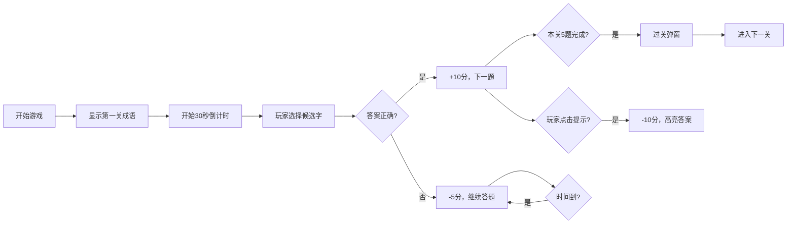

## 1. 产品概述

成语填空游戏是一款基于HTML、CSS和原生JavaScript的中文学习益智游戏。玩家通过填写成语中的空缺汉字来学习和巩固成语知识，兼具娱乐性和教育价值。

- 核心目标：通过游戏化方式帮助用户学习和记忆中文成语
- 目标用户：学生、中文学习者、成语爱好者
- 市场价值：寓教于乐，提升中文学习的趣味性

## 2. 核心功能

### 2.1 用户角色

| 角色 | 注册方式 | 核心权限 |
|------|----------|----------|
| 普通玩家 | 无需注册，本地存储 | 游戏游玩、查看排行榜、导入成语库 |

### 2.2 功能模块

1. **游戏主界面**：成语展示区、候选字选择区、状态栏
2. **关卡系统**：多关卡递进，每关5个成语，难度递增
3. **计分系统**：答对+10分，答错-5分，提示消耗10分
4. **计时功能**：每道题限时30秒，超时自动判错
5. **提示功能**：高亮正确答案，消耗积分
6. **排行榜**：本地存储最高分记录
7. **成语库扩展**：支持导入自定义成语JSON文件
8. **音效系统**：答对、答错、过关不同音效
9. **每日挑战**：每日固定一组成语，全员相同
10. **成语解释**：点击查看成语释义和出处

### 2.3 页面详情

| 页面名称 | 模块名称 | 功能描述 |
|---------|---------|----------|
| 游戏主页 | 顶部状态栏 | 显示当前关数、得分、剩余时间 |
| 游戏主页 | 成语展示区 | 显示带空缺的成语，高亮空缺位置 |
| 游戏主页 | 候选字区 | 4个候选汉字按钮，点击选择 |
| 游戏主页 | 功能按钮区 | 提示按钮、音效开关、导入成语库 |
| 游戏主页 | 排行榜区 | 显示历史最高分记录 |
| 过关弹窗 | 过关提示 | 显示本关得分，进入下一关按钮 |
| 解释弹窗 | 成语详情 | 显示成语拼音、释义、出处 |
| 每日挑战 | 挑战模式 | 展示当日挑战，记录最佳成绩 |

## 3. 核心流程

## 4. 用户界面设计

### 4.1 设计风格

- **主色调**：中国传统红色 (#C41E3A) + 金色 (#D4AF37)，体现传统文化氛围
- **辅助色**：墨色 (#2C2C2C) + 宣纸色 (#F5F0E6)
- **按钮风格**：圆角矩形，微立体效果，悬停有放大动画
- **字体**：标题使用"Ma Shan Zheng"（马善政楷体），正文使用"Noto Serif SC"
- **布局**：卡片式布局，居中对齐，传统卷轴视觉元素
- **图标**：使用emoji和SVG中国风图标（毛笔、印章、卷轴等）

### 4.2 页面设计概述

| 页面名称 | 模块名称 | UI元素 |
|---------|---------|--------|
| 游戏主页 | 状态栏 | 卷轴式背景，印章式关卡徽章，金色分数显示 |
| 游戏主页 | 成语展示区 | 大号汉字，田字格样式，空缺处闪烁动画 |
| 游戏主页 | 候选字区 | 4个等大按钮，毛笔字效果，点击反馈动画 |
| 过关弹窗 | 弹窗内容 | 烟花庆祝动画，得分展示，下一关按钮 |
| 解释弹窗 | 弹窗内容 | 卷轴展开动画，拼音标注，释义排版 |

### 4.3 响应式设计

- 桌面端优先，适配1280px及以上宽度
- 平板端：候选字按钮自适应缩小
- 移动端：单列布局，字体适当放大，触摸区域优化
- 触摸优化：按钮最小48x48px触摸区域

### 4.4 动画效果

- 页面加载：卷轴展开动画
- 答对：绿色闪光+粒子效果
- 答错：红色抖动效果
- 提示：正确答案脉冲高亮
- 过关：彩带飘落+烟花效果
- 候选字悬停：轻微放大+阴影加深
