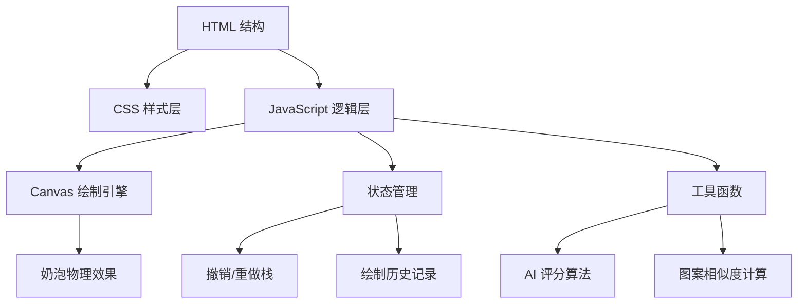

## 1. 架构设计



## 2. 技术描述

- **前端**：原生 HTML5 + CSS3 + JavaScript (ES6+)
- **核心技术**：Canvas 2D API
- **无构建工具**：直接运行，无需编译
- **无外部依赖**：纯原生实现

## 3. 文件结构

| 文件 | 用途 |
|------|------|
| index.html | 主页面结构 |
| styles.css | 样式定义 |
| app.js | 主应用逻辑 |

## 4. 核心模块设计

### 4.1 Canvas 绘制引擎
- 圆形画布裁剪（咖啡杯形状）
- 双层画布：背景层（咖啡基底）+ 绘制层（奶泡）
- 支持鼠标和触摸事件

### 4.2 状态管理
- `historyStack`：撤销栈
- `redoStack`：重做栈
- `drawingPath`：当前绘制路径记录
- `maxHistory`：最大历史记录数（20）

### 4.3 AI 评分算法
- **对称性评分**：计算左右像素差异
- **复杂度评分**：统计绘制点数、路径长度
- **总分计算**：(对称性 * 0.5 + 复杂度 * 0.5) → 1-5星

### 4.4 挑战模式
- 预设目标图案数据
- 像素级相似度比较
- 归一化评分输出

### 4.5 回放功能
- 记录每个绘制点的时间戳、位置、粗细
- requestAnimationFrame 动画播放
- 可调节播放速度

## 5. 数据结构

### 5.1 绘制点数据结构
```javascript
{
    x: number,           // X坐标
    y: number,           // Y坐标
    size: number,        // 画笔粗细
    opacity: number,     // 透明度
    timestamp: number    // 时间戳
}
```

### 5.2 预设图案数据结构
```javascript
{
    name: string,        // 图案名称
    emoji: string,       // 图标
    paths: [             // 路径数组
        {
            points: [{x, y, size}],
            color: string
        }
    ]
}
```

### 5.3 咖啡基底颜色
```javascript
[
    { name: '深烘焙', color: '#3D2914' },
    { name: '中烘焙', color: '#6F4E37' },
    { name: '加奶咖啡', color: '#C4A484' }
]
```

## 6. 关键算法

### 6.1 奶泡扩散效果
- 绘制时在主笔触周围随机生成3-5个辅助点
- 辅助点透明度降低（30%-50%）
- 大小随机变化（80%-120%）

### 6.2 对称性检测
- 以画布中心为对称轴
- 计算左右半球像素差异
- 差异越小，对称性评分越高

### 6.3 图案相似度（挑战模式）
- 将用户图案和目标图案转换为二值图像
- 计算汉明距离（相同位置像素不同的数量）
- 归一化得到相似度百分比

## 7. 事件处理

### 7.1 鼠标事件
- `mousedown`：开始绘制
- `mousemove`：绘制中
- `mouseup` / `mouseleave`：结束绘制

### 7.2 触摸事件
- `touchstart`：开始绘制
- `touchmove`：绘制中
- `touchend`：结束绘制
- 阻止默认滚动行为
