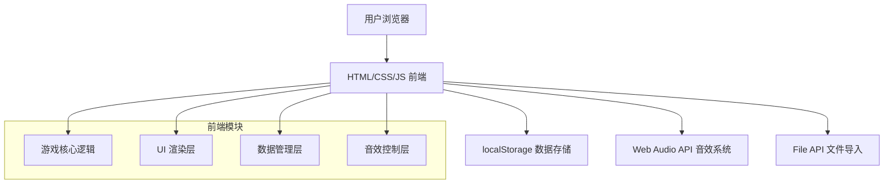

## 1. 架构设计



## 2. 技术描述

- **前端**：纯原生 HTML5 + CSS3 + JavaScript（ES6+）
- **样式**：CSS变量 + Flexbox/Grid布局，无第三方框架
- **数据存储**：浏览器 localStorage
- **音效**：Web Audio API 生成合成音效（无需外部音频文件）
- **字体**：Google Fonts（Ma Shan Zheng + Noto Serif SC）
- **动画**：CSS Keyframes + JavaScript 动画控制

## 3. 文件结构

| 文件路径 | 用途 |
|---------|------|
| `/idiom-game/index.html` | 游戏主页面 |
| `/idiom-game/css/style.css` | 样式文件 |
| `/idiom-game/js/game.js` | 游戏核心逻辑 |
| `/idiom-game/js/idioms.js` | 成语库数据 |
| `/idiom-game/js/audio.js` | 音效系统 |
| `/idiom-game/js/storage.js` | 本地存储管理 |

## 4. 数据模型

### 4.1 成语数据结构

```javascript
{
  idiom: "一分为二",
  pinyin: "yī fēn wéi èr",
  meaning: "指事物作为矛盾的统一体，都包含着相互矛盾对立的两个方面",
  source: "《黄帝内经·素问·阴阳离合论》",
  difficulty: 1,
  blankIndex: 1
}
```

### 4.2 游戏状态数据结构

```javascript
{
  currentLevel: 1,
  currentQuestion: 0,
  score: 0,
  timeLeft: 30,
  soundEnabled: true,
  levelIdioms: [],
  answered: []
}
```

### 4.3 排行榜数据结构

```javascript
{
  name: "玩家",
  score: 150,
  level: 5,
  date: "2024-01-15"
}
```

## 5. 核心API（内部函数）

| 函数名 | 参数 | 返回值 | 功能 |
|--------|------|--------|------|
| `initGame()` | 无 | void | 初始化游戏 |
| `loadLevel(level)` | level: number | void | 加载指定关卡 |
| `showQuestion()` | 无 | void | 显示当前题目 |
| `checkAnswer(char)` | char: string | boolean | 检查答案是否正确 |
| `useHint()` | 无 | void | 使用提示功能 |
| `startTimer()` | 无 | void | 开始倒计时 |
| `stopTimer()` | 无 | void | 停止倒计时 |
| `importIdioms(file)` | file: File | Promise | 导入成语库 |
| `saveScore(score, level)` | score, level | void | 保存分数到排行榜 |
| `playSound(type)` | type: string | void | 播放指定音效 |

## 6. 技术要点

### 6.1 音效实现方案
使用 Web Audio API 的 OscillatorNode 生成合成音效，避免依赖外部音频文件：
- 答对：上升音阶 + 和弦
- 答错：下降音阶
- 过关：胜利旋律
- 提示：提示音

### 6.2 每日挑战实现
使用日期哈希算法生成当日固定成语列表：
```javascript
const today = new Date().toISOString().split('T')[0];
const seed = hashCode(today);
const dailyIdioms = shuffleWithSeed(allIdioms, seed).slice(0, 5);
```

### 6.3 本地存储键名
- `idiom_game_state` - 当前游戏状态
- `idiom_game_highscores` - 排行榜数据
- `idiom_game_custom` - 自定义成语库
- `idiom_game_daily` - 每日挑战记录
