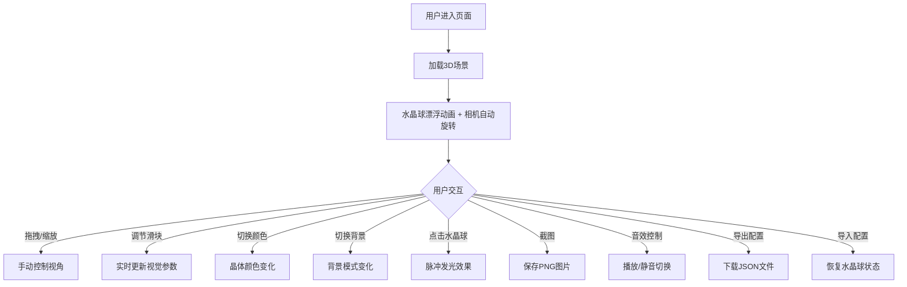

## 1. 产品概述

基于Three.js的3D交互式魔法水晶球场景展示应用。用户可以在浏览器中欣赏一个漂浮的半透明水晶球，内部悬浮发光晶体，周围有粒子光环和星光效果，并通过控制面板调节各种视觉参数。

- 目标用户：3D视觉爱好者、互动艺术欣赏者
- 核心价值：沉浸式魔法水晶球视觉体验，高度可定制的3D交互场景

## 2. 核心功能

### 2.1 功能模块

1. **3D场景页面**：水晶球主体、粒子系统、背景环境、交互控制面板

### 2.2 页面详情

| 页面名称 | 模块名称 | 功能描述 |
|---------|---------|---------|
| 3D场景页面 | 水晶球主体 | 半透明球体，内部悬浮发光晶体，漂浮动画效果 |
| 3D场景页面 | 粒子系统 | 环绕旋转的粒子光环 + 随机闪烁的星光粒子 |
| 3D场景页面 | 视角控制 | 拖拽旋转、滚轮缩放、相机自动缓慢旋转 |
| 3D场景页面 | 控制面板 | 透明度滑块、光环速度滑块、发光强度滑块 |
| 3D场景页面 | 颜色切换 | 红/蓝/绿/紫四种晶体颜色切换 |
| 3D场景页面 | 倒影开关 | 开启/关闭地面倒影效果 |
| 3D场景页面 | 背景切换 | 深蓝色/星空两种背景模式 |
| 3D场景页面 | 截图功能 | 一键截图保存当前视角为PNG图片 |
| 3D场景页面 | 音效控制 | 空灵背景音乐播放/静音切换 |
| 3D场景页面 | 脉冲交互 | 点击水晶球时内部晶体短暂脉冲发光 |
| 3D场景页面 | 配置管理 | 导出当前配置为JSON，可重新导入恢复 |

## 3. 核心流程

用户打开页面后，看到漂浮的水晶球场景，默认相机自动缓慢旋转。用户可以：
1. 拖拽旋转视角观察水晶球各角度
2. 滚轮缩放远近
3. 通过左侧控制面板调节视觉效果参数
4. 点击水晶球触发脉冲发光效果
5. 随时截图或导出/导入配置

## 4. 用户界面设计

### 4.1 设计风格

- **主色调**：深蓝/深紫宇宙色系（#0a0a2e, #1a1a4e）
- **辅助色**：水晶色系随选择变化（红#ff3366, 蓝#3399ff, 绿#33ff99, 紫#cc66ff）
- **按钮样式**：圆角玻璃拟态（glassmorphism），半透明模糊背景
- **字体**：Orbitron（标题/标签）+ Exo 2（正文/数值），科幻未来感
- **布局风格**：全屏3D场景 + 左侧悬浮控制面板
- **图标风格**：线性图标，Lucide React

### 4.2 页面设计概览

| 页面名称 | 模块名称 | UI元素 |
|---------|---------|--------|
| 3D场景页面 | 场景主体 | 全屏Canvas，深色背景，居中水晶球 |
| 3D场景页面 | 控制面板 | 左侧玻璃拟态面板，滑块/按钮/开关，可折叠 |
| 3D场景页面 | 工具栏 | 右上角图标按钮组（截图/音效/导入/导出） |
| 3D场景页面 | 颜色选择 | 四个彩色圆形按钮，选中高亮 |

### 4.3 响应式

- 桌面优先设计，3D场景全屏
- 控制面板在移动端可折叠为底部抽屉
- 触摸操作支持旋转和缩放

### 4.4 3D场景指引

- **环境/氛围**：神秘宇宙空间，深蓝色调，可选星空粒子
- **灯光设置**：环境光 + 点光源（跟随晶体颜色）+ 聚光灯
- **相机设置**：透视相机，初始距离5，自动缓慢旋转速度0.1rad/s
- **构图和焦点**：水晶球居中，粒子光环环绕
- **交互和动画**：水晶球上下漂浮，粒子旋转，点击脉冲
- **后处理效果**：Bloom辉光效果，可选地面倒影
- **性能预算**：粒子数量<2000，目标60FPS
