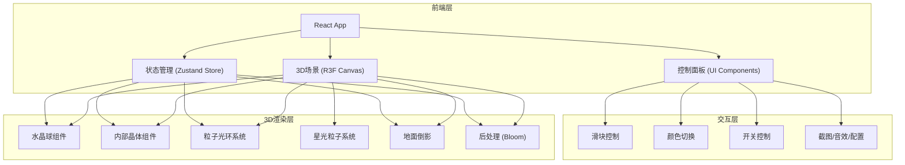

## 1. 架构设计



## 2. 技术说明

- **前端框架**：React@18 + TypeScript + Vite
- **3D渲染**：Three.js + @react-three/fiber + @react-three/drei + @react-three/postprocessing
- **样式方案**：Tailwind CSS@3
- **状态管理**：Zustand
- **初始化工具**：vite-init (react-ts 模板)
- **后端**：无（纯前端项目）
- **数据库**：无

## 3. 路由定义

| 路由 | 用途 |
|------|------|
| / | 主页面，展示3D水晶球场景及控制面板 |

## 4. 核心组件设计

### 4.1 3D场景组件

| 组件名 | 职责 |
|--------|------|
| `CrystalBallScene` | 3D场景根组件，包含Canvas和所有3D子组件 |
| `CrystalBall` | 半透明球体，接收透明度参数 |
| `InnerCrystal` | 内部发光晶体，接收颜色和发光强度，处理点击脉冲 |
| `ParticleRing` | 粒子光环，接收旋转速度 |
| `StarParticles` | 闪烁星光粒子 |
| `GroundReflection` | 地面倒影平面 |
| `Background` | 背景切换（深蓝/星空） |
| `SceneEffects` | Bloom后处理效果 |

### 4.2 UI控制组件

| 组件名 | 职责 |
|--------|------|
| `ControlPanel` | 控制面板容器，玻璃拟态样式 |
| `Slider` | 通用滑块组件（透明度/速度/强度） |
| `ColorPicker` | 晶体颜色选择器（红/蓝/绿/紫） |
| `ToggleSwitch` | 开关组件（倒影/自动旋转） |
| `Toolbar` | 工具栏（截图/音效/导入/导出） |

### 4.3 状态管理 (Zustand Store)

```typescript
interface CrystalBallState {
  transparency: number;
  ringSpeed: number;
  glowIntensity: number;
  crystalColor: 'red' | 'blue' | 'green' | 'purple';
  reflectionEnabled: boolean;
  backgroundMode: 'deepBlue' | 'starry';
  autoRotate: boolean;
  isMuted: boolean;
  pulseActive: boolean;
  
  setTransparency: (v: number) => void;
  setRingSpeed: (v: number) => void;
  setGlowIntensity: (v: number) => void;
  setCrystalColor: (c: string) => void;
  toggleReflection: () => void;
  toggleBackground: () => void;
  toggleAutoRotate: () => void;
  toggleMute: () => void;
  triggerPulse: () => void;
  exportConfig: () => => string;
  importConfig: (json: string) => void;
}
```

## 5. 关键技术实现

### 5.1 水晶球半透明效果

使用 `MeshPhysicalMaterial` 配置 `transmission`、`roughness`、`ior` 参数实现玻璃质感半透明球体。

### 5.2 内部晶体发光

使用 `MeshStandardMaterial` 配合 `emissive` 和 `emissiveIntensity`，通过 `PointLight` 内嵌增强发光效果。脉冲效果通过临时增大 `emissiveIntensity` 并用 `useFrame` 平滑回退实现。

### 5.3 粒子系统

使用 `Points` + `BufferGeometry` + 自定义 `ShaderMaterial`：
- 粒子光环：沿圆环分布，旋转动画
- 星光粒子：球面随机分布，闪烁动画（alpha随时间sin变化）

### 5.4 地面倒影

使用 `MeshReflectorMaterial`（@react-three/drei）实现镜面反射地面。

### 5.5 Bloom后处理

使用 `@react-three/postprocessing` 的 `EffectComposer` + `Bloom` 效果。

### 5.6 截图功能

通过 `gl.domElement.toDataURL('image/png')` 获取Canvas截图，创建下载链接。

### 5.7 音效实现

使用 Web Audio API + OscillatorNode 生成空灵的环境音效，无需外部音频文件。

### 5.8 配置导入导出

将 Zustand store 状态序列化为JSON下载，导入时解析JSON并调用各setter恢复状态。
