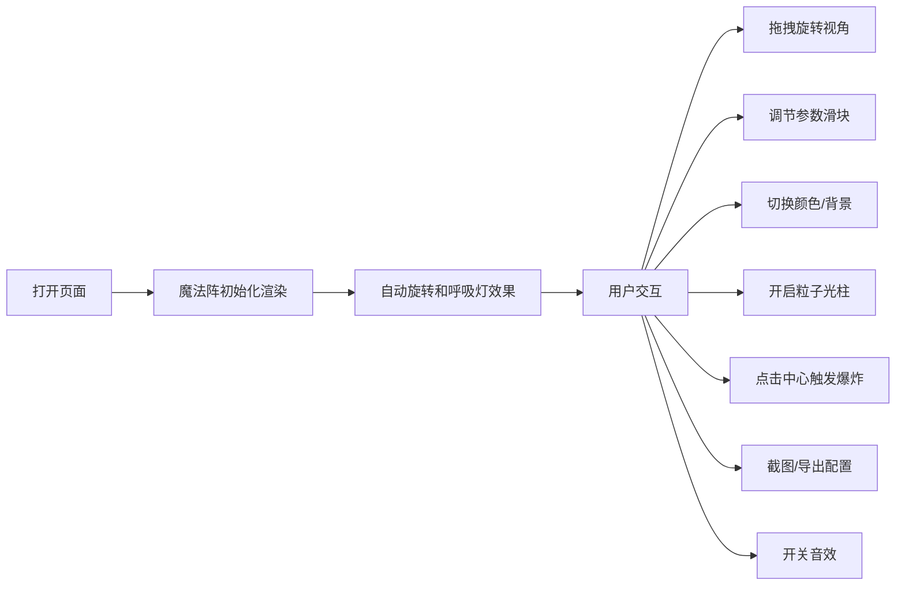

## 1. 产品概述

基于Three.js的交互式3D魔法阵展示系统，提供沉浸式的魔幻视觉体验和丰富的自定义控制功能。

- 主要目的：为用户提供一个可交互、可定制的3D魔法阵展示平台，支持多种视觉效果和交互方式
- 目标用户：游戏开发者、魔法/奇幻主题爱好者、3D视觉艺术创作者

## 2. 核心功能

### 2.1 用户角色

| 角色 | 注册方式 | 核心权限 |
|------|---------|---------|
| 普通用户 | 无需注册 | 使用所有魔法阵功能，配置导入导出 |

### 2.2 功能模块

1. **主页面**：3D魔法阵展示区域、控制面板、状态信息

### 2.3 页面详情

| 页面名称 | 模块名称 | 功能描述 |
|---------|---------|----------|
| 主页面 | 3D魔法阵展示 | 复杂圆形图案、发光线条和符文、悬浮效果、自动旋转、呼吸灯 |
| 主页面 | 视角控制 | 鼠标拖拽旋转视角、相机自动环绕旋转 |
| 主页面 | 参数调节 | 旋转速度、发光强度、符文字体大小 |
| 主页面 | 颜色切换 | 蓝色火焰、红色火焰、绿色自然、紫色暗影 |
| 主页面 | 粒子效果 | 向上粒子光柱、中心点击爆炸特效 |
| 主页面 | 背景切换 | 夜晚草地、古堡地砖、虚空 |
| 主页面 | 功能按钮 | 一键截图PNG、音效开关、导出JSON配置 |

## 3. 核心流程

## 4. 用户界面设计

### 4.1 设计风格

- 主色调：深紫黑色背景配合魔法发光效果
- 辅助色：蓝色、红色、绿色、紫色（四种魔法主题色）
- 按钮风格：半透明玻璃拟态按钮，带发光边框
- 字体：Cinzel（魔法风格标题）、Roboto（控制面板）
- 布局：3D场景全屏展示，控制面板悬浮在右侧
- 图标风格：简洁线条图标，配合发光效果

### 4.2 页面设计概述

| 页面名称 | 模块名称 | UI元素 |
|---------|---------|--------|
| 主页面 | 3D场景区域 | Three.js渲染器、OrbitControls、魔法阵主体 |
| 主页面 | 右侧控制面板 | 滑块组、颜色选择按钮、功能开关、导出按钮 |
| 主页面 | 状态信息 | 帧率显示、当前配置状态 |

### 4.3 响应式

- 桌面端优先，控制面板悬浮右侧
- 移动端控制面板自动转为底部抽屉式

### 4.4 3D场景指导

- **环境/氛围**：神秘魔幻氛围，深色背景配合发光元素
- **光照设置**：环境光 + 点光源（跟随魔法阵颜色变化）+ 自发光材质
- **相机设置**：PerspectiveCamera，初始位置(0, 5, 10)，fov 60
- **构图与焦点**：魔法阵居中悬浮，地面作为衬托，粒子效果向上延伸
- **交互与动画**：魔法阵缓慢自转，符文呼吸灯效果，粒子系统动态效果
- **后期处理效果**：Bloom发光效果、轻微辉光
- **资源来源与性能预算**：符文使用Canvas生成纹理，粒子系统优化性能
