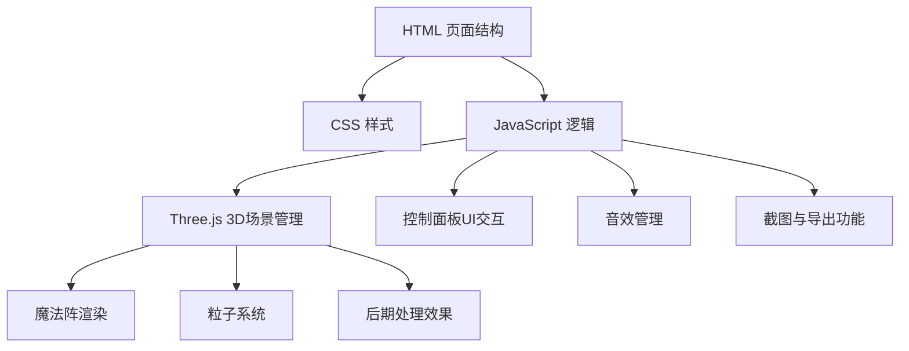

## 1. 架构设计



## 2. 技术描述

- 前端: 原生 HTML5 + CSS3 + JavaScript (ES6+)
- 3D渲染: Three.js (通过CDN引入)
- 后期处理: Three.js EffectComposer + UnrealBloomPass
- 控件: Three.js OrbitControls
- 音效: Web Audio API
- 无后端依赖

## 3. 核心数据结构

### 3.1 魔法阵配置数据结构

```javascript
{
  rotationSpeed: number,
  glowIntensity: number,
  runeFontSize: number,
  colorTheme: 'blue' | 'red' | 'green' | 'purple',
  background: 'grass' | 'castle' | 'void',
  particleBeamEnabled: boolean,
  soundEnabled: boolean,
  autoRotateCamera: boolean
}
```

### 3.2 颜色主题配置

```javascript
{
  blue: { primary: '#4fc3f7', secondary: '#0288d1', ambient: '#81d4fa' },
  red: { primary: '#ff5252', secondary: '#d32f2f', ambient: '#ff8a80' },
  green: { primary: '#69f0ae', secondary: '#2e7d32', ambient: '#b9f6ca' },
  purple: { primary: '#e040fb', secondary: '#7b1fa2', ambient: '#ea80fc' }
}
```

### 3.3 粒子数据结构

```javascript
{
  position: THREE.Vector3,
  velocity: THREE.Vector3,
  life: number,
  maxLife: number,
  size: number,
  color: THREE.Color
}
```

## 4. 核心算法

1. **魔法阵生成**: 使用Three.js Line绘制多层同心圆和几何图案，Canvas生成符文纹理
2. **呼吸灯效果**: 使用正弦函数周期性调整材质emissive强度
3. **粒子系统**: 粒子光柱使用BufferGeometry优化，爆炸粒子使用随机速度向量
4. **后期处理**: UnrealBloomPass实现发光效果
5. **截图功能**: 使用renderer.domElement.toDataURL()生成PNG
6. **音效生成**: Web Audio API生成低频嗡鸣声

## 5. 文件结构

```
/
├── index.html           # 主页面
├── css/
│   └── style.css        # 样式文件
├── js/
│   ├── main.js          # 主入口
│   ├── scene.js         # Three.js场景管理
│   ├── magicCircle.js   # 魔法阵生成
│   ├── particles.js     # 粒子系统
│   ├── audio.js         # 音效管理
│   └── ui.js            # UI控制面板
└── assets/              # 静态资源（如需要）
```
