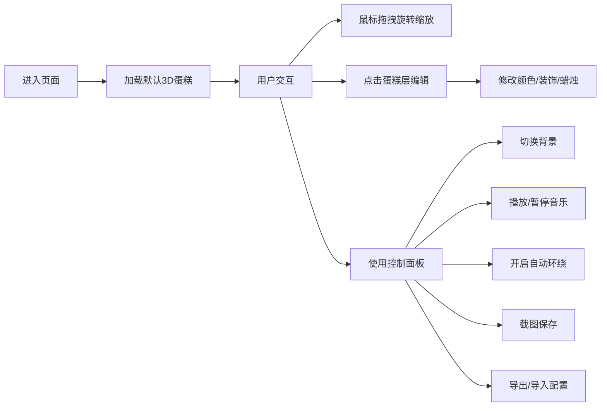

## 1. 产品概述

基于Three.js的3D交互式生日蛋糕场景，用户可以自由定制蛋糕的外观、装饰、蜡烛等元素，支持多种交互功能和分享选项。

- 主要目的：提供一个有趣的3D蛋糕定制体验，用于生日庆祝、贺卡制作等场景
- 目标用户：需要创建个性化生日祝福的普通用户

## 2. 核心功能

### 2.1 功能模块

1. **3D蛋糕展示**：三层蛋糕展示，每层不同颜色和装饰
2. **交互控制**：鼠标拖拽旋转、缩放视角
3. **分层编辑**：点击每层蛋糕弹出编辑窗口
4. **祝福文字**：可编辑的旋转文字横幅
5. **粒子效果**：蜡烛火焰粒子动画
6. **截图功能**：一键保存为PNG图片
7. **背景切换**：派对气球场景或纯色背景
8. **音乐播放**：生日快乐背景音乐
9. **热量估算**：根据层数和装饰计算总热量
10. **配置导出**：导出/导入JSON配置文件
11. **自动环绕**：相机自动环绕旋转
12. **蜡烛控制**：点燃/熄灭切换开关

### 2.2 页面详情

| 页面名称 | 模块名称 | 功能描述 |
|---------|---------|----------|
| 主页面 | 3D场景区域 | 展示可交互的3D蛋糕，支持鼠标旋转缩放 |
| 主页面 | 控制面板 | 背景切换、音乐控制、自动环绕、截图、导出配置 |
| 主页面 | 编辑弹窗 | 点击蛋糕层后弹出，可编辑颜色、奶油花数量、蜡烛数量 |
| 主页面 | 信息面板 | 显示总热量估算、当前配置状态 |

## 3. 核心流程

## 4. 用户界面设计

### 4.1 设计风格

- **主色调**：粉色渐变（#FFB6C1 到 #FF69B4），配合金色点缀
- **辅助色**：奶油白、巧克力棕、草莓红
- **按钮风格**：圆角按钮，带有轻微阴影和悬停动画
- **字体**：使用活泼可爱的手写风格字体配合清晰的无衬线字体
- **布局风格**：3D场景居中，控制面板采用半透明卡片式布局
- **图标风格**：圆润可爱的emoji风格图标

### 4.2 页面设计概述

| 页面名称 | 模块名称 | UI元素 |
|---------|---------|--------|
| 主页面 | 3D场景区域 | 全屏Three.js画布，蛋糕居中展示，柔和光照 |
| 主页面 | 控制面板 | 右上角半透明玻璃态卡片，垂直排列控制按钮 |
| 主页面 | 编辑弹窗 | 居中模态框，带颜色选择器、滑块、数字输入 |
| 主页面 | 信息面板 | 左下角显示热量信息，半透明背景 |

### 4.3 响应式

- Desktop-first设计，适配1920px以上屏幕
- 移动端适配：控制面板转为底部或侧边抽屉式
- 触摸操作优化：支持双指缩放、单指旋转

### 4.4 3D场景指导

- **环境**：温暖的室内派对氛围，柔和的环境光配合聚光灯
- **光照设置**：主光源（暖白色）+ 环境光 + 蛋糕上方补光
- **相机设置**：透视相机，初始距离30，可环绕旋转
- **交互**：OrbitControls控制，阻尼效果，限制缩放范围
- **动画**：蜡烛火焰粒子动画、文字旋转、相机自动环绕
- **后处理**：轻微泛光效果，增强节日氛围
- **性能**：控制粒子数量，使用InstancedMesh优化装饰元素
