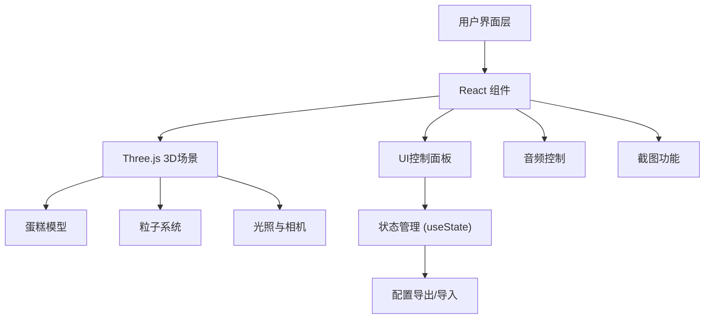

## 1. 架构设计



## 2. 技术描述

- **前端框架**: React@18 + Vite
- **3D引擎**: Three.js + @react-three/fiber + @react-three/drei
- **样式**: TailwindCSS@3
- **状态管理**: React useState/useContext
- **类型**: TypeScript

## 3. 核心依赖

| 依赖包 | 用途 |
|--------|------|
| three | 3D渲染核心 |
| @react-three/fiber | React Three.js 桥接 |
| @react-three/drei | Three.js 实用工具组件 |
| @react-three/postprocessing | 后处理效果 |
| html2canvas | 截图功能 |
| file-saver | 文件保存 |

## 4. 主要组件结构

```
src/
├── components/
│   ├── CakeScene.tsx        # 3D蛋糕场景主组件
│   ├── CakeLayer.tsx        # 单一层蛋糕组件
│   ├── Candle.tsx           # 蜡烛组件
│   ├── FlameParticles.tsx   # 火焰粒子系统
│   ├── Frosting.tsx         # 奶油花装饰
│   ├── Sprinkles.tsx        # 糖珠装饰
│   ├── BannerText.tsx       # 旋转文字横幅
│   ├── Balloons.tsx         # 派对气球背景
│   ├── ControlPanel.tsx     # 控制面板
│   ├── EditModal.tsx        # 编辑弹窗
│   └── InfoPanel.tsx        # 信息面板
├── hooks/
│   ├── useAudio.ts          # 音频控制hook
│   └── useCakeConfig.ts     # 蛋糕配置管理hook
├── types/
│   └── index.ts             # 类型定义
├── utils/
│   ├── calories.ts          # 热量计算
│   └── export.ts            # 导出导入工具
├── App.tsx
├── main.tsx
└── index.css
```

## 5. 数据模型定义

### 5.1 蛋糕配置类型

```typescript
interface CakeLayerConfig {
  id: number;
  color: string;
  height: number;
  radius: number;
  frostingCount: number;
  candleCount: number;
}

interface CakeConfig {
  layers: CakeLayerConfig[];
  bannerText: string;
  backgroundType: 'solid' | 'balloons';
  backgroundColor: string;
  candlesLit: boolean;
  showParticles: boolean;
  autoRotate: boolean;
  musicPlaying: boolean;
  musicMuted: boolean;
}
```

### 5.2 热量计算规则

- 每层蛋糕基础热量: 500卡路里
- 每个奶油花: 50卡路里
- 每根蜡烛: 10卡路里
- 糖珠装饰: 100卡路里/层
