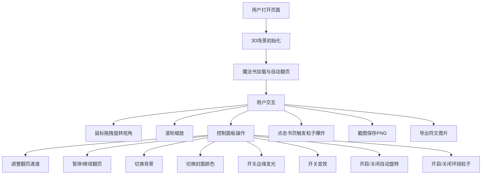

## 1. 产品概述

基于Three.js的交互式3D魔法书展示应用，用户可以与一本漂浮的魔法书进行丰富的互动，体验沉浸式的魔法世界。

- **主要用途**：提供一个视觉震撼的3D魔法书交互体验，支持书页翻动、符文展示、粒子特效等多种魔法效果
- **目标用户**：对3D交互、魔法主题感兴趣的用户，可作为展示、学习或娱乐用途
- **产品价值**：展示Three.js在复杂3D交互场景中的应用能力，提供丰富的用户交互体验

## 2. 核心功能

### 2.1 用户角色

本产品无需用户角色区分，所有功能对所有访问者开放。

### 2.2 功能模块

1. **3D魔法书主场景**：漂浮的魔法书、金属质感封面、自动翻页动画
2. **符文系统**：每页显示不同魔法符文纹理，支持导出符文图片
3. **相机控制**：拖拽旋转、缩放、自动旋转模式
4. **粒子特效系统**：书页点击爆炸效果、环绕书本的悬浮魔法粒子
5. **控制面板**：翻页速度控制、暂停/继续、背景切换、封面颜色切换、边缘发光开关、音效开关
6. **导出功能**：一键截图保存PNG、导出当前书页符文图片

### 2.3 页面详情

| 页面名称 | 模块名称 | 功能描述 |
|-----------|-------------|---------------------|
| 主页面 | 3D场景渲染 | 全屏Three.js场景，展示漂浮魔法书，支持鼠标交互 |
| 主页面 | 控制面板 | 右侧悬浮控制面板，包含所有控制选项和功能按钮 |
| 主页面 | 符文展示 | 书页上动态显示魔法符文纹理，支持细节查看 |
| 主页面 | 粒子特效 | 点击书页触发爆炸特效，环绕粒子持续旋转 |

## 3. 核心流程

用户打开页面 → 3D魔法书场景加载完成 → 自动开始翻页展示 → 用户可通过鼠标拖拽旋转视角/滚轮缩放 → 通过控制面板调整各项参数 → 点击书页触发粒子特效 → 可随时截图或导出符文图片

## 4. 用户界面设计

### 4.1 设计风格

- **主色调**：深邃的紫色和蓝色作为主色调，配合金色作为魔法点缀，营造神秘魔法氛围
- **按钮样式**：半透明玻璃质感按钮，带有微妙的光晕效果，hover时有魔法光效
- **字体**：使用Cinzel Decorative作为标题字体（魔法风格），配合Noto Sans SC作为正文字体
- **布局风格**：全屏3D场景作为主体，右侧悬浮半透明控制面板，采用不规则圆角设计
- **图标风格**：使用魔法主题图标，如符文、星星、魔法棒等元素

### 4.2 页面设计概述

| 页面名称 | 模块名称 | UI元素 |
|-----------|-------------|-------------|
| 主页面 | 3D场景 | 漂浮魔法书（金属封面、发光边缘）、动态符文、悬浮粒子、背景（星空/图书馆）、环境光效 |
| 主页面 | 控制面板 | 玻璃态半透明面板、滑块控件（翻页速度）、切换按钮组、功能按钮、状态指示器 |
| 主页面 | 交互反馈 | 点击波纹效果、粒子爆炸动画、翻页过渡动画、按钮hover光效 |

### 4.3 响应性

- **Desktop-first**：主要面向桌面端设计，全屏3D场景配合右侧控制面板
- **移动端适配**：控制面板自适应为底部抽屉式布局，优化触摸交互
- **触摸优化**：支持单指旋转、双指缩放手势

### 4.4 3D场景设计

- **环境氛围**：神秘的魔法氛围，可切换星空背景（深邃宇宙）或图书馆背景（古老书架）
- **光照设置**：多光源系统，包括主方向光、环境光、魔法书自发光、粒子光源
- **相机设置**：透视相机，初始位置略微俯视，支持OrbitControls控制
- **焦点元素**：魔法书为绝对视觉中心，书页翻转动画为主要动态元素
- **交互动画**：翻页动画采用贝塞尔曲线模拟真实书页弯曲，粒子动画采用物理模拟
- **后处理效果**：Bloom泛光效果增强魔法光感，FXAA抗锯齿提升画面质量
- **性能优化**：使用BufferGeometry减少绘制调用，合理控制粒子数量，支持像素比自适应
