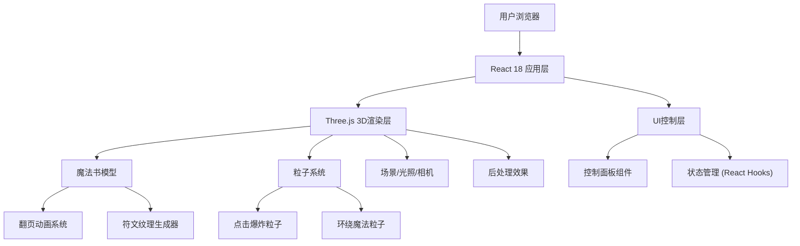

## 1. 架构设计



## 2. 技术描述

- **前端框架**: React@18 + TypeScript
- **构建工具**: Vite@5
- **样式方案**: TailwindCSS@3
- **3D引擎**: three@0.160
- **React Three Fiber**: @react-three/fiber@8
- **Three.js工具库**: @react-three/drei@9
- **后处理效果**: @react-three/postprocessing@2
- **状态管理**: React Hooks (useState, useRef, useFrame)
- **音频处理**: Web Audio API

## 3. 目录结构

```
src/
├── components/
│   ├── MagicBook/
│   │   ├── MagicBook.tsx          # 魔法书主组件
│   │   ├── BookCover.tsx          # 书本封面
│   │   ├── BookPage.tsx           # 书页组件
│   │   └── PageFlipAnimation.tsx  # 翻页动画
│   ├── Particles/
│   │   ├── ExplosionParticles.tsx # 点击爆炸粒子
│   │   └── FloatingParticles.tsx  # 环绕悬浮粒子
│   ├── Scene/
│   │   ├── Scene.tsx              # 3D场景容器
│   │   ├── Background.tsx         # 背景（星空/图书馆）
│   │   └── Lighting.tsx           # 光照系统
│   ├── Controls/
│   │   ├── ControlPanel.tsx       # 控制面板
│   │   ├── SpeedSlider.tsx        # 翻页速度滑块
│   │   ├── ColorPicker.tsx        # 封面颜色选择器
│   │   └── ToggleButton.tsx       # 开关按钮组件
│   └── Effects/
│       ├── BloomEffect.tsx        # 泛光效果
│       └── EdgeGlow.tsx           # 边缘发光
├── hooks/
│   ├── useBookAnimation.ts        # 书本动画Hook
│   ├── useParticleSystem.ts       # 粒子系统Hook
│   └── useAudio.ts                # 音效Hook
├── utils/
│   ├── runeGenerator.ts           # 符文纹理生成器
│   ├── screenshot.ts              # 截图工具
│   └── constants.ts               # 常量配置
├── types/
│   └── index.ts                   # TypeScript类型定义
├── App.tsx                        # 应用入口
└── main.tsx                       # React入口
```

## 4. 核心模块技术方案

### 4.1 魔法书渲染方案

- **书本结构**: 使用多个PlaneGeometry构建书页，每一页为独立网格
- **翻页动画**: 使用CSS3DRenderer或自定义Shader实现书页弯曲效果，通过贝塞尔曲线插值
- **金属质感封面**: 使用MeshStandardMaterial配合metalness和roughness贴图，配合环境贴图实现真实金属反射
- **符文纹理**: 使用Canvas API动态生成魔法符文图案，创建CanvasTexture应用到书页材质

### 4.2 粒子系统方案

- **点击爆炸特效**: 使用Points配合BufferGeometry，粒子发射后遵循物理运动规律（重力、速度衰减）
- **环绕悬浮粒子**: 使用ShaderMaterial实现粒子沿圆形路径运动，添加随机偏移和闪烁效果
- **性能优化**: 使用InstancedMesh渲染大量粒子，合理控制粒子数量上限

### 4.3 交互控制方案

- **相机控制**: 使用OrbitControls实现拖拽旋转和缩放
- **自动旋转**: 通过useFrame在每一帧更新相机角度
- **书页点击检测**: 使用Three.js的Raycaster进行射线检测

### 4.4 音效方案

- **翻页音效**: 使用Web Audio API播放音频片段，支持音量控制和静音
- **音效资源**: 内置Base64编码的翻页音效，无需额外加载外部资源

### 4.5 导出功能方案

- **场景截图**: 使用Three.js的WebGLRenderer.domElement.toDataURL()生成PNG图片
- **符文导出**: 直接导出生成符文的Canvas元素为PNG图片

## 5. 关键技术点

1. **自定义Shader实现书页弯曲**: 通过顶点着色器修改书页顶点位置，模拟纸张翻折的物理效果
2. **动态纹理生成**: 使用Canvas 2D API绘制魔法符文，实时更新Three.js纹理
3. **后处理管线**: 使用EffectComposer构建Bloom泛光等后处理效果链
4. **性能优化策略**:
   - 限制粒子数量（≤500）
   - 使用BufferGeometry替代Geometry
   - 合理设置pixelRatio（上限2）
   - 页面不可见时暂停动画
5. **响应式布局**: 使用TailwindCSS的响应式工具类，控制面板在移动端转为底部抽屉

## 6. 数据模型

### 6.1 应用状态类型定义

```typescript
interface AppState {
  // 书本状态
  currentPage: number;
  isPaused: boolean;
  pageFlipSpeed: 'slow' | 'normal' | 'fast';
  coverColor: 'red' | 'blue' | 'green' | 'purple';
  
  // 视觉效果
  background: 'stars' | 'library';
  edgeGlowEnabled: boolean;
  floatingParticlesEnabled: boolean;
  autoRotateEnabled: boolean;
  
  // 音效
  soundEnabled: boolean;
  volume: number;
}

interface RuneData {
  id: number;
  pattern: string;
  color: string;
  name: string;
}
```

### 6.2 常量配置

```typescript
// 翻页速度配置（毫秒）
const PAGE_FLIP_SPEEDS = {
  slow: 3000,
  normal: 2000,
  fast: 1000,
};

// 封面颜色配置
const COVER_COLORS = {
  red: '#8B0000',
  blue: '#1a1a4e',
  green: '#0d3b0d',
  purple: '#3d1a5c',
};

// 符文数据
const RUNE_PATTERNS = [
  { id: 1, name: '火焰符文', color: '#FF6B35' },
  { id: 2, name: '冰霜符文', color: '#4ECDC4' },
  { id: 3, name: '雷电符文', color: '#FFE66D' },
  { id: 4, name: '大地符文', color: '#95E1D3' },
  { id: 5, name: '星空符文', color: '#A8E6CF' },
  { id: 6, name: '暗影符文', color: '#6C5B7B' },
];
```
